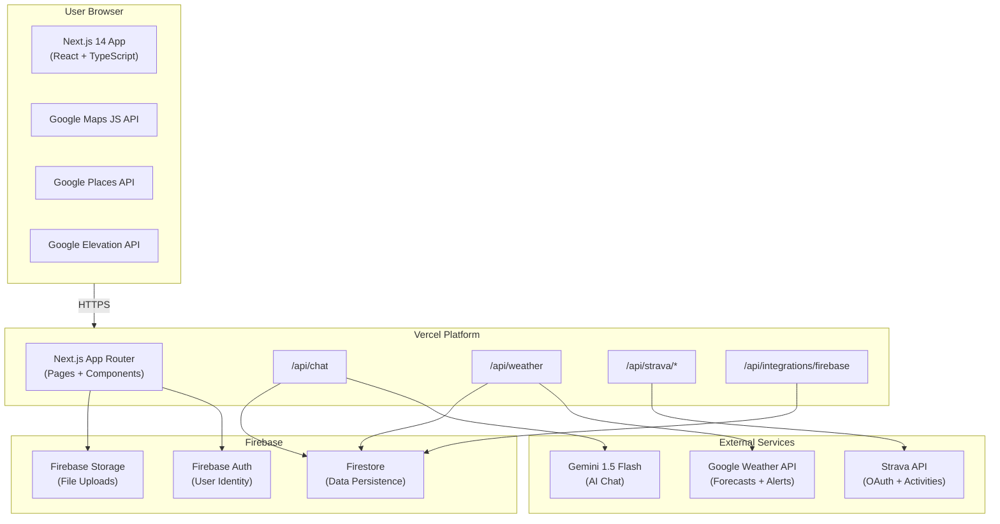
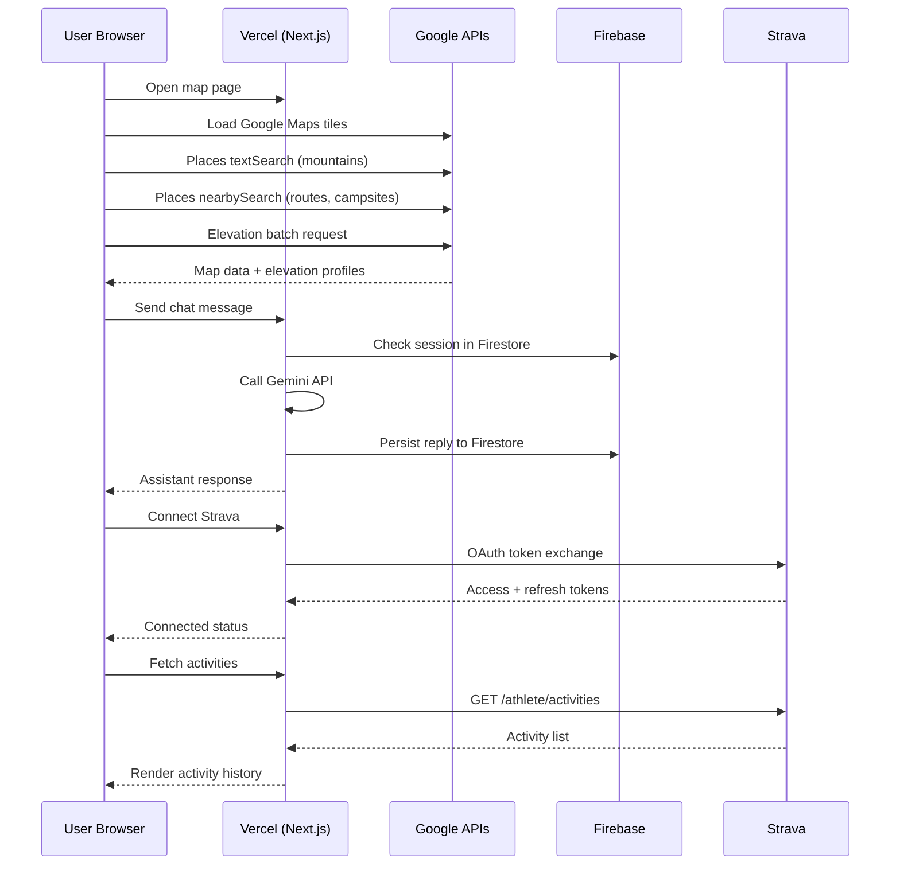
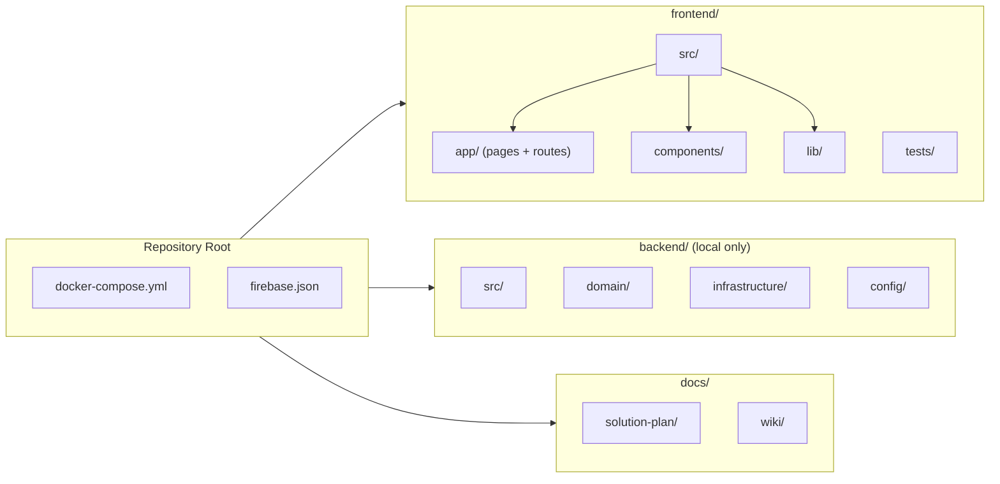
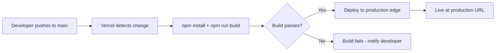

# Fit-Ready-IQ

**The definitive adventure readiness platform for serious outdoor athletes.**

Fit-Ready-IQ is a comprehensive web application that helps mountaineers, hikers, trail runners, and ultra-distance cyclists prepare for their next challenge. It combines real-time geographic data, live weather intelligence, fitness tracking integration, and AI-powered guidance into a unified planning experience.

---

## Overview

Fit-Ready-IQ addresses a critical gap in outdoor adventure planning: the disconnect between route information, weather conditions, personal fitness data, and gear requirements. Athletes today must juggle multiple apps, websites, and manual calculations to assess whether they are ready for a given route. Fit-Ready-IQ unifies these data sources into a single, intelligent platform that provides personalized readiness assessments.

### What It Does

- **Route Discovery** -- Find mountains, trails, and campsites near any location with real elevation data from Google Elevation API and place details from Google Places API.
- **Elevation Intelligence** -- Komoot-style elevation profiles with grade visualization, color-coded difficulty segments, and jumpoff-to-summit analysis.
- **Live Weather Forecasts** -- Google Weather API integration with persona-specific safety alerts and hourly breakdowns (Phase 1).
- **Fitness Data Sync** -- Connect Strava for automatic activity sync, or import GPX files from COROS, Garmin, and Komoot devices.
- **AI Adventure Assistant** -- Gemini-powered chat that understands routes, weather, gear, and training to provide actionable advice.
- **Readiness Scoring** -- Compare personal fitness metrics against route demands to get a readiness score and gap analysis (Phase 4).

### Who It Serves

The platform serves four primary user personas, each with distinct needs, risk thresholds, and feature requirements:

| Persona | Primary Activities | Key Differentiators |
| --- | --- | --- |
| **Mountaineer** | Alpine climbs, multi-day expeditions, technical summits, via ferrata | Acclimatization, exposure rating, snow/ice conditions, weather windows |
| **Hiker** | Day hikes, backpacking, thru-hikes, ridge walks, loop trails | Trail surface, water sources, campsite discovery, distance/elevation filtering |
| **Trail Runner** | Trail races, ultra marathons, FKT attempts, mountain marathons | Vert-per-km, technical rating, estimated finish time, aid station planning |
| **Ultra-Distance Cyclist** | Brevets, bikepacking, gran fondos, multi-day touring, gravel racing | Gradient analysis, wind/headwind forecasting, power zone estimation, resupply planning |

See **[SOLUTION-PLAN.md](docs/solution-plan/SOLUTION-PLAN.md)** for the complete product roadmap, architecture evolution, and implementation details.

---

## Architecture

### System Overview



### Data Flow



---

## Tech Stack

| Layer | Technology | Purpose |
| --- | --- | --- |
| **Frontend Framework** | Next.js 14 (App Router) | Server-rendered React with file-based routing |
| **Language** | TypeScript (strict mode) | Type-safe development across all components |
| **Styling** | Tailwind CSS (`slate-*` palette) | Utility-first CSS with consistent dark theme |
| **Maps** | Google Maps JS API | Interactive map rendering with custom markers |
| **Places** | Google Places API | Mountain, route, and campsite discovery |
| **Elevation** | Google Elevation API | Real altitude data for profiles and scoring |
| **Weather** | Google Weather API (Phase 1) | Live forecasts with persona-specific alerts |
| **AI** | Gemini 1.5 Flash | Conversational adventure planning assistant |
| **Database** | Firebase Firestore | Document-based data persistence |
| **Authentication** | Firebase Auth (Phase 3) | Email, Google, and Apple sign-in |
| **File Storage** | Firebase Storage (Phase 3) | GPX uploads, user content |
| **Fitness Sync** | Strava OAuth 2.0 | Activity history, athlete stats, polylines |
| **File Import** | GPX Parser (custom) | Import from COROS, Garmin, Komoot devices |
| **Icons** | Lucide React | Consistent icon system |
| **Hosting** | Vercel | Serverless functions + edge CDN |
| **Local Dev** | Docker Compose | Firebase Emulator Suite for offline development |

---

## Quick Start

### Prerequisites

| Requirement | Version | Purpose |
| --- | --- | --- |
| Node.js | 20+ | Frontend runtime and build |
| npm | 10+ | Package management |
| Git | 2.x | Source control |
| Google Maps API Key | -- | Maps JS, Places, Elevation APIs enabled |
| Gemini API Key | -- | AI chat functionality |
| Firebase Project | -- | Firestore persistence |
| Docker Desktop | -- | (Optional) Local Firebase Emulators |
| Python | 3.11+ | (Optional) Backend development |
| Poetry | 1.x | (Optional) Python dependency management |

### 1. Clone and Install

```bash
git clone https://github.com/Oweeboi011/Fit-Ready-IQ.git
cd Fit-Ready-IQ/frontend
npm install
```

### 2. Configure Environment

Create a `.env.local` file in the `frontend/` directory:

```bash
# Required - Google Maps (enables map, places, elevation)
NEXT_PUBLIC_GOOGLE_MAPS_API_KEY=your_google_maps_api_key

# Required - AI Chat Assistant
GEMINI_API_KEY=your_gemini_api_key

# Required - Firebase Persistence
FIREBASE_PROJECT_ID=your_firebase_project_id
FIREBASE_SERVICE_ACCOUNT_KEY_JSON={"type":"service_account",...}

# Required - Strava Integration
STRAVA_CLIENT_ID=your_strava_client_id
STRAVA_CLIENT_SECRET=your_strava_client_secret

# Phase 1 - Weather (when implemented)
GOOGLE_WEATHER_API_KEY=your_weather_api_key
```

### 3. Run Development Server

```bash
npm run dev
# Application available at http://localhost:4790
```

### 4. Run with Firebase Emulators (Optional)

```bash
# From repository root
docker-compose up -d

# Emulator UI at http://localhost:4000
# Firestore emulator at localhost:8080
# Auth emulator at localhost:9099
```

### 5. Backend Development (Optional -- not deployed)

```bash
cd backend
poetry install
poetry run uvicorn src.main:app --reload --port 8000
```

---

## Key Features

### Implemented Features

| Feature | Component | Description |
| --- | --- | --- |
| Interactive Map | `MapView.tsx` | Google Maps with custom markers for mountains, routes, and campsites. Supports zoom, pan, and click-to-detail interactions. |
| Route Discovery | `page.tsx` | Discovers nearby points of interest using Google Places textSearch and nearbySearch APIs with configurable radius. |
| Elevation Profiles | `DetailsModal.tsx` | Komoot-style SVG elevation profiles with grade-based color coding (green/yellow/orange/red segments). |
| Strava OAuth | `ConnectDevicesModal.tsx` | Full OAuth 2.0 flow with server-side token exchange and client-side activity display. |
| GPX Import | `ConnectDevicesModal.tsx` | Drag-and-drop GPX file parsing for COROS, Garmin, and Komoot exports. |
| AI Chat | `ChatBot.tsx` | Gemini-powered conversational assistant with Firestore session persistence. |
| Route Filtering | `RouteFilter.tsx` | Filter by activity type, difficulty level, distance range, and elevation gain. |
| Activity History | `ConnectDevicesModal.tsx` | Unified view of synced activities with source badges and polyline overlays. |
| Photo Galleries | `DetailsModal.tsx` | Google Places photos displayed in route/mountain detail views. |

### Planned Features (by Phase)

| Phase | Feature | Description |
| --- | --- | --- |
| 1 | Live Weather | Google Weather API with persona-specific safety alerts |
| 2 | Persona Routing | Multi-persona scoring algorithms and UI customization |
| 3 | User Profiles | Firebase Auth + persistent user data and saved routes |
| 4 | Readiness Engine | Fitness-vs-route demand comparison with training recommendations |
| 5 | Smart AI | Context-grounded chat with route, weather, and fitness data |
| 6 | Performance | Hook extraction, code splitting, edge caching |

---

## Project Structure



### Directory Details

| Path | Purpose |
| --- | --- |
| `frontend/src/app/` | Next.js App Router pages and API routes |
| `frontend/src/app/api/chat/` | Gemini chat server route |
| `frontend/src/app/api/strava/` | Strava OAuth exchange and activity routes |
| `frontend/src/app/api/integrations/` | Firebase health check route |
| `frontend/src/components/` | React components (MapView, DetailsModal, RouteFilter, etc.) |
| `frontend/src/lib/` | Shared utilities (GPX parser, polyline decoder, activity types) |
| `backend/src/domain/` | Domain entities, interfaces, services (local dev only) |
| `backend/src/infrastructure/` | API clients and database layer (local dev only) |
| `backend/src/config/` | Settings via pydantic-settings (local dev only) |
| `docs/solution-plan/` | Master solution plan (source of truth) |
| `docs/wiki/` | Architecture, API, Deployment, Security, Troubleshooting guides |

---

## Testing

### Unit Tests (Vitest)

```bash
cd frontend
npm run test:unit
```

Current test coverage: `activityTypes.ts`, `decodePolyline.ts`, `gpxParser.ts` (7 tests passing).

### End-to-End Tests (Playwright)

```bash
cd frontend
npm run test:e2e
```

Tests the full user journey including map rendering and component interactions.

### Load Tests (Autocannon)

```bash
cd frontend
npm run test:load
```

Validates response times under concurrent request load.

---

## Deployment

Production deployment runs on **Vercel** with automatic deployments triggered by pushes to the `main` branch.



### Deploy Manually

```bash
cd frontend
npx vercel --prod
```

### Environment Configuration

All environment variables must be set in **Vercel Project Settings > Environment Variables** before deploying. See [DEPLOYMENT.md](docs/wiki/DEPLOYMENT.md) for the complete guide.

---

## Documentation

| Document | Description |
| --- | --- |
| **[SOLUTION-PLAN.md](docs/solution-plan/SOLUTION-PLAN.md)** | Master plan -- product vision, roadmap, architecture evolution, data models, quality gates. Source of truth for all decisions. |
| **[ARCHITECTURE.md](docs/wiki/ARCHITECTURE.md)** | System design, module boundaries, server route patterns, data architecture, configuration strategy. |
| **[API.md](docs/wiki/API.md)** | Complete API reference for all server routes with request/response schemas and flow diagrams. |
| **[DEPLOYMENT.md](docs/wiki/DEPLOYMENT.md)** | Vercel deployment setup, environment configuration, validation checklist, rollback strategy. |
| **[TESTING.md](docs/wiki/TESTING.md)** | Testing strategy, test commands, coverage targets, performance baselines, and post-deploy validation. |
| **[SECURITY.md](docs/wiki/SECURITY.md)** | Trust boundaries, secret management, integration hardening, incident response procedures. |
| **[TROUBLESHOOTING.md](docs/wiki/TROUBLESHOOTING.md)** | Diagnostic flows for common issues across all integrations and deployment targets. |
| **[CONTRIBUTING.md](docs/wiki/CONTRIBUTING.md)** | Contribution workflow, branch naming, validation commands, review checklist. |

---

## License

MIT
