# Fit-Ready-IQ Solution Plan

**Version:** 2026-06-21
**Status:** Active -- source of truth for all development
**Repository:** [Fit-Ready-IQ](https://github.com/Oweeboi011/Fit-Ready-IQ)

---

## 1. Purpose

This document is the **master plan** for Fit-Ready-IQ. Every architectural decision, feature roadmap item, enhancement, and optimization flows from here. All other documentation (ARCHITECTURE.md, DEPLOYMENT.md, API.md, SECURITY.md) derives from this plan and must remain consistent with it.

This plan defines:
- Who the product serves and what problems it solves
- What is implemented today (as-is baseline)
- What enhancements and optimizations are planned (phase-by-phase)
- How the architecture evolves to support each phase
- Data models, API contracts, and integration details
- Quality gates and success metrics for each milestone

**Governance Rule:** Any architecture, deployment, or feature decision must update this plan first. Other docs are updated to reflect changes defined here.

---

## 2. Product Vision

Fit-Ready-IQ is the definitive adventure readiness platform for serious outdoor athletes. It combines geographic intelligence, weather data, fitness tracking, and AI-powered guidance to help athletes assess their readiness for any route or challenge.

### 2.1 Problem Statement

Outdoor athletes today face a fragmented planning experience:
- Route information is scattered across multiple apps (AllTrails, Komoot, Strava)
- Weather data requires separate lookups with no activity-specific context
- Fitness readiness assessment is entirely manual and subjective
- Gear recommendations are generic, not tied to specific route conditions
- No unified view connecting route demands, weather conditions, and personal fitness

Fit-Ready-IQ solves this by unifying all adventure planning data into a single intelligent platform with persona-specific insights.

### 2.2 Target Users

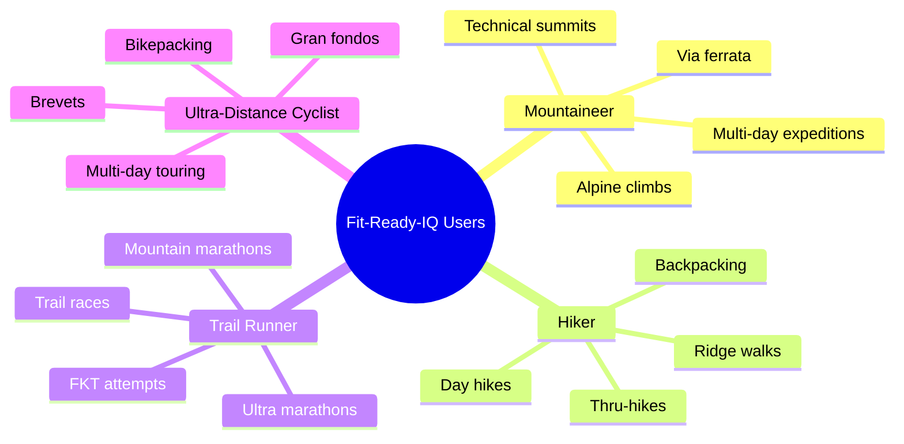

### 2.3 Core Value Propositions

| Value | Description |
| --- | --- |
| **Know Before You Go** | Real elevation profiles, live weather, and difficulty scoring so athletes can assess readiness before committing to a route. |
| **Train Smarter** | Compare personal fitness data against route demands to identify gaps and build targeted training plans. |
| **Stay Safe** | Weather alerts, gear checklists, and condition briefings tailored to activity type, terrain, and persona. |
| **Plan Everything** | AI assistant that understands routes, weather, gear, and training to create complete adventure plans. |
| **Track Progress** | Unified activity history from all devices with performance trend analysis across all fitness providers. |

---

## 3. Target User Personas

### 3.1 The Mountaineer

**Profile:** Experienced climber tackling alpine environments, high-altitude summits, and technical terrain.

| Attribute | Details |
| --- | --- |
| Key needs | Summit elevation, jumpoff-to-summit profiles, technical grade, weather windows, acclimatization guidance |
| Critical data | Elevation gain/loss, exposure rating, snow/ice conditions, sunrise/sunset, temperature at altitude |
| Activity types | Alpine climb, scramble, expedition, via ferrata |
| Safety concerns | Lightning, hypothermia, altitude sickness, rockfall, whiteout conditions |
| Unique features | Acclimatization calculator, exposure risk assessment, summit weather windows |

### 3.2 The Hiker

**Profile:** Recreational to avid hiker exploring trails ranging from day hikes to multi-week thru-hikes.

| Attribute | Details |
| --- | --- |
| Key needs | Trail discovery, distance/elevation filtering, campsite locations, water sources, trail surface type |
| Critical data | Trail distance, total ascent/descent, difficulty rating, trail surface, estimated time |
| Activity types | Day hike, backpacking, thru-hike, ridge walk, loop trail |
| Safety concerns | Dehydration, navigation errors, weather changes, wildlife encounters |
| Unique features | Campsite discovery, water source mapping, trail surface ratings |

### 3.3 The Trail Runner

**Profile:** Competitive or recreational runner on technical terrain, from short trail races to 100+ mile ultras.

| Attribute | Details |
| --- | --- |
| Key needs | Technical trail profiles, aid station planning, cutoff time calculators, race-day weather forecasts |
| Critical data | Distance, vertical gain per km, technical rating, terrain type, estimated finish time |
| Activity types | Trail run, ultra marathon, FKT attempt, mountain marathon |
| Safety concerns | Overexertion, heat illness, night navigation, hypothermia at altitude |
| Unique features | Estimated finish time calculator, vert-per-km analysis, aid station planning |

### 3.4 The Ultra-Distance Cyclist

**Profile:** Endurance cyclist covering extreme distances across varied terrain, from paved roads to gravel.

| Attribute | Details |
| --- | --- |
| Key needs | Route profiles with gradient analysis, wind/weather forecasts, resupply planning, night riding conditions |
| Critical data | Distance, total climbing, average/max gradient, road surface, wind direction/speed |
| Activity types | Brevet, bikepacking, gran fondo, multi-day touring, gravel racing |
| Safety concerns | High-speed descents, crosswinds, hypothermia during night riding, traffic |
| Unique features | Gradient analysis with power zones, headwind/tailwind forecasting, resupply point mapping |

---

## 4. Current State (As-Is Baseline)

### 4.1 Runtime Architecture

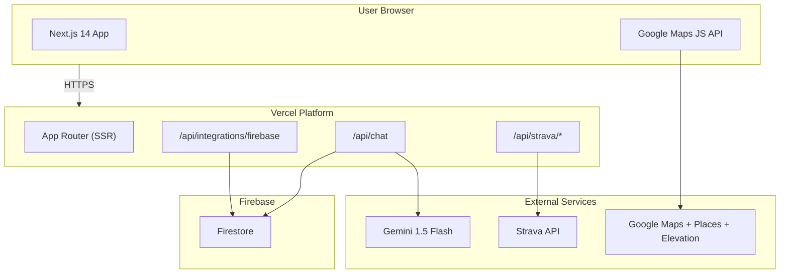

### 4.2 Implemented Features

| Feature | Status | Component | Details |
| --- | --- | --- | --- |
| Interactive map exploration | Done | `MapView.tsx` | Google Maps with custom markers for mountains, routes, campsites |
| Route/mountain detail modal | Done | `DetailsModal.tsx` | Elevation profiles, photos, Strava segments, gear recommendations |
| Strava OAuth + activity sync | Done | `ConnectDevicesModal.tsx` | Server-side token exchange, client-side activity display |
| GPX file import | Done | `ConnectDevicesModal.tsx` | Drag-and-drop for COROS, Garmin, Komoot exports |
| AI chat assistant | Done | `ChatBot.tsx` | Gemini-backed with Firestore session persistence |
| Firebase health check | Done | `/api/integrations/firebase` | Connectivity and write probe validation |
| Route filtering | Done | `RouteFilter.tsx` | Activity type, difficulty, distance, elevation filters |
| Activity history with polylines | Done | `ConnectDevicesModal.tsx` | Source badges, polyline overlay on map |
| Campsite discovery | Done | `page.tsx` | Google Places nearbySearch for campsites |
| Elevation profile visualization | Done | `DetailsModal.tsx` | Komoot-style SVG with grade-based color segments |
| Photo galleries | Done | `DetailsModal.tsx` | Google Places photos in detail views |

### 4.3 Technology Stack

| Layer | Technology | Purpose |
| --- | --- | --- |
| Frontend | Next.js 14, TypeScript, Tailwind CSS (`slate-*`) | App shell and UI rendering |
| Maps | Google Maps JS API, Places API, Elevation API | Geographic data and visualization |
| AI | Gemini 1.5 Flash | Conversational chat assistant |
| Data | Firebase Firestore | Chat persistence, future user data |
| Auth | Firebase Auth (planned Phase 3) | User identity management |
| Storage | Firebase Storage (planned Phase 3) | GPX files, user uploads |
| Device Sync | Strava OAuth, GPX import | Activity data integration |
| Hosting | Vercel | Frontend + serverless functions |
| Local Dev | Docker Compose + Firebase Emulators | Offline development environment |

### 4.4 Active Server Routes

| Route | Method | Purpose | External Dependency |
| --- | --- | --- | --- |
| `/api/chat` | POST | Gemini AI chat with Firestore persistence | Gemini API, Firebase |
| `/api/strava/exchange` | POST | OAuth authorization code to token exchange | Strava API |
| `/api/strava/activities` | GET | Fetch athlete activities | Strava API |
| `/api/integrations/firebase` | GET | Firebase connectivity health check | Firebase |

---

## 5. Enhancement Roadmap

### 5.1 Phase Overview

```mermaid
gantt
    title Fit-Ready-IQ Enhancement Roadmap
    dateFormat YYYY-MM
    axisFormat %b %Y

    section Foundation
        Phase 0: Hardening & Cleanup       :done, p0, 2026-06, 2026-07

    section Intelligence Layer
        Phase 1: Weather API               :active, p1, 2026-07, 2026-08
        Phase 2: Persona Route Intelligence :p2, 2026-08, 2026-09

    section Platform Layer
        Phase 3: Auth & User Profiles      :p3, 2026-09, 2026-10
        Phase 4: Readiness Engine          :p4, 2026-10, 2026-12

    section Optimization Layer
        Phase 5: Intelligent AI Assistant  :p5, 2026-12, 2027-01
        Phase 6: Performance & Scale       :p6, 2027-01, 2027-02
```

### 5.2 Phase 0: Foundation Hardening (Current)

**Goal:** Stabilize the existing codebase, fix security gaps, update documentation, remove technical debt.

| Task | Priority | Status | Details |
| --- | --- | --- | --- |
| Remove Azure deployment artifacts | P0 | Done | Deleted azure.yaml, infra/, .dockerignore, frontend/Dockerfile |
| Update all documentation | P0 | Done | Rewritten with Mermaid diagrams and detailed content |
| Fix npm audit vulnerabilities | P0 | Planned | Upgrade next to 14.2.x+, fix axios/lodash/follow-redirects |
| Move Strava token from localStorage | P0 | Planned | Server-managed token lifecycle in Firestore |
| Add .env.example | P1 | Planned | Document all required environment variables |
| Replace raw `` with next/image | P1 | Planned | Automatic optimization (lazy load, WebP, srcset) |
| Remove unused dependencies | P1 | Planned | Audit and remove packages not imported anywhere |

### 5.3 Phase 1: Google Weather API Integration

**Goal:** Replace hardcoded weather notes with live forecast data from Google Weather API, including persona-specific safety alerts.

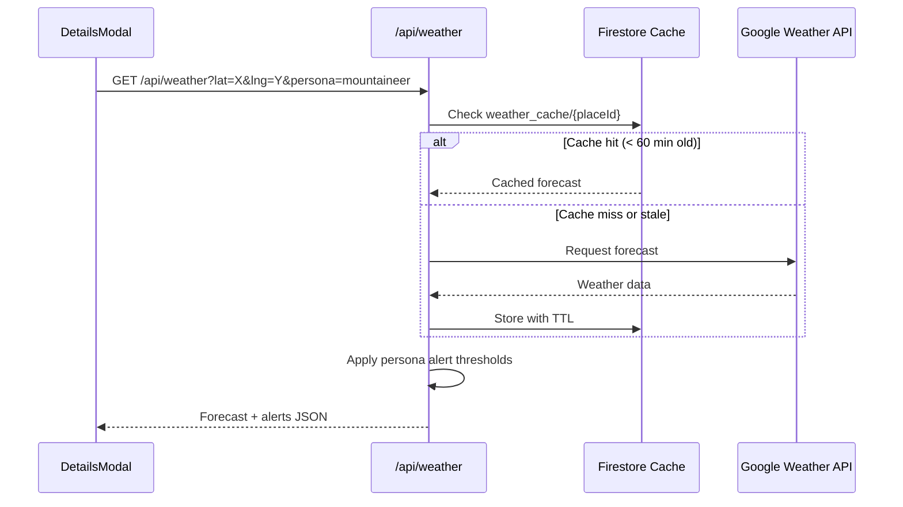

| Task | Priority | Details |
| --- | --- | --- |
| Create `/api/weather` server route | P0 | Accepts lat/lng/persona, returns forecast + alerts |
| Implement Firestore weather caching | P0 | TTL-based cache (60 min default) to reduce API costs |
| Integrate weather in DetailsModal | P0 | Replace static `weatherNotes` object with live data |
| Persona-specific alert thresholds | P1 | Different warning levels per persona (see table below) |
| Weather overlay on MapView | P1 | Optional layer showing conditions at marker locations |
| Sunrise/sunset display | P2 | Show daylight hours for route planning |

**Weather Alert Thresholds by Persona:**

| Condition | Mountaineer | Hiker | Trail Runner | Cyclist |
| --- | --- | --- | --- | --- |
| Wind (km/h) | >40 warn | >50 warn | >30 warn | >25 warn |
| Rain (mm/h) | >5 warn | >10 warn | >8 warn | >5 warn |
| Temp low (C) | <-5 warn | <0 warn | <-3 warn | <2 warn |
| Temp high (C) | >35 warn | >35 warn | >30 warn | >38 warn |
| Visibility (km) | <1 STOP | <2 warn | <2 warn | <3 warn |
| Lightning | STOP | STOP | STOP | STOP |
| UV Index | >8 warn | >8 warn | >8 warn | >8 warn |

### 5.4 Phase 2: Multi-Persona Route Intelligence

**Goal:** Make route discovery, scoring, and detail views persona-aware with different algorithms and UI per activity type.

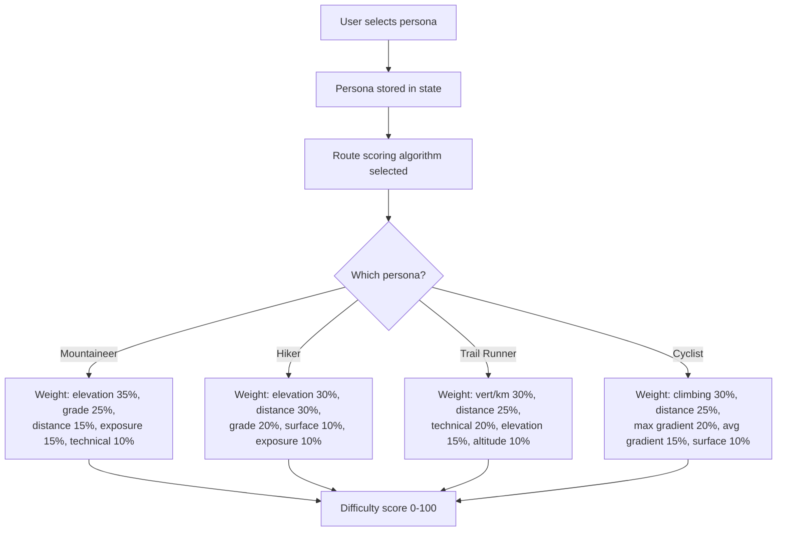

| Task | Priority | Details |
| --- | --- | --- |
| Add persona selector in header/onboarding | P0 | `mountaineer` / `hiker` / `trail_runner` / `cyclist` |
| Persona-specific difficulty scoring algorithm | P0 | Different weights per formula above |
| Persona-specific DetailsModal sections | P1 | Different stats, gear, and briefing content per persona |
| Trail runner: estimated finish time calculator | P1 | Based on distance, vert, user fitness data |
| Cyclist: gradient analysis with power zones | P1 | Average/max grade, expected power output |
| Mountaineer: acclimatization calculator | P2 | Based on summit elevation and user history |

**Difficulty Scoring Formulas:**

```
MOUNTAINEER:
  score = (elevation_gain * 0.35) + (max_grade * 0.25) +
          (distance * 0.15) + (exposure * 0.15) + (technical * 0.10)

HIKER:
  score = (elevation_gain * 0.30) + (distance * 0.30) +
          (max_grade * 0.20) + (trail_surface * 0.10) + (exposure * 0.10)

TRAIL RUNNER:
  score = (vert_per_km * 0.30) + (distance * 0.25) +
          (technical * 0.20) + (elevation_gain * 0.15) + (altitude * 0.10)

CYCLIST:
  score = (total_climbing * 0.30) + (distance * 0.25) +
          (max_gradient * 0.20) + (avg_gradient * 0.15) + (surface * 0.10)
```

### 5.5 Phase 3: Firebase Auth + User Profiles

**Goal:** Persistent user accounts with saved adventures, preferences, fitness history, and server-managed device tokens.

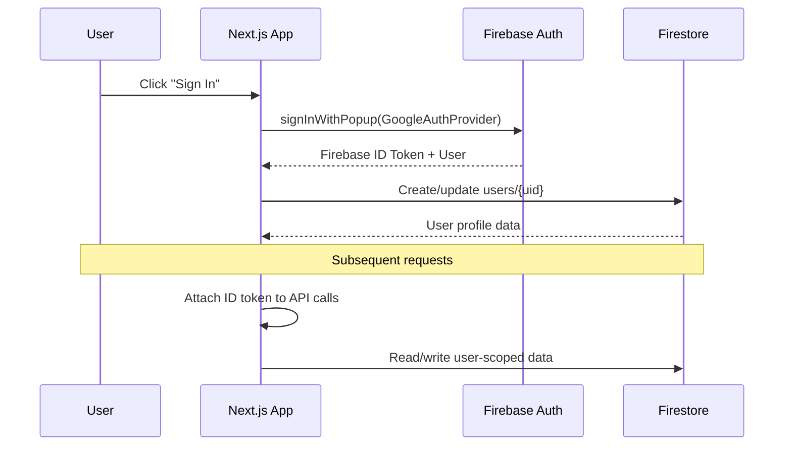

| Task | Priority | Details |
| --- | --- | --- |
| Firebase Auth integration (email + Google) | P0 | Sign up, sign in, password reset flows |
| User profile Firestore schema | P0 | Persona, fitness level, preferences |
| Saved routes / favorites | P1 | Bookmark routes, mountains, campsites |
| Activity history in Firestore | P1 | Move from localStorage to user-scoped collection |
| Server-managed Strava token lifecycle | P0 | Store tokens in Firestore, auto-refresh on expiry |
| User fitness dashboard | P2 | Weekly volume, elevation trends, HR zones |

### 5.6 Phase 4: Advanced Fitness Readiness Engine

**Goal:** Compare user fitness data against route demands and produce actionable readiness scores with training gap analysis.

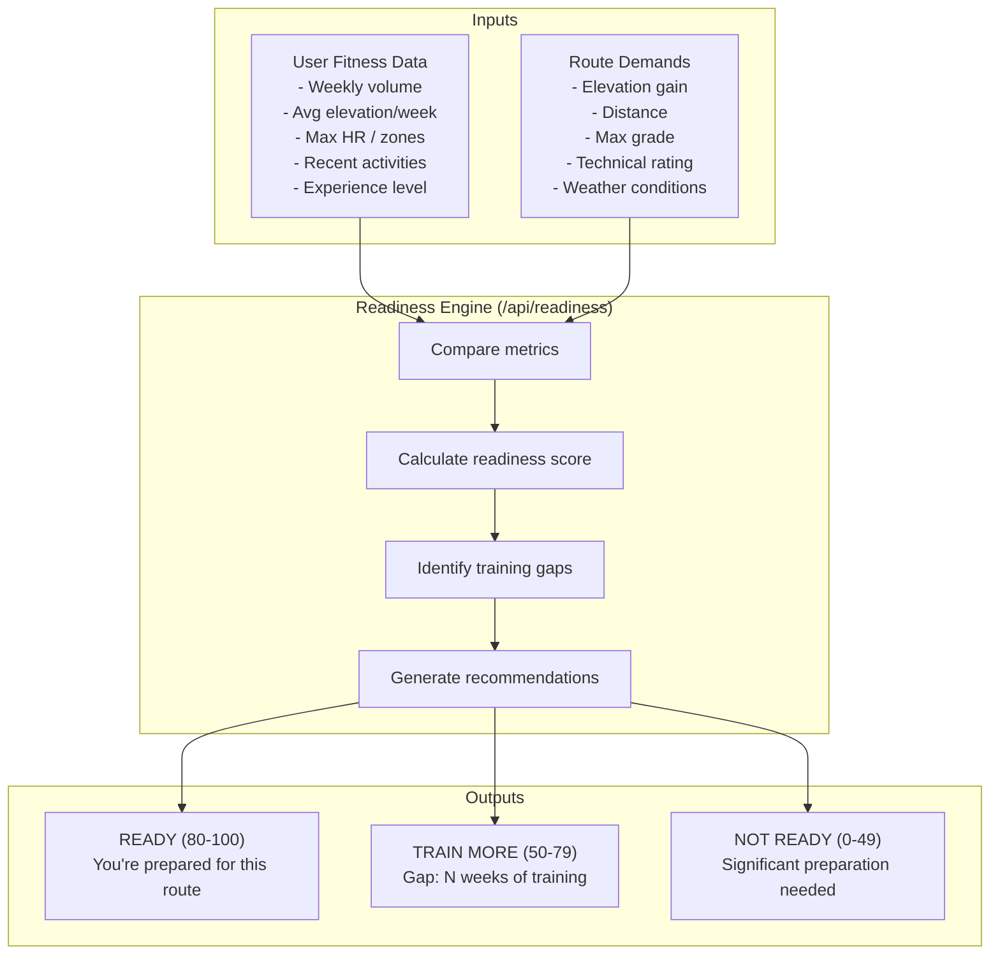

| Task | Priority | Details |
| --- | --- | --- |
| Readiness scoring API (`/api/readiness`) | P0 | Compare fitness metrics vs route demands |
| Training volume analysis | P1 | Weekly distance, elevation, time trends |
| Gap analysis with training plan | P1 | "You need X more weeks at Y volume" |
| Heart rate zone analysis | P2 | Zone distribution from Strava activities |
| Experience-based scoring | P2 | Adjust readiness by similar past activities |

### 5.7 Phase 5: Intelligent AI Assistant

**Goal:** Make the chat assistant context-aware with route, weather, and fitness data grounding.

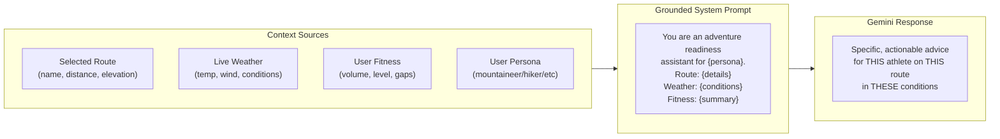

| Task | Priority | Details |
| --- | --- | --- |
| Route-grounded prompts | P0 | Pass current route details to Gemini context |
| Weather-grounded prompts | P0 | Include live weather in assistant context |
| Fitness-grounded prompts | P1 | Include user fitness summary in context |
| Persona-specific system prompt | P1 | Different advice style per persona |
| Suggested questions | P2 | Pre-built questions based on selected route |
| Multi-turn session memory | P2 | Assistant remembers conversation context |

**Enhanced System Prompt Template:**

```
You are an adventure readiness assistant for a {persona_type}.

Current route: {route_name}
- Distance: {distance} km
- Elevation gain: {elevation} m
- Difficulty: {difficulty_score}/100
- Technical rating: {technical_rating}

Current weather at route location:
- Temperature: {temperature}C (feels like {feels_like}C)
- Wind: {wind_speed} km/h from {wind_direction}
- Conditions: {conditions}
- Visibility: {visibility} km

User fitness level: {fitness_level}
- Weekly volume: {weekly_km} km
- Weekly elevation: {weekly_elevation} m
- Readiness score: {readiness_score}/100

Give specific, actionable advice for this athlete and this route
in current conditions. Be concise and safety-conscious.
```

### 5.8 Phase 6: Performance and Scale Optimization

**Goal:** Production-grade performance for real user traffic with optimized bundle sizes and API cost management.

| Task | Priority | Details |
| --- | --- | --- |
| Extract `usePlacesData()` hook from page.tsx | P0 | Reduce 1200-line monolith, improve maintainability |
| Extract `useActivities()` hook | P0 | Separate activity management logic |
| Extract `useWeather()` hook | P1 | Centralize weather data fetching and caching |
| Memoize Google Maps service instances | P1 | Single PlacesService/ElevationService, reuse across fetches |
| Replace `Math.random()` with seeded PRNG | P1 | Deterministic Strava segment mock data |
| Replace raw `` with `next/image` | P1 | Automatic lazy loading, WebP conversion, srcset |
| Dynamic imports for DetailsModal | P2 | Code-split heavy modal component (~100KB) |
| Firestore query indexes | P2 | Composite indexes for user data queries |
| Edge caching for weather API | P2 | Vercel edge config for weather responses |

---

## 6. Technical Architecture (Target State)

### 6.1 Full System Architecture

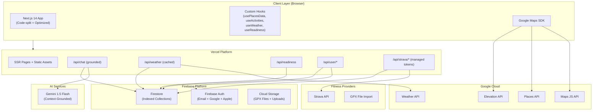

### 6.2 Data Model (Firestore Collections)

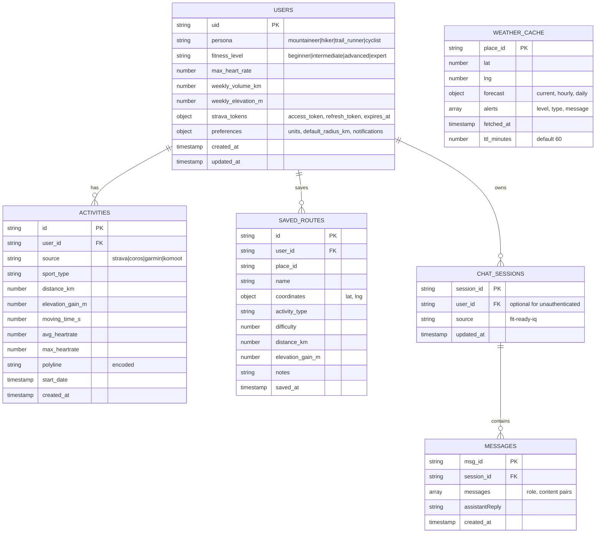

### 6.3 Environment Variables (Complete)

| Variable | Scope | Required | Phase | Description |
| --- | --- | --- | --- | --- |
| `NEXT_PUBLIC_GOOGLE_MAPS_API_KEY` | Client + Server | Yes | 0 | Google Maps JS API key (browser-restricted) |
| `GOOGLE_WEATHER_API_KEY` | Server only | Yes | 1 | Google Weather API key |
| `GEMINI_API_KEY` | Server only | Yes | 0 | Gemini AI API key |
| `FIREBASE_PROJECT_ID` | Server only | Yes | 0 | GCP/Firebase project identifier |
| `FIREBASE_SERVICE_ACCOUNT_KEY_JSON` | Server only | Recommended | 0 | Service account JSON string |
| `FIREBASE_CLIENT_EMAIL` | Server only | Alternative | 0 | Service account email |
| `FIREBASE_PRIVATE_KEY` | Server only | Alternative | 0 | Service account private key |
| `STRAVA_CLIENT_ID` | Server only | Yes | 0 | Strava OAuth application client ID |
| `STRAVA_CLIENT_SECRET` | Server only | Yes | 0 | Strava OAuth application client secret |

---

## 7. Persona-Specific Feature Matrix

| Feature | Mountaineer | Hiker | Trail Runner | Cyclist |
| --- | --- | --- | --- | --- |
| Elevation profile | Yes | Yes | Yes | Yes |
| Summit/jumpoff data | Yes | Yes | No | No |
| Gradient analysis | Yes | Lite | Lite | Full |
| Weather alerts | Yes | Yes | Yes | Yes |
| Wind overlay | No | No | Lite | Full |
| Strava segments | Yes | Yes | Yes | Yes |
| Estimated time | Yes | Yes | Yes | Yes |
| Power zone estimate | No | No | No | Yes |
| Technical grade | Yes | Lite | Yes | Lite |
| Acclimatization calc | Yes | No | No | No |
| Aid station planning | No | No | Yes | Lite |
| Gear checklist | Yes | Yes | Lite | Lite |
| Night riding/running | No | No | Yes | Yes |
| Campsite discovery | Yes | Yes | No | Yes |
| Water source mapping | Yes | Yes | Yes | Lite |

---

## 8. Google API Integration Details

### 8.1 Maps JavaScript API (Current)

**Purpose:** Map rendering, marker placement, user location detection, map interactions.

**Usage Pattern:** Loaded once via `useJsApiLoader` hook. Map instance reused throughout session.

### 8.2 Places API (Current)

**Purpose:** Route, mountain, and campsite discovery via `textSearch` and `nearbySearch`.

**Optimization Strategy:**
- Deduplicate results across query terms by `place_id`
- Batch related searches to minimize round trips
- Cache `place_id` results in component state for session duration

### 8.3 Elevation API (Current)

**Purpose:** Real summit elevations, jumpoff elevations, route base elevations, and elevation profile data.

**Optimization Strategy:**
- Batch up to 512 locations per request (API maximum)
- Cache elevation results by `place_id` in component state
- Request elevation data only when detail modal opens (lazy loading)

### 8.4 Weather API (Phase 1)

**Purpose:** Live weather forecasts with current conditions, hourly breakdowns, daily summaries, and safety alerts.

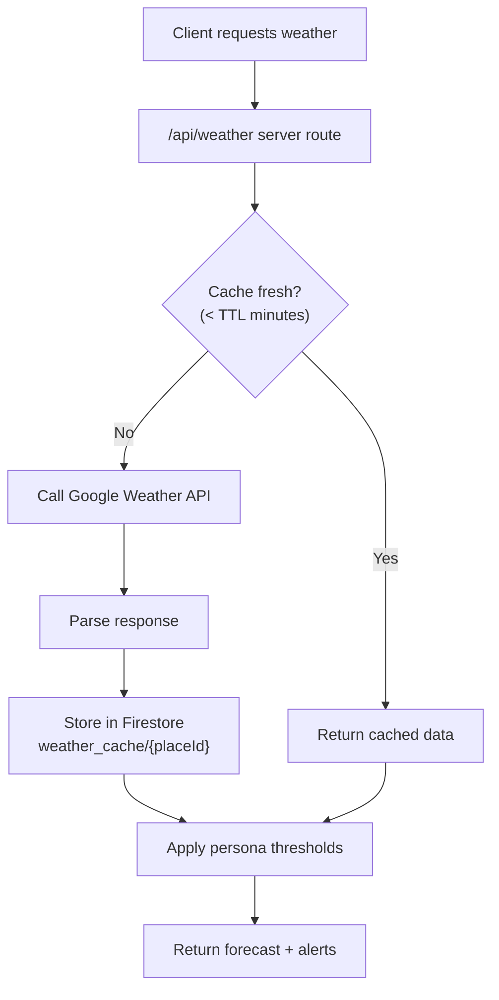

**Response Shape:**

```json
{
  "temperature_c": 18,
  "feels_like_c": 15,
  "humidity_pct": 65,
  "wind_speed_kmh": 22,
  "wind_direction": "NW",
  "conditions": "Partly cloudy",
  "precipitation_mm": 0,
  "uv_index": 6,
  "visibility_km": 15,
  "sunrise": "05:42",
  "sunset": "18:15",
  "hourly_forecast": [],
  "alerts": [
    { "type": "wind", "severity": "warning", "message": "..." }
  ],
  "persona_warnings": {
    "mountaineer": [],
    "hiker": [],
    "trail_runner": ["High UV -- carry sun protection"],
    "cyclist": ["Headwind NW 22km/h on exposed sections"]
  }
}
```

---

## 9. Key Risks and Mitigations

| Risk | Impact | Likelihood | Mitigation Strategy |
| --- | --- | --- | --- |
| Google Maps API cost overrun | High bills from Places/Elevation calls | Medium | Cache aggressively in Firestore, batch elevation calls, set billing alerts in Cloud Console |
| npm dependency vulnerabilities | Security exposure, potential data breach | High (current) | Upgrade next to 14.2.x, run `npm audit fix`, scheduled quarterly dependency reviews |
| Client-side Strava token storage | Token theft via XSS attack | Medium | Phase 3: Move to server-managed tokens in Firestore with auto-refresh |
| Large page.tsx monolith | Slow development velocity, merge conflicts | Low | Phase 6: Extract custom hooks (`usePlacesData`, `useActivities`) |
| Weather API rate limits | Degraded UX during high traffic | Low | Firestore TTL cache (60 min default), graceful fallback to static weather notes |
| Firebase cold starts on Vercel | Slow first request after idle period | Medium | Firebase Admin singleton pattern, consider function warming with cron |
| Gemini API quota exhaustion | Chat assistant unavailable | Low | Rate limit in route (max 15 RPM free tier), upgrade plan for production |

---

## 10. Quality Gates

Every phase must pass these gates before merging to the `main` branch:

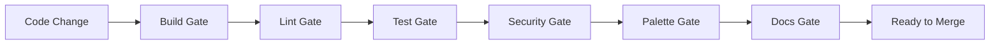

| Gate | Check | Tool | Threshold |
| --- | --- | --- | --- |
| Build | `npm run build` passes | Next.js compiler | Zero errors |
| Lint | `npm run lint` passes | ESLint | Zero errors |
| Tests | `npm run test:unit` passes | Vitest | All tests green |
| Security | `npm audit --audit-level=high` | npm audit | No new high/critical |
| Types | No untyped `any` without justification | TypeScript strict | Zero violations |
| Secrets | No hardcoded keys in tracked files | grep + code review | Zero findings |
| Docs | SOLUTION-PLAN.md updated for arch changes | Manual review | Current and accurate |
| Palette | All Tailwind uses `slate-*` | grep for `gray-` | Zero matches |

---

## 11. Success Metrics

| Metric | Current Baseline | Phase 1 Target | Phase 4 Target | Phase 6 Target |
| --- | --- | --- | --- | --- |
| Time to first map render | ~3s | < 2s | < 2s | < 1.5s |
| Places API calls per session | ~50+ | < 30 (cached) | < 25 | < 20 |
| Chat response latency (p95) | ~2s | < 1.5s | < 1.5s | < 1s |
| Weather data freshness | Static (hardcoded) | < 60 min | < 30 min | < 30 min |
| Unit test count | 7 | 20+ | 35+ | 50+ |
| npm audit high/critical | 15 | 0 | 0 | 0 |
| Active personas supported | 1 (generic) | 2 (+ cyclist) | 4 (all) | 4 (optimized) |
| Lighthouse performance score | ~65 | > 75 | > 80 | > 90 |
| Bundle size (first load JS) | 187 KB | < 170 KB | < 160 KB | < 130 KB |

---

## 12. Deployment Architecture

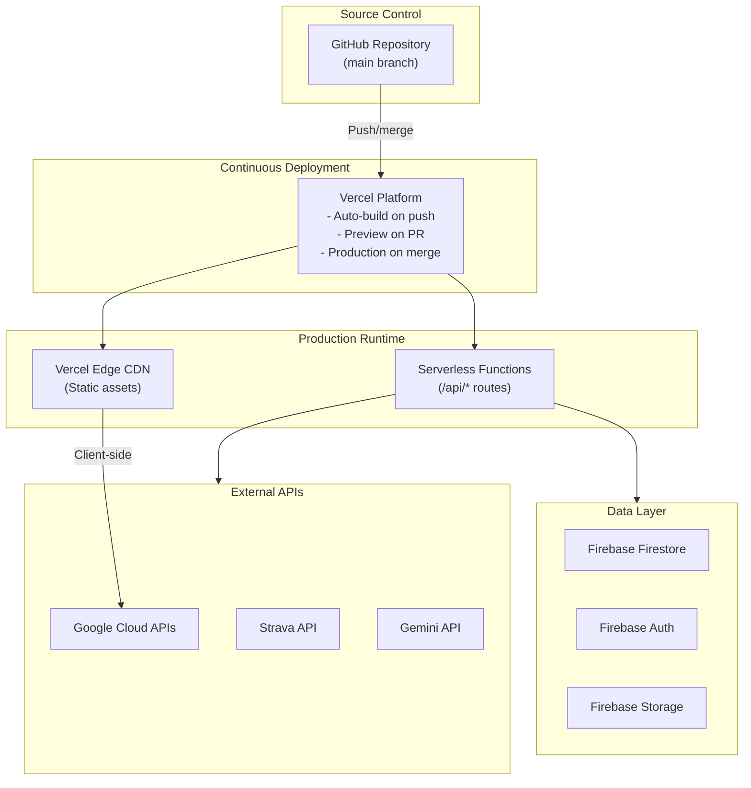

### 12.1 Environments

| Environment | Platform | Firebase Project | Trigger | Purpose |
| --- | --- | --- | --- | --- |
| Development | localhost:4790 | Emulators (Docker) | `npm run dev` | Local development with hot reload |
| Preview | Vercel preview URL | fit-ready-iq-dev | PR opened/updated | PR review and QA testing |
| Production | Custom domain | fit-ready-iq-prod | Push to `main` | Live users |

---

## 13. Implementation Priority Summary

```mermaid
flowchart LR
    subgraph Now["NOW (Phase 0)"]
        direction TB
        N1["Fix npm vulnerabilities"]
        N2["Server-managed Strava tokens"]
        N3[".env.example file"]
        N4["next/image migration"]
    end

    subgraph Next["NEXT (Phase 1-2)"]
        direction TB
        X1["Google Weather API"]
        X2["Live weather in modals"]
        X3["Persona selector"]
        X4["Persona-specific scoring"]
        X5["Estimated time calculators"]
    end

    subgraph Later["LATER (Phase 3-4)"]
        direction TB
        L1["Firebase Auth"]
        L2["User profiles"]
        L3["Saved routes"]
        L4["Readiness scoring API"]
        L5["Training gap analysis"]
    end

    subgraph Future["FUTURE (Phase 5-6)"]
        direction TB
        F1["Context-aware AI chat"]
        F2["Route-grounded prompts"]
        F3["Extract React hooks"]
        F4["Code-split components"]
        F5["Edge caching"]
    end

    Now --> Next --> Later --> Future
```

---

## 14. Governance

### 14.1 Decision Authority

Any architecture, deployment, or feature decision must:
1. Update **this solution plan** first (source of truth)
2. Update derived docs (`ARCHITECTURE.md`, `DEPLOYMENT.md`, `API.md`, `SECURITY.md`) to remain consistent
3. Go through PR review -- no direct pushes to `main` for feature work

### 14.2 Change Categories

| Category | Requires | Examples |
| --- | --- | --- |
| Bug fix | PR review | Fix type error, handle edge case |
| Feature | PR review + solution plan update | New server route, new component |
| Architecture change | PR review + solution plan update + ADR | New data model, new external service |
| Security change | PR review + solution plan update + security review | New secret, auth flow change |
| Dependency update | PR review + audit check | Upgrade Next.js, add new package |

### 14.3 Documentation Cascade

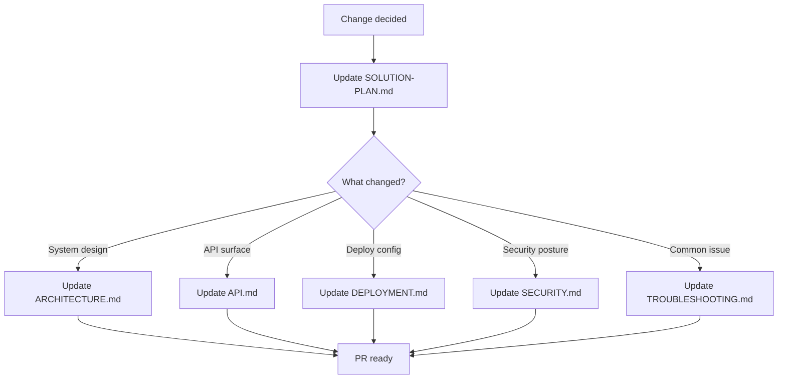
