# Fit-Ready-IQ Solution Plan

**Version:** 2026-08-12
**Status:** Active — source of truth for all development. Reconciled with ADR-0003 and ADR-0004 as of this revision (see Section 6.2); the prior revision (2026-06-27) predated both and had drifted out of sync with them for roughly five weeks — see ADR-0005 for the process fix.
**Repository:** [Fit-Ready-IQ](https://github.com/Oweeboi011/Fit-Ready-IQ)

---

## 1. Purpose

This document is the **master plan** for Fit-Ready-IQ. Every architectural decision, feature roadmap item, enhancement, and optimization flows from here. All other documentation (`docs/wiki/ARCHITECTURE.md`, `DEPLOYMENT.md`, `API.md`, `SECURITY.md`, `CODE-QUALITY.md`, `DATA.md`, `AI.md`, `USER-FLOW.md`, and `docs/adr/`) derives from this plan and must remain consistent with it.

This plan defines:
- Who the product serves and what problems it solves
- What is implemented today (as-is baseline)
- What quality harnesses are in place (CI/CD, testing, security)
- What enhancements and optimizations are planned (phase-by-phase)
- How the architecture evolves to support each phase
- Data models, API contracts, and integration details
- Known risks, challenges, and mitigations

**Governance Rule:** Any architecture, deployment, or feature decision must update this plan first. Other docs are updated to reflect changes defined here.

---

## 2. Product Vision

Fit-Ready-IQ is the definitive adventure readiness platform for serious outdoor athletes. It combines geographic intelligence, weather data, fitness tracking, and AI-powered guidance to help athletes assess their readiness for any route or challenge.

### 2.1 Problem Statement

Outdoor athletes today face a fragmented planning experience:
- Route information is scattered across multiple apps (AllTrails, Komoot, Strava)
- Weather data requires separate lookups with no activity-specific context
- Fitness readiness assessment is entirely manual and subjective
- Gear recommendations are generic, not tied to specific route conditions
- No unified view connecting route demands, weather conditions, and personal fitness

Fit-Ready-IQ solves this by unifying all adventure planning data into a single intelligent platform with persona-specific insights.

### 2.2 Target Users

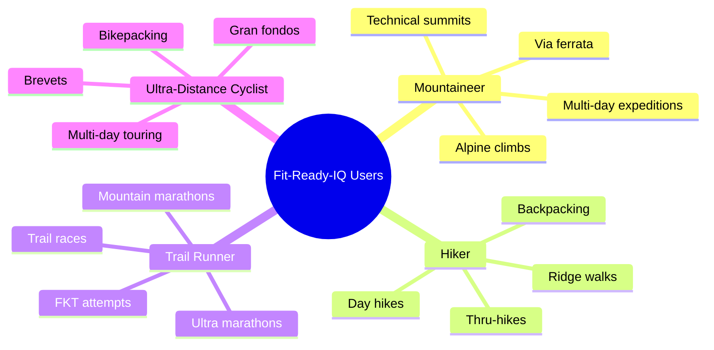
```mermaid
mindmap
  root((Fit-Ready-IQ Users))
    Mountaineer
      Alpine climbs
      Multi-day expeditions
      Technical summits
      Via ferrata
    Hiker
      Day hikes
      Backpacking
      Thru-hikes
      Ridge walks
    Trail Runner
      Trail races
      Ultra marathons
      FKT attempts
      Mountain marathons
    Ultra-Distance Cyclist
      Brevets
      Bikepacking
      Gran fondos
      Multi-day touring
```

### 2.3 Core Value Propositions

| Value | Description |
| --- | --- |
| **Know Before You Go** | Real elevation profiles, live weather, and difficulty scoring so athletes can assess readiness before committing to a route. |
| **Train Smarter** | Compare personal fitness data against route demands to identify gaps and build targeted training plans. |
| **Stay Safe** | Weather alerts, gear checklists, and condition briefings tailored to activity type, terrain, and persona. |
| **Plan Everything** | AI assistant that understands routes, weather, gear, and training to create complete adventure plans. |
| **Track Progress** | Unified activity history from all devices with performance trend analysis across all fitness providers. |

---

## 3. Target User Personas

### 3.1 The Mountaineer

**Profile:** Experienced climber tackling alpine environments, high-altitude summits, and technical terrain.

| Attribute | Details |
| --- | --- |
| Key needs | Summit elevation, jumpoff-to-summit profiles, technical grade, weather windows, acclimatization guidance |
| Critical data | Elevation gain/loss, exposure rating, snow/ice conditions, sunrise/sunset, temperature at altitude |
| Activity types | Alpine climb, scramble, expedition, via ferrata |
| Safety concerns | Lightning, hypothermia, altitude sickness, rockfall, whiteout conditions |
| Unique features | Acclimatization calculator, exposure risk assessment, summit weather windows |

### 3.2 The Hiker

**Profile:** Recreational to avid hiker exploring trails ranging from day hikes to multi-week thru-hikes.

| Attribute | Details |
| --- | --- |
| Key needs | Trail discovery, distance/elevation filtering, campsite locations, water sources, trail surface type |
| Critical data | Trail distance, total ascent/descent, difficulty rating, trail surface, estimated time |
| Activity types | Day hike, backpacking, thru-hike, ridge walk, loop trail |
| Safety concerns | Dehydration, navigation errors, weather changes, wildlife encounters |
| Unique features | Campsite discovery, water source mapping, trail surface ratings |

### 3.3 The Trail Runner

**Profile:** Competitive or recreational runner on technical terrain, from short trail races to 100+ mile ultras.

| Attribute | Details |
| --- | --- |
| Key needs | Technical trail profiles, aid station planning, cutoff time calculators, race-day weather forecasts |
| Critical data | Distance, vertical gain per km, technical rating, terrain type, estimated finish time |
| Activity types | Trail run, ultra marathon, FKT attempt, mountain marathon |
| Safety concerns | Overexertion, heat illness, night navigation, hypothermia at altitude |
| Unique features | Estimated finish time calculator, vert-per-km analysis, aid station planning |

### 3.4 The Ultra-Distance Cyclist

**Profile:** Endurance cyclist covering extreme distances across varied terrain, from paved roads to gravel.

| Attribute | Details |
| --- | --- |
| Key needs | Route profiles with gradient analysis, wind/weather forecasts, resupply planning, night riding conditions |
| Critical data | Distance, total climbing, average/max gradient, road surface, wind direction/speed |
| Activity types | Brevet, bikepacking, gran fondo, multi-day touring, gravel racing |
| Safety concerns | High-speed descents, crosswinds, hypothermia during night riding, traffic |
| Unique features | Gradient analysis with power zones, headwind/tailwind forecasting, resupply point mapping |

---

## 4. Current State (As-Is Baseline)

### 4.1 Runtime Architecture

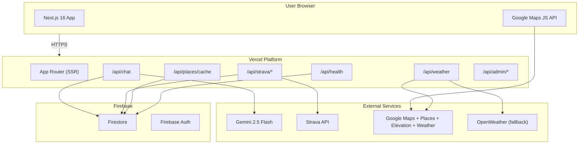
```mermaid
graph TB
    subgraph Client["User Browser"]
        NextApp["Next.js 16 App"]
        MapsSDK["Google Maps JS API"]
    end

    subgraph Vercel["Vercel Platform"]
        SSR["App Router (SSR)"]
        ChatRoute["/api/chat"]
        WeatherRoute["/api/weather"]
        StravaRoutes["/api/strava/*"]
        PlacesRoute["/api/places/cache"]
        HealthRoute["/api/health"]
        AdminRoutes["/api/admin/*"]
    end

    subgraph External["External Services"]
        Gemini["Gemini 2.5 Flash"]
        Strava["Strava API"]
        Google["Google Maps + Places + Elevation + Weather"]
        OpenWeather["OpenWeather (fallback)"]
    end

    subgraph Firebase["Firebase"]
        Firestore["Firestore"]
        Auth["Firebase Auth"]
    end

    Client -->|HTTPS| Vercel
    MapsSDK --> Google
    ChatRoute --> Gemini
    ChatRoute --> Firestore
    WeatherRoute --> Google
    WeatherRoute --> OpenWeather
    StravaRoutes --> Strava
    StravaRoutes --> Firestore
    PlacesRoute --> Firestore
    HealthRoute --> Firestore
```

### 4.2 CI/CD Quality Harness (Completed 2026-06-27)

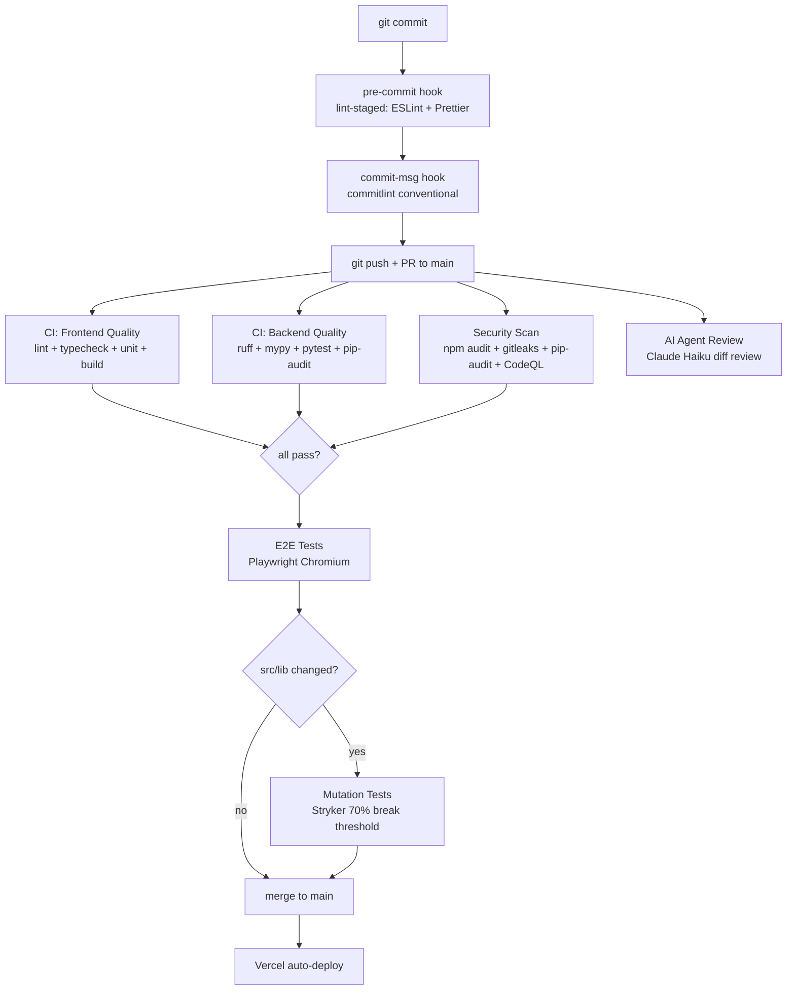
```mermaid
flowchart TD
    A[git commit] --> B[pre-commit hook\nlint-staged: ESLint + Prettier]
    B --> C[commit-msg hook\ncommitlint conventional]
    C --> D[git push + PR to main]
    D --> E[CI: Frontend Quality\nlint + typecheck + unit + build]
    D --> F[CI: Backend Quality\nruff + mypy + pytest + pip-audit]
    D --> G[Security Scan\nnpm audit + gitleaks + pip-audit + CodeQL]
    D --> H[AI Agent Review\nClaude Haiku diff review]
    E --> J{all pass?}
    F --> J
    G --> J
    J --> K[E2E Tests\nPlaywright Chromium]
    K --> L{src/lib changed?}
    L -->|yes| M[Mutation Tests\nStryker 70% break threshold]
    L -->|no| N[merge to main]
    M --> N
    N --> O[Vercel auto-deploy]
```

### 4.3 Implemented Features

| Feature | Status | Component | Details |
| --- | --- | --- | --- |
| Interactive map exploration | Done | `MapView.tsx` | Google Maps with custom markers for mountains, routes, campsites |
| Route/mountain detail modal | Done | `DetailsModal.tsx` | Elevation profiles, photos, gear recommendations. Strava segments were removed — they were generated from the place name, not real segment data; see ADR-0004. |
| Live weather in details | Done | `DetailsModal.tsx` | Google Weather API with OpenWeather fallback |
| Strava OAuth + activity sync | Done | `ConnectDevicesModal.tsx` | Server-side token exchange, client-side activity display |
| GPX file import | Done | `ConnectDevicesModal.tsx` | Drag-and-drop for COROS, Garmin, Komoot exports |
| AI chat assistant | Done | `ChatBot.tsx` | Gemini-backed with Firestore session persistence |
| Places grid cache | Done | `/api/places/cache` | 0.5° grid cells, 24 h TTL, shared across users |
| Aggregate health endpoint | Done | `/api/health` | Single endpoint checks all integrations |
| Admin cache management | Done | `/api/admin/cache` | Inspect / purge places cache (batch 400 docs) |
| Admin Strava sync | Done | `/api/admin/strava-sync` | Sync status across users |
| Saved places hook | Done | `useSavedPlaces.ts` | Real-time Firestore listener, toggle save |
| Route filtering | Done | `RouteFilter.tsx` | Activity type, difficulty, distance, elevation filters |
| Activity history with polylines | Done | `ConnectDevicesModal.tsx` | Source badges, polyline overlay on map |
| Campsite discovery | Done | `page.tsx` | Google Places nearbySearch for campsites |
| Elevation profile visualization | Done | `DetailsModal.tsx` | Komoot-style SVG with grade-based color segments |
| Photo galleries | Done | `DetailsModal.tsx` | Google Places photos in detail views |
| CI/CD quality harness | Done | `.github/workflows/` | 5 workflows: CI, E2E, mutation, security, AI review |
| Pre-commit hooks | Done | `.husky/` | lint-staged + commitlint, trunk-based branch flow |
| Dependabot | Done | `.github/dependabot.yml` | npm, pip, github-actions — weekly PRs to main |
| Unit test suite | Done | `src/frontend/src/lib/*.test.ts` | gpxParser, polylineDecoder, activityTypes, useSavedPlaces |

### 4.4 Technology Stack

| Layer | Technology | Purpose |
| --- | --- | --- |
| Frontend | Next.js 16, TypeScript, Tailwind CSS (`slate-*`) | App shell and UI rendering |
| Maps | Google Maps JS API, Places API, Elevation API | Geographic data and visualization |
| AI | Gemini 2.5 Flash | Conversational chat assistant |
| Data | Firebase Firestore | Chat persistence, places cache, saved places |
| Auth | Firebase Auth (partial — Google sign-in in firebaseClient) | User identity management |
| Storage | Firebase Storage (planned Phase 3) | GPX files, user uploads |
| Device Sync | Strava OAuth, GPX import | Activity data integration |
| Hosting | Vercel | Frontend + serverless functions |
| Local Dev | Docker Compose + Firebase Emulators | Offline development environment |
| CI | GitHub Actions (5 workflows) | Quality gates on every PR |
| Testing | Vitest, Playwright, Stryker, Autocannon | Unit, E2E, mutation, load |
| Pre-commit | Husky, lint-staged, commitlint | Code quality before push |

### 4.5 Active Server Routes

| Route | Method | Purpose | Timeout |
| --- | --- | --- | --- |
| `/api/chat` | POST | Gemini AI chat with Firestore persistence | 30 s |
| `/api/weather` | GET | Google Weather → OpenWeather fallback | 15 s |
| `/api/health` | GET | Aggregate health check for all integrations | 15 s |
| `/api/strava/exchange` | POST | OAuth authorization code → token | — |
| `/api/strava/activities` | GET | Fetch athlete activities from Strava | — |
| `/api/strava/sync` | POST | Admin: sync Strava activities → Firestore | 60 s |
| `/api/places/cache` | GET | Grid-based places cache (0.5° cells, 24 h TTL) | 15 s |
| `/api/admin/cache` | GET/DELETE | Inspect / purge places cache | 30 s |
| `/api/admin/strava-sync` | GET | Strava sync status across users | — |

---

## 5. Enhancement Roadmap

### 5.1 Phase Overview

```mermaid
gantt
    title Fit-Ready-IQ Enhancement Roadmap
    dateFormat YYYY-MM
    axisFormat %b %Y

    section Foundation
        Phase 0: Hardening & CI/CD             :done, p0, 2026-06, 2026-07

    section Intelligence Layer
        Phase 1: Weather API                   :active, p1, 2026-07, 2026-08
        Phase 2: Persona Route Intelligence    :p2, 2026-08, 2026-09

    section Platform Layer
        Phase 3: Auth & User Profiles          :p3, 2026-09, 2026-10
        Phase 4: Readiness Engine              :p4, 2026-10, 2026-12

    section Optimization Layer
        Phase 5: Intelligent AI Assistant      :p5, 2026-12, 2027-01
        Phase 6: Performance & Scale           :p6, 2027-01, 2027-02
```

### 5.2 Phase 0: Foundation Hardening (Completed + Remaining)

**Goal:** Stabilize the existing codebase, establish quality harnesses, fix security gaps, update documentation, remove technical debt.

#### Completed

| Task | Completed | Details |
| --- | --- | --- |
| Remove Azure deployment artifacts | 2026-06 | Deleted azure.yaml, infra/, .dockerignore, frontend/Dockerfile |
| Update all documentation | 2026-06 | Rewritten with Mermaid diagrams and detailed content |
| Live weather endpoint | 2026-06 | `/api/weather` — Google Weather primary, OpenWeather fallback |
| Aggregate health endpoint | 2026-06 | `/api/health` — all integrations checked in one call |
| Strava admin sync + cache admin | 2026-06 | `/api/strava/sync`, `/api/admin/*` endpoints |
| CI/CD quality harness | 2026-06-27 | 5 GitHub Actions workflows (CI, E2E, mutation, security, AI review) |
| Branch flow: feature -> develop -> main | 2026-08-12 | `develop` is the integration branch every feature PR targets; `main` only receives release PRs from `develop`, merged with a real merge commit (never squash — squashing breaks the shared history and causes spurious conflicts on the next release). Superseded an earlier trunk-based `feature/* → main` flow adopted 2026-06-27. |
| Pre-commit hooks | 2026-06-27 | Husky: lint-staged (ESLint + Prettier) + commitlint (Conventional Commits) |
| Dependabot | 2026-06-27 | Weekly dependency PRs for npm, pip, github-actions |
| CODEOWNERS | 2026-06-27 | `@oweeboipenaranda` owns all files — enforces PR reviews |
| Unit test suite | 2026-06-27 | Vitest tests for gpxParser, polylineDecoder, activityTypes, useSavedPlaces |
| Mutation testing | 2026-06-27 | Stryker on src/lib/ files, break threshold 70%, high 80% |
| Security scanning | 2026-06-27 | npm audit + gitleaks + CodeQL + pip-audit |
| AI agent review | 2026-06-27 | Claude Haiku posts review comments on every PR |
| Shell injection fix (agent-review) | 2026-06-27 | `github.base_ref` moved to env var before git diff step |
| commit-msg hook path fix | 2026-06-27 | `realpath` before `cd frontend` prevents wrong COMMIT_EDITMSG path |
| pip-audit added to pyproject.toml | 2026-06-27 | `pip-audit = "^2.7"` in dev dependencies |
| CI env var deduplication | 2026-06-27 | 7 NEXT_PUBLIC_* vars moved to job-level `env:` in ci.yml |
| mutation.yml env var gap fixed | 2026-06-27 | Added 2 missing Firebase env vars to prevent init failure in Stryker runs |
| Stryker threshold raised | 2026-06-27 | break=70 (was 50), low=70 — was too permissive to be a meaningful gate |

#### Remaining (Phase 0)

| Task | Priority | Status | Details |
| --- | --- | --- | --- |
| Fix npm audit vulnerabilities | P0 | Done | Upgraded past 14.2.x to Next.js 16, resolving the tracked high/critical advisories (see `docs/wiki/SECURITY.md` Section 8.1 for the historical baseline). Only moderate-severity advisories remain, below the CI gate's `--audit-level=high` threshold. |
| Move Strava token from localStorage | P0 | Pending | Server-managed token lifecycle in Firestore — prevents XSS token theft |
| Add `.env.example` | P1 | Pending | Document all required environment variables for onboarding |
| Replace raw `` with `next/image` | P1 | Pending | Automatic optimization: lazy load, WebP, srcset |
| Remove unused dependencies | P1 | Pending | Audit and remove packages not imported anywhere |
| firebaseClient.ts test coverage | P2 | Pending | Currently excluded from coverage scope — needs mocking strategy |
| Raise coverage branch threshold | P2 | Pending | Currently 50% — should match statements/functions at 85% |

### 5.3 Phase 1: Google Weather API Integration

**Goal:** Replace hardcoded weather notes with live forecast data from Google Weather API, including persona-specific safety alerts.

> **Status:** `/api/weather` route is implemented. DetailsModal fetches live weather and caches it in a module-level in-memory object (30-minute TTL, per browser tab — see `docs/wiki/DATA.md` Section 5), not the Firestore-backed cache this diagram describes as target state. Persona-specific alert thresholds and weather overlay on the map are pending.

The diagram below is the **target** design (Firestore-backed, cross-tab cache); the arrow into a `weather_cache` collection has not been built — see "Firestore weather caching" in the task table as still Pending.

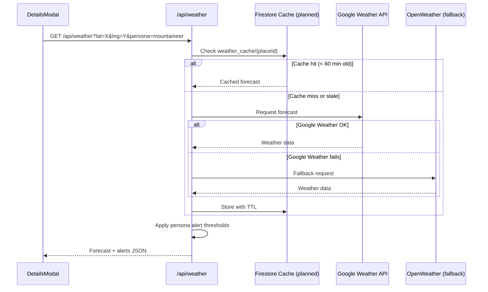
```mermaid
sequenceDiagram
    participant UI as DetailsModal
    participant Route as /api/weather
    participant Cache as Firestore Cache (planned)
    participant GW as Google Weather API
    participant OW as OpenWeather (fallback)

    UI->>Route: GET /api/weather?lat=X&lng=Y&persona=mountaineer
    Route->>Cache: Check weather_cache/{placeId}
    alt Cache hit (< 60 min old)
        Cache-->>Route: Cached forecast
    else Cache miss or stale
        Route->>GW: Request forecast
        alt Google Weather OK
            GW-->>Route: Weather data
        else Google Weather fails
            Route->>OW: Fallback request
            OW-->>Route: Weather data
        end
        Route->>Cache: Store with TTL
    end
    Route->>Route: Apply persona alert thresholds
    Route-->>UI: Forecast + alerts JSON
```

| Task | Priority | Status | Details |
| --- | --- | --- | --- |
| `/api/weather` server route | P0 | Done | Live with Google Weather + OpenWeather fallback |
| Integrate weather in DetailsModal | P0 | Done | Replaces static `weatherNotes` object |
| Firestore weather caching | P0 | Pending | TTL-based cache (60 min default) to reduce API costs |
| Persona-specific alert thresholds | P1 | Pending | Different warning levels per persona (see table below) |
| Weather overlay on MapView | P1 | Pending | Optional layer showing conditions at marker locations |
| Sunrise/sunset display | P2 | Pending | Show daylight hours for route planning |

**Weather Alert Thresholds by Persona:**

| Condition | Mountaineer | Hiker | Trail Runner | Cyclist |
| --- | --- | --- | --- | --- |
| Wind (km/h) | >40 warn | >50 warn | >30 warn | >25 warn |
| Rain (mm/h) | >5 warn | >10 warn | >8 warn | >5 warn |
| Temp low (°C) | <-5 warn | <0 warn | <-3 warn | <2 warn |
| Temp high (°C) | >35 warn | >35 warn | >30 warn | >38 warn |
| Visibility (km) | <1 STOP | <2 warn | <2 warn | <3 warn |
| Lightning | STOP | STOP | STOP | STOP |
| UV Index | >8 warn | >8 warn | >8 warn | >8 warn |

### 5.4 Phase 2: Multi-Persona Route Intelligence

**Goal:** Make route discovery, scoring, and detail views persona-aware with different algorithms and UI per activity type.

> **See ADR-0004** (`docs/adr/0004-routes-have-real-geometry.md`): this phase's difficulty-scoring formulas below assume route metrics (`elevation_gain`, `max_grade`, `technical`) that do not exist yet in a trustworthy form — today's "route" is a Places pin with driving-distance-to-trailhead and five scattered elevation probes standing in for real trail data. Persona-specific scoring should not be built on top of that; it needs ADR-0004's real-geometry Route model underneath it first, or it will just be persona-weighted fabrication.
>
> **Already substantially built, ahead of persona-awareness itself:** the GPX-based route-building workflow this phase would eventually need is largely done — waypoint planning and map click-to-add (`RoutePlanner.tsx`, `MapArea.tsx`), GPX export (`gpxBuilder.ts`, closes GitHub issue #24), and server-side route-snapping via the Google Routes API (`/api/directions`, closing the API-choice question in issues #21/#22). What is still purely local-device (`savedPlans.ts`, `localStorage`) rather than server-persisted is the gap GitHub issue #23 is asking to design — and ADR-0004's geometry model is the natural target shape for that persistence once built. See `docs/wiki/DEAD-CODE-AUDIT.md` for the full scaffolding inventory.

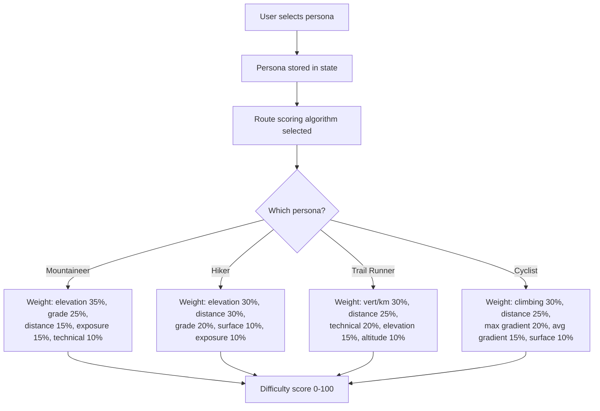
```mermaid
flowchart TD
    A["User selects persona"] --> B["Persona stored in state"]
    B --> C["Route scoring algorithm selected"]
    C --> D{"Which persona?"}
    D -->|Mountaineer| E["Weight: elevation 35%, grade 25%,<br/>distance 15%, exposure 15%, technical 10%"]
    D -->|Hiker| F["Weight: elevation 30%, distance 30%,<br/>grade 20%, surface 10%, exposure 10%"]
    D -->|Trail Runner| G["Weight: vert/km 30%, distance 25%,<br/>technical 20%, elevation 15%, altitude 10%"]
    D -->|Cyclist| H["Weight: climbing 30%, distance 25%,<br/>max gradient 20%, avg gradient 15%, surface 10%"]
    E --> I["Difficulty score 0-100"]
    F --> I
    G --> I
    H --> I
```

| Task | Priority | Status | Details |
| --- | --- | --- | --- |
| Route waypoint planning + map click-to-add | P0 | Done | `RoutePlanner.tsx`, `MapArea.tsx` |
| GPX export | P0 | Done | `gpxBuilder.ts` — closes GitHub issue #24 |
| Server-side route-snapping | P0 | Done | `/api/directions` via Google Routes API — closes issues #21/#22 |
| Server-persisted user-drawn routes | P0 | Pending | Currently `localStorage`-only (`savedPlans.ts`); GitHub issue #23. Target shape is ADR-0004's geometry model. |
| Add persona selector in header/onboarding | P0 | Pending | `mountaineer` / `hiker` / `trail_runner` / `cyclist` |
| Persona-specific difficulty scoring algorithm | P0 | Pending | Different weights per formula below — blocked on ADR-0004's real-geometry Route model landing first |
| Persona-specific DetailsModal sections | P1 | Pending | Different stats, gear, and briefing content per persona |
| Trail runner: estimated finish time calculator | P1 | Pending | Based on distance, vert, user fitness data |
| Cyclist: gradient analysis with power zones | P1 | Pending | Average/max grade, expected power output |
| Mountaineer: acclimatization calculator | P2 | Pending | Based on summit elevation and user history |

**Difficulty Scoring Formulas:**

```
MOUNTAINEER:
  score = (elevation_gain * 0.35) + (max_grade * 0.25) +
          (distance * 0.15) + (exposure * 0.15) + (technical * 0.10)

HIKER:
  score = (elevation_gain * 0.30) + (distance * 0.30) +
          (max_grade * 0.20) + (trail_surface * 0.10) + (exposure * 0.10)

TRAIL RUNNER:
  score = (vert_per_km * 0.30) + (distance * 0.25) +
          (technical * 0.20) + (elevation_gain * 0.15) + (altitude * 0.10)

CYCLIST:
  score = (total_climbing * 0.30) + (distance * 0.25) +
          (max_gradient * 0.20) + (avg_gradient * 0.15) + (surface * 0.10)
```

### 5.5 Phase 3: Firebase Auth + User Profiles

**Goal:** Persistent user accounts with saved adventures, preferences, fitness history, and server-managed device tokens.

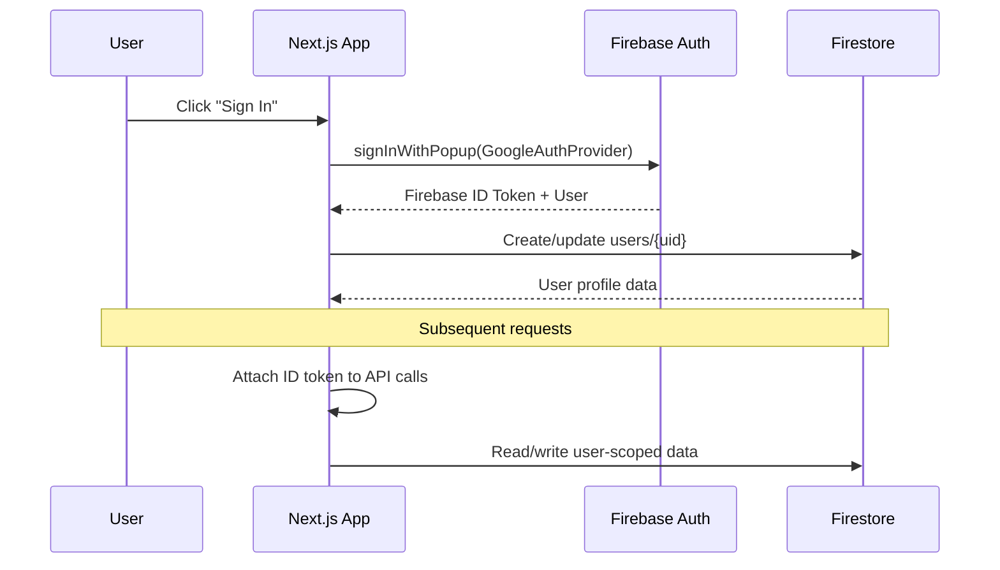
```mermaid
sequenceDiagram
    participant U as User
    participant App as Next.js App
    participant Auth as Firebase Auth
    participant FS as Firestore

    U->>App: Click "Sign In"
    App->>Auth: signInWithPopup(GoogleAuthProvider)
    Auth-->>App: Firebase ID Token + User
    App->>FS: Create/update users/{uid}
    FS-->>App: User profile data

    Note over U,FS: Subsequent requests
    App->>App: Attach ID token to API calls
    App->>FS: Read/write user-scoped data
```

| Task | Priority | Details |
| --- | --- | --- |
| Firebase Auth integration (email + Google) | P0 | Sign up, sign in, password reset flows |
| User profile Firestore schema | P0 | Persona, fitness level, preferences |
| Saved routes / favorites | P1 | Bookmark routes, mountains, campsites |
| Activity history in Firestore | P1 | Move from localStorage to user-scoped collection |
| Server-managed Strava token lifecycle | P0 | Store tokens in Firestore, auto-refresh on expiry |
| User fitness dashboard | P2 | Weekly volume, elevation trends, HR zones |

### 5.6 Phase 4: Advanced Fitness Readiness Engine

**Goal:** Compare user fitness data against route demands and produce actionable readiness scores with training gap analysis.

> **Status: a real version of this already ships today**, client-side — `computeReadiness()` in `src/frontend/src/lib/readiness.ts`, documented in `docs/wiki/AI.md` Section 3. It works differently from the design this section originally described: it is **limiter-gated, not weighted-averaged** — the overall score is the *worst* of three factors (longest recent outing, weekly volume, biggest recent climb), not a blended composite, because averaging would hide exactly the thing that turns someone back on a route. It runs entirely client-side against the last 8 weeks of activity data; there is no `/api/readiness` server route, and none of the diagram or task table below is built as originally envisioned. Training gap analysis and heart-rate zone analysis genuinely remain undone.

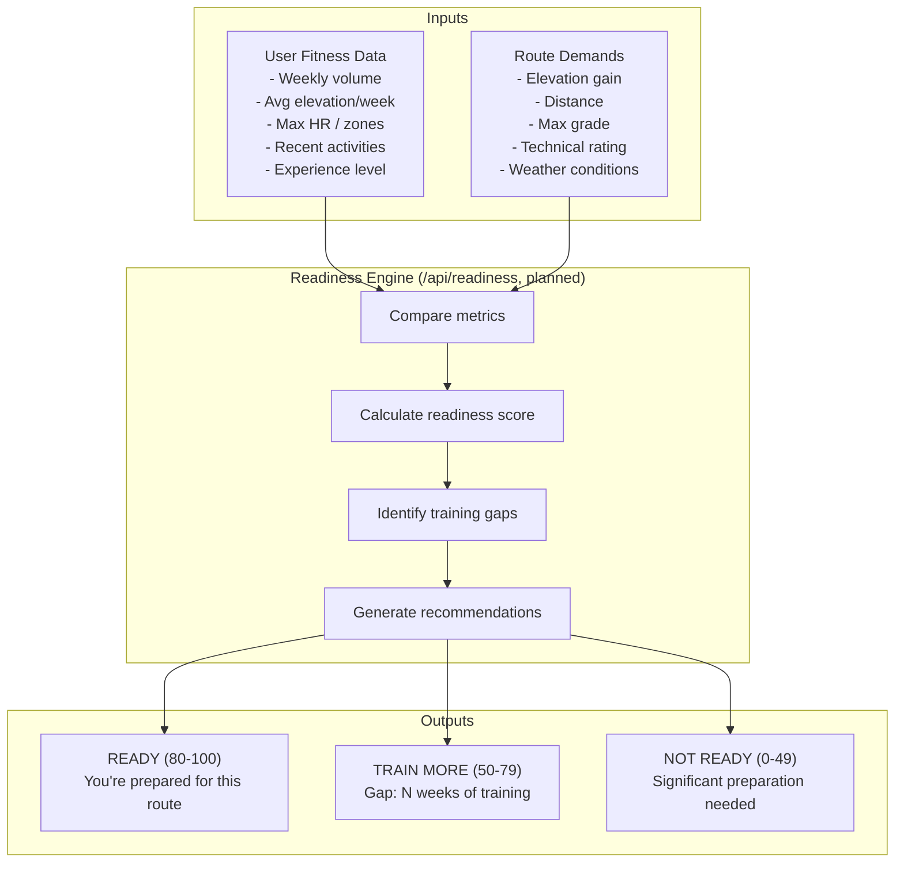
```mermaid
flowchart TD
    subgraph Inputs
        Fitness["User Fitness Data<br/>- Weekly volume<br/>- Avg elevation/week<br/>- Max HR / zones<br/>- Recent activities<br/>- Experience level"]
        Route["Route Demands<br/>- Elevation gain<br/>- Distance<br/>- Max grade<br/>- Technical rating<br/>- Weather conditions"]
    end

    subgraph Engine["Readiness Engine (/api/readiness, planned)"]
        Compare["Compare metrics"]
        Score["Calculate readiness score"]
        Gap["Identify training gaps"]
        Plan["Generate recommendations"]
    end

    subgraph Outputs
        Ready["READY (80-100)<br/>You're prepared for this route"]
        TrainMore["TRAIN MORE (50-79)<br/>Gap: N weeks of training"]
        NotReady["NOT READY (0-49)<br/>Significant preparation needed"]
    end

    Fitness --> Compare
    Route --> Compare
    Compare --> Score
    Score --> Gap
    Gap --> Plan
    Plan --> Ready
    Plan --> TrainMore
    Plan --> NotReady
```

| Task | Priority | Status | Details |
| --- | --- | --- | --- |
| Client-side readiness scoring | P0 | Done | `computeReadiness()`, limiter-gated across distance/volume/ascent factors, `unknown` state when there is no training data — see `docs/wiki/AI.md` Section 3 |
| Readiness scoring API (`/api/readiness`) | P1 | Pending | Only needed if scoring must be server-authoritative or cross-device; today's client-side version already answers the product's core question without one |
| Training volume analysis | P1 | Pending | Weekly distance, elevation, time trends |
| Gap analysis with training plan | P1 | Pending | "You need X more weeks at Y volume" |
| Heart rate zone analysis | P2 | Pending | Zone distribution from Strava activities |
| Experience-based scoring | P2 | Pending | Adjust readiness by similar past activities |

### 5.7 Phase 5: Intelligent AI Assistant

**Goal:** Make the chat assistant context-aware with route, weather, and fitness data grounding.

> **See `docs/wiki/AI.md`** for the full current-state chat implementation (Section 2) and this phase's status (Section 4) — none of it is built yet, and the context sources below should be re-evaluated against ADR-0003's Trip entity before work starts, since a Trip already carries route, weather window, and gear together.

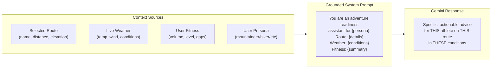
```mermaid
flowchart LR
    subgraph Context["Context Sources"]
        RouteCtx["Selected Route<br/>(name, distance, elevation)"]
        WeatherCtx["Live Weather<br/>(temp, wind, conditions)"]
        FitnessCtx["User Fitness<br/>(volume, level, gaps)"]
        PersonaCtx["User Persona<br/>(mountaineer/hiker/etc)"]
    end

    subgraph Prompt["Grounded System Prompt"]
        System["You are an adventure readiness<br/>assistant for {persona}.<br/>Route: {details}<br/>Weather: {conditions}<br/>Fitness: {summary}"]
    end

    subgraph AI["Gemini Response"]
        Reply["Specific, actionable advice<br/>for THIS athlete on THIS route<br/>in THESE conditions"]
    end

    Context --> Prompt
    Prompt --> AI
```

| Task | Priority | Details |
| --- | --- | --- |
| Route-grounded prompts | P0 | Pass current route details to Gemini context |
| Weather-grounded prompts | P0 | Include live weather in assistant context |
| Fitness-grounded prompts | P1 | Include user fitness summary in context |
| Persona-specific system prompt | P1 | Different advice style per persona |
| Suggested questions | P2 | Pre-built questions based on selected route |
| Multi-turn session memory | P2 | Assistant remembers conversation context |

**Enhanced System Prompt Template:**

```
You are an adventure readiness assistant for a {persona_type}.

Current route: {route_name}
- Distance: {distance} km
- Elevation gain: {elevation} m
- Difficulty: {difficulty_score}/100
- Technical rating: {technical_rating}

Current weather at route location:
- Temperature: {temperature}°C (feels like {feels_like}°C)
- Wind: {wind_speed} km/h from {wind_direction}
- Conditions: {conditions}
- Visibility: {visibility} km

User fitness level: {fitness_level}
- Weekly volume: {weekly_km} km
- Weekly elevation: {weekly_elevation} m
- Readiness score: {readiness_score}/100

Give specific, actionable advice for this athlete and this route
in current conditions. Be concise and safety-conscious.
```

### 5.8 Phase 6: Performance and Scale Optimization

**Goal:** Production-grade performance for real user traffic with optimized bundle sizes and API cost management.

| Task | Priority | Status | Details |
| --- | --- | --- | --- |
| Extract `usePlacesData()` hook from page.tsx | P0 | Done | `src/frontend/src/lib/usePlacesData.ts`, delegating the Google Places/Elevation pipeline to `placesFetchers.ts`/`placesSearch.ts` — part of decomposing the file from 3,239 to 818 lines |
| Extract activity-management hook | P0 | Done | `useStravaSync.ts` — paginated fetch, localStorage load, Firestore background sync |
| Extract `useWeather()` hook | P1 | Pending | Weather fetch/cache still lives as module-level state in `DetailsModal.tsx`, not a shared hook |
| Memoize Google Maps service instances | P1 | Pending | Single PlacesService/ElevationService, reuse across fetches |
| ~~Replace `Math.random()` with seeded PRNG for Strava segment mock data~~ | -- | Superseded | The feature this task was patching (mock Strava segments generated from the place name) was removed entirely per ADR-0004, not fixed with a better PRNG |
| Replace raw `` with `next/image` | P1 | Pending | Automatic lazy loading, WebP conversion, srcset |
| Dynamic imports for DetailsModal | P2 | Pending | Code-split heavy modal component (~100KB) |
| Firestore query indexes | P2 | Pending | Composite indexes for user data queries |
| Edge caching for weather API | P2 | Pending | Vercel edge config for weather responses |

---

## 6. Technical Architecture (Target State)

### 6.1 Full System Architecture

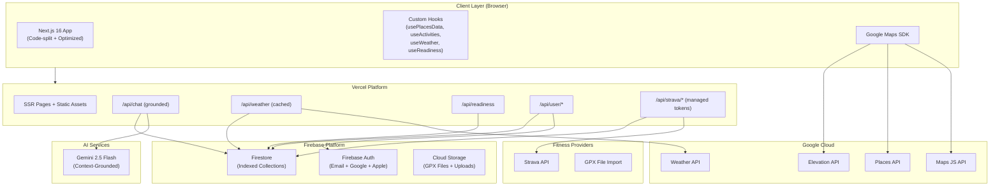
```mermaid
graph TB
    subgraph Client["Client Layer (Browser)"]
        App["Next.js 16 App<br/>(Code-split + Optimized)"]
        Hooks["Custom Hooks<br/>(usePlacesData, useActivities,<br/>useWeather, useReadiness)"]
        Maps["Google Maps SDK"]
    end

    subgraph Vercel["Vercel Platform"]
        Pages["SSR Pages + Static Assets"]
        ChatRoute["/api/chat (grounded)"]
        WeatherRoute["/api/weather (cached)"]
        ReadinessRoute["/api/readiness"]
        UserRoute["/api/user/*"]
        StravaRoute["/api/strava/* (managed tokens)"]
    end

    subgraph Google["Google Cloud"]
        MapsAPI["Maps JS API"]
        PlacesAPI["Places API"]
        ElevAPI["Elevation API"]
        WeatherAPI["Weather API"]
    end

    subgraph Firebase["Firebase Platform"]
        Firestore["Firestore<br/>(Indexed Collections)"]
        Auth["Firebase Auth<br/>(Email + Google + Apple)"]
        Storage["Cloud Storage<br/>(GPX Files + Uploads)"]
    end

    subgraph AI["AI Services"]
        Gemini["Gemini 2.5 Flash<br/>(Context-Grounded)"]
    end

    subgraph Fitness["Fitness Providers"]
        Strava["Strava API"]
        GPX["GPX File Import"]
    end

    Client --> Vercel
    Maps --> MapsAPI
    Maps --> PlacesAPI
    Maps --> ElevAPI

    ChatRoute --> Gemini
    ChatRoute --> Firestore
    WeatherRoute --> WeatherAPI
    WeatherRoute --> Firestore
    ReadinessRoute --> Firestore
    UserRoute --> Auth
    UserRoute --> Firestore
    StravaRoute --> Strava
    StravaRoute --> Firestore
```

### 6.2 Data Model (Firestore Collections)

**The current, verified-against-code schema lives in `docs/wiki/DATA.md`** — it is the canonical reference and is not duplicated here. What follows is the *target* model this plan is building toward, which is no longer the simple point-coordinate model this section described before ADR-0003 and ADR-0004 were accepted:

- **ADR-0003** makes **Trip** the central entity (a Route/Place + readiness judgement + weather window + gear list + emergency contact + the resulting Activity). The dormant `Itinerary` entity/`itineraries` collection (confirmed unused — see `docs/wiki/DATA.md` Section 2.2) is renamed to Trip rather than built fresh.
- **ADR-0004** makes a Route real geometry — an ordered `[lng, lat]` line, not a Places pin with a `place_id` and fabricated point-derived metrics. `SAVED_ROUTES` as previously modeled here (point coordinates, `place_id`-keyed) is retired; a saved Route now references a geometry-bearing Route document, and `Mountain`/`Campsite` collapse into Place types rather than siblings of Route.

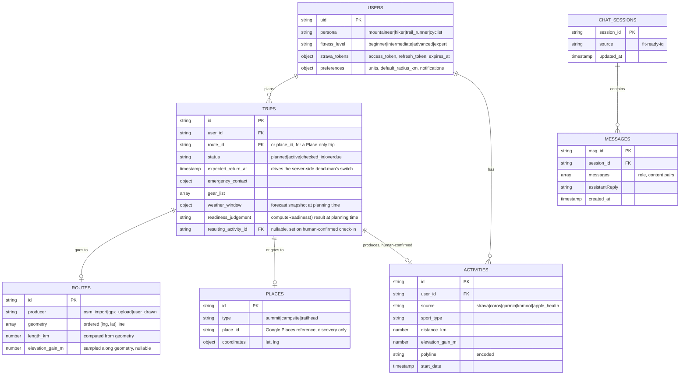
```mermaid
erDiagram
    USERS {
        string uid PK
        string persona "mountaineer|hiker|trail_runner|cyclist"
        string fitness_level "beginner|intermediate|advanced|expert"
        object strava_tokens "access_token, refresh_token, expires_at"
        object preferences "units, default_radius_km, notifications"
    }

    TRIPS {
        string id PK
        string user_id FK
        string route_id FK "or place_id, for a Place-only trip"
        string status "planned|active|checked_in|overdue"
        timestamp expected_return_at "drives the server-side dead-man's switch"
        object emergency_contact
        array gear_list
        object weather_window "forecast snapshot at planning time"
        string readiness_judgement "computeReadiness() result at planning time"
        string resulting_activity_id FK "nullable, set on human-confirmed check-in"
    }

    ROUTES {
        string id PK
        string producer "osm_import|gpx_upload|user_drawn"
        array geometry "ordered [lng, lat] line"
        number length_km "computed from geometry"
        number elevation_gain_m "sampled along geometry, nullable"
    }

    PLACES {
        string id PK
        string type "summit|campsite|trailhead"
        string place_id "Google Places reference, discovery only"
        object coordinates "lat, lng"
    }

    ACTIVITIES {
        string id PK
        string user_id FK
        string source "strava|coros|garmin|komoot|apple_health"
        string sport_type
        number distance_km
        number elevation_gain_m
        string polyline "encoded"
        timestamp start_date
    }

    CHAT_SESSIONS {
        string session_id PK
        string source "fit-ready-iq"
        timestamp updated_at
    }

    MESSAGES {
        string msg_id PK
        string session_id FK
        array messages "role, content pairs"
        string assistantReply
        timestamp created_at
    }

    USERS ||--o{ TRIPS : plans
    USERS ||--o{ ACTIVITIES : has
    TRIPS ||--o| ROUTES : "goes to"
    TRIPS ||--o| PLACES : "or goes to"
    TRIPS ||--o| ACTIVITIES : "produces, human-confirmed"
    CHAT_SESSIONS ||--o{ MESSAGES : contains
```

Field-level schema for `TRIPS`/`ROUTES`/`PLACES` is intentionally not exhaustive — neither ADR specifies it yet, and per ADR-0005 that detail should be written when the first Trip/geometry-producing code lands, not speculated here ahead of it.

### 6.3 Environment Variables (Complete)

| Variable | Scope | Required | Phase | Description |
| --- | --- | --- | --- | --- |
| `NEXT_PUBLIC_GOOGLE_MAPS_API_KEY` | Client + Server | Yes | 0 | Google Maps JS API key (browser-restricted) |
| `NEXT_PUBLIC_FIREBASE_API_KEY` | Client | Yes | 0 | Firebase client API key |
| `NEXT_PUBLIC_FIREBASE_AUTH_DOMAIN` | Client | Yes | 0 | Firebase Auth domain |
| `NEXT_PUBLIC_FIREBASE_PROJECT_ID` | Client | Yes | 0 | Firebase project ID (client SDK) |
| `NEXT_PUBLIC_FIREBASE_APP_ID` | Client | Yes | 0 | Firebase app ID |
| `NEXT_PUBLIC_FIREBASE_MESSAGING_SENDER_ID` | Client | Yes | 0 | FCM sender ID |
| `NEXT_PUBLIC_FIREBASE_STORAGE_BUCKET` | Client | Yes | 0 | Firebase Storage bucket |
| `GOOGLE_WEATHER_API_KEY` | Server only | Yes | 1 | Google Weather API key |
| `GEMINI_API_KEY` | Server only | Yes | 0 | Gemini AI API key |
| `FIREBASE_PROJECT_ID` | Server only | Yes | 0 | GCP/Firebase project identifier (Admin SDK) |
| `FIREBASE_SERVICE_ACCOUNT_KEY_JSON` | Server only | Recommended | 0 | Service account JSON string |
| `FIREBASE_CLIENT_EMAIL` | Server only | Alternative | 0 | Service account email |
| `FIREBASE_PRIVATE_KEY` | Server only | Alternative | 0 | Service account private key |
| `STRAVA_CLIENT_ID` | Server only | Yes | 0 | Strava OAuth application client ID |
| `STRAVA_CLIENT_SECRET` | Server only | Yes | 0 | Strava OAuth application client secret |
| `OPENWEATHER_API_KEY` | Server only | Optional | 1 | OpenWeather fallback key |

---

## 7. Persona-Specific Feature Matrix (Target State)

**This table describes where persona-differentiated features are headed, not what exists today.** The app currently shows every user the same UI regardless of persona — see `docs/wiki/USER-FLOW.md` Section 2 for the honest current state. Treat every "Yes"/"Lite" below as a target for the phases in Section 5, not a shipped feature.

Strava segments are not in this table. They existed briefly as a feature, generated from the place name rather than real segment data, and were removed for exactly that reason — see ADR-0004. If persona-scoped segment data is ever built, it needs a real data source, not a rejected-and-removed approach revived under a new name.

| Feature | Mountaineer | Hiker | Trail Runner | Cyclist |
| --- | --- | --- | --- | --- |
| Elevation profile | Yes | Yes | Yes | Yes |
| Summit/jumpoff data | Yes | Yes | No | No |
| Gradient analysis | Yes | Lite | Lite | Full |
| Weather alerts | Yes | Yes | Yes | Yes |
| Wind overlay | No | No | Lite | Full |
| Estimated time | Yes | Yes | Yes | Yes |
| Power zone estimate | No | No | No | Yes |
| Technical grade | Yes | Lite | Yes | Lite |
| Acclimatization calc | Yes | No | No | No |
| Aid station planning | No | No | Yes | Lite |
| Gear checklist | Yes | Yes | Lite | Lite |
| Night riding/running | No | No | Yes | Yes |
| Campsite discovery | Yes | Yes | No | Yes |
| Water source mapping | Yes | Yes | Yes | Lite |

---

## 8. Google API Integration Details

### 8.1 Maps JavaScript API (Current)

**Purpose:** Map rendering, marker placement, user location detection, map interactions.

**Usage Pattern:** Loaded once via `useJsApiLoader` hook. Map instance reused throughout session.

### 8.2 Places API (Current)

**Purpose:** Route, mountain, and campsite discovery via `textSearch` and `nearbySearch`.

**Optimization Strategy:**
- Deduplicate results across query terms by `place_id`
- Batch related searches to minimize round trips
- Cache `place_id` results in component state for session duration
- Server-side grid cache (`/api/places/cache`) — 0.5° cells shared across users

### 8.3 Elevation API (Current)

**Purpose:** Real summit elevations, jumpoff elevations, route base elevations, and elevation profile data.

**Optimization Strategy:**
- Batch up to 512 locations per request (API maximum)
- Cache elevation results by `place_id` in component state
- Request elevation data only when detail modal opens (lazy loading)

### 8.4 Weather API (Current)

**Purpose:** Live weather forecasts with current conditions, hourly breakdowns, daily summaries, and safety alerts.

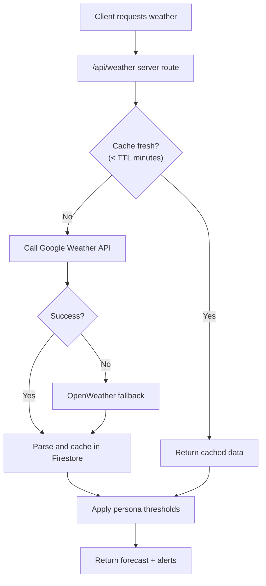
```mermaid
flowchart TD
    A["Client requests weather"] --> B["/api/weather server route"]
    B --> C{"Cache fresh?<br/>(< TTL minutes)"}
    C -->|Yes| D["Return cached data"]
    C -->|No| E["Call Google Weather API"]
    E --> F{"Success?"}
    F -->|Yes| G["Parse and cache in Firestore"]
    F -->|No| H["OpenWeather fallback"]
    H --> G
    G --> I["Apply persona thresholds"]
    I --> J["Return forecast + alerts"]
    D --> I
```

---

## 9. Risks, Challenges, and Mitigations

### 9.1 Security Risks

| Risk | Impact | Likelihood | Mitigation |
| --- | --- | --- | --- |
| npm dependency vulnerabilities | Data breach, supply chain attack | Low (resolved — see `docs/wiki/SECURITY.md` 8.1) | Upgraded past 14.2.x to Next.js 16; only moderate advisories remain, below the CI gate's threshold. Dependabot weekly PRs keep this from regressing. |
| Client-side Strava token storage | Token theft via XSS | Medium | Phase 3: Server-managed tokens in Firestore with auto-refresh |
| Hardcoded secrets in commits | Credential exposure | Low (gitleaks blocks pushes) | Gitleaks secret scan in security.yml blocks merges |
| pip dependency vulnerabilities | Backend compromise | Low (pip-audit now in CI) | `pip-audit` runs in both security.yml and backend CI |
| Firebase rules too permissive | Unauthorized data access | Unknown | Audit Firestore security rules before Phase 3 user data |

### 9.2 Architecture Risks

| Risk | Impact | Likelihood | Mitigation |
| --- | --- | --- | --- |
| Large page.tsx monolith | Slow development, merge conflicts | Low (resolved) | Decomposed from 3,239 to 818 lines: `usePlacesData`/`useStravaSync`/`useFirebaseAuth` hooks, `AppHeader`/`PlacesSidebar`/`MapArea` component groups. See `docs/wiki/ARCHITECTURE.md` Section 3.1. |
| Activities stored in localStorage only | Data loss on clear, no cross-device | Medium (partially resolved) | Strava-sourced activities now sync server-side to `users/{uid}/strava_activities` (Firestore). GPX/TCX/Apple-Health-imported activities and locally-planned routes (`savedPlans.ts`) remain localStorage-only — Phase 3 for activities, GitHub issue #23 / ADR-0004 for planned routes. |
| ADR-0003/0004 migration touches the map's core data flow | Regressions in route discovery, saved places, and readiness scoring during the Trip/geometry rewrite | Medium | Land the geometry model behind the existing Places-pin code path rather than replacing it in one PR; keep `docs/wiki/DATA.md` updated in the same PR that ships each schema change (see ADR-0005) |
| Firebase cold starts on Vercel | Slow first request after idle | Medium | Firebase Admin singleton pattern; function warming via cron |
| Gemini quota exhaustion | Chat assistant unavailable | Low | Rate limit in route (max 15 RPM free tier); upgrade for production |
| Google Maps API cost overrun | High bills from Places/Elevation calls | Medium | Cache aggressively in Firestore; batch elevation calls; set billing alerts |

### 9.3 CI/CD and Testing Risks

| Risk | Impact | Likelihood | Mitigation |
| --- | --- | --- | --- |
| Stryker 70% threshold fails after new code | CI blocks merges | Medium | Add mutation tests alongside new lib/ code; keep logic out of components |
| Dynamic imports in useSavedPlaces make testing brittle | Coverage gaps | Low | Vitest `vi.mock` handles dynamic imports; full test suite added 2026-06-27 |
| firebaseClient.ts not in coverage scope | Hidden regressions | Medium | Add to vitest.config.ts include list; use Firebase emulator for integration tests |
| Agent-review burns ANTHROPIC_API_KEY quota | Review not posted | Low | 30 s timeout added; `[skip review]` in PR title suppresses it |
| E2E tests need real API keys | CI flaky in PR environment | Medium | All secrets in GitHub Secrets; E2E only runs on PR to main |
| Mutation tests only on push to src/lib/ | Coverage gaps for lib changes in large PRs | Low | path filter in mutation.yml is intentional — keeps CI fast |

### 9.4 Operational Challenges

| Challenge | Current State | Plan |
| --- | --- | --- |
| No staging environment | Preview URLs on Vercel but no stable staging Firebase project | Create `fit-ready-iq-dev` Firebase project for PR previews |
| No alerting or monitoring | Partially resolved — `uptime.yml` polls `/api/health` every 15 min (needs `PRODUCTION_URL` repo variable set); backend Sentry SDK is wired with a guarded init. Frontend has no Sentry integration yet. | Add Sentry SDK to the frontend; configure alert thresholds beyond GitHub's own workflow-failure signaling |
| Vercel function timeouts on slow Strava sync | 60 s timeout may not be enough for large accounts | Consider queued background job via Firestore + Cloud Function trigger |
| Weather API fallback not cached separately | OpenWeather response treated same as Google Weather | Consider separate TTL for fallback data (lower confidence data) |

### 9.5 Documentation and Process Risks

| Risk | Impact | Likelihood | Mitigation |
| --- | --- | --- | --- |
| Docs drift from an accepted ADR | A newer decision (e.g. ADR-0003/0004) changes the data model but the plan/roadmap docs keep describing the old one — exactly what this document needed a full audit pass to catch | High without discipline, now Low | ADR-0005 makes cross-referencing `SOLUTION-PLAN.md` part of writing any ADR that changes the roadmap or data model, not an afterthought |
| Docs drift from a directory/branch-flow restructure | Stale `frontend/`/`backend/` paths or an outdated branch-flow description across every doc that mentions them | Medium | No mechanical gate catches this today (unlike code layering, which `dependency-cruiser` enforces) — see ADR-0005's proposal to extend the same ratchet discipline to docs |
| A doc silently becomes a stub or gets deleted without anyone noticing | `docs/wiki/AI.md` existed as an empty directory and `DATA.md`/`USER-FLOW.md` as 0-byte files for an unknown period before this audit found them | Low, but was undetected for a while | No current gate — a future doc-freshness check is a plausible enhancement (see Section 15) |

---

## 10. Quality Gates

Every PR to `main` must pass all applicable gates before merge:

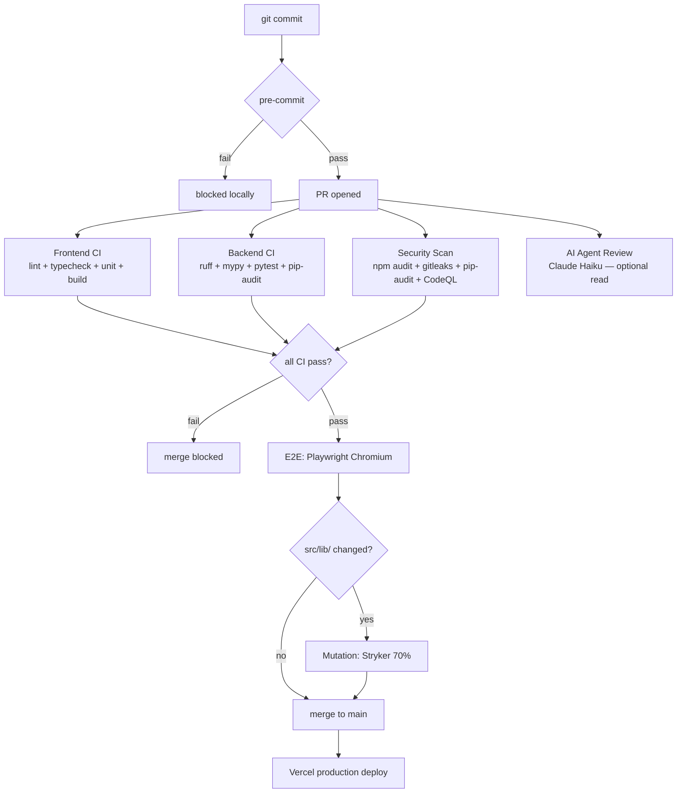
```mermaid
flowchart TD
    A[git commit] --> B{pre-commit}
    B -->|fail| Z1[blocked locally]
    B -->|pass| C[PR opened]
    C --> D[Frontend CI\nlint + typecheck + unit + build]
    C --> E[Backend CI\nruff + mypy + pytest + pip-audit]
    C --> F[Security Scan\nnpm audit + gitleaks + pip-audit + CodeQL]
    C --> G[AI Agent Review\nClaude Haiku — optional read]
    D --> H{all CI pass?}
    E --> H
    F --> H
    H -->|fail| Z2[merge blocked]
    H -->|pass| I[E2E: Playwright Chromium]
    I --> J{src/lib/ changed?}
    J -->|yes| K[Mutation: Stryker 70%]
    J -->|no| L[merge to main]
    K --> L
    L --> M[Vercel production deploy]
```

### Gate Details

| Gate | Workflow | Check | Threshold | Runs when |
| --- | --- | --- | --- | --- |
| Frontend lint | `ci.yml` | ESLint | Zero errors | Every PR |
| Frontend typecheck | `ci.yml` | TypeScript strict | Zero errors | Every PR |
| Frontend unit tests | `ci.yml` | Vitest (4 test files) | 85% stmt/fn/lines, 50% branch | Every PR |
| Frontend build | `ci.yml` | Next.js compiler | Zero errors | Every PR |
| Backend lint | `ci.yml` | Ruff check + format | Zero errors | Every PR |
| Backend types | `ci.yml` | mypy | Zero errors | Every PR |
| Backend tests | `ci.yml` | pytest --cov | All green | Every PR |
| Backend security | `ci.yml` | pip-audit | No high/critical | Every PR |
| npm audit | `security.yml` | npm audit --audit-level=high | Zero high/critical | Every PR + weekly |
| Secret scan | `security.yml` | gitleaks | Zero secrets | Every PR + weekly |
| Python audit | `security.yml` | pip-audit | Zero high/critical | Every PR + weekly |
| Code analysis | `security.yml` | CodeQL | Zero high alerts | Every PR + weekly |
| E2E tests | `e2e.yml` | Playwright (Chromium) | All scenarios pass | PR to main |
| Mutation tests | `mutation.yml` | Stryker on src/lib/ | break=70, high=80 | PR to main (lib/ changed) |
| AI review | `agent-review.yml` | Claude Haiku diff review | Informational only | PR open/update |
| Pre-commit lint | Husky | lint-staged (ESLint + Prettier) | Zero errors | Every commit |
| Commit format | Husky | commitlint conventional | Valid type + subject-case | Every commit |

### Pre-commit Flow

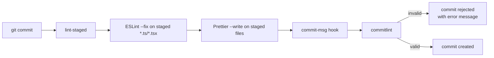
```mermaid
flowchart LR
    A[git commit] --> B[lint-staged]
    B --> C[ESLint --fix on staged *.ts/*.tsx]
    C --> D[Prettier --write on staged files]
    D --> E[commit-msg hook]
    E --> F[commitlint]
    F -->|invalid| G[commit rejected\nwith error message]
    F -->|valid| H[commit created]
```

**Commit format:** `type(scope): lowercase subject`

Types: `feat fix docs style refactor perf test chore revert ci build`

Example: `feat(weather): add persona-specific alert thresholds`

---

## 11. Success Metrics

| Metric | Current Baseline | Phase 1 Target | Phase 4 Target | Phase 6 Target |
| --- | --- | --- | --- | --- |
| Time to first map render | ~3s | < 2s | < 2s | < 1.5s |
| Places API calls per session | ~50+ | < 30 (cached) | < 25 | < 20 |
| Chat response latency (p95) | ~2s | < 1.5s | < 1.5s | < 1s |
| Weather data freshness | Live (no cache yet) | < 60 min | < 30 min | < 30 min |
| Unit test count | 4 files / ~35 cases | 6 files / 50+ | 10 files / 75+ | 15 files / 100+ |
| Mutation score (src/lib/) | ~70% (current gate) | > 75% | > 80% | > 85% |
| npm audit high/critical | 15 | 0 | 0 | 0 |
| Active personas supported | 1 (generic) | 2 (+ cyclist) | 4 (all) | 4 (optimized) |
| Lighthouse performance score | ~65 | > 75 | > 80 | > 90 |
| Bundle size (first load JS) | 187 KB | < 170 KB | < 160 KB | < 130 KB |
| CI run time (full suite) | ~4 min | < 5 min | < 6 min | < 5 min |

---

## 12. Deployment Architecture

### 12.1 Branch and Release Flow

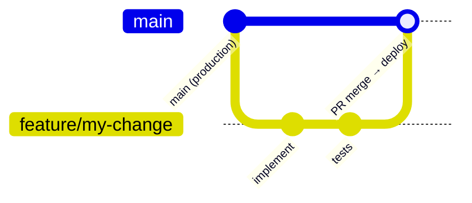
```mermaid
gitGraph
    commit id: "main (production)"
    branch feature/my-change
    checkout feature/my-change
    commit id: "implement"
    commit id: "tests"
    checkout main
    merge feature/my-change id: "PR merge → deploy"
```

All development follows trunk-based flow: short-lived feature branches PR directly to `main`. No intermediary branches. Vercel deploys automatically on every merge to `main`.

### 12.2 Infrastructure Diagram

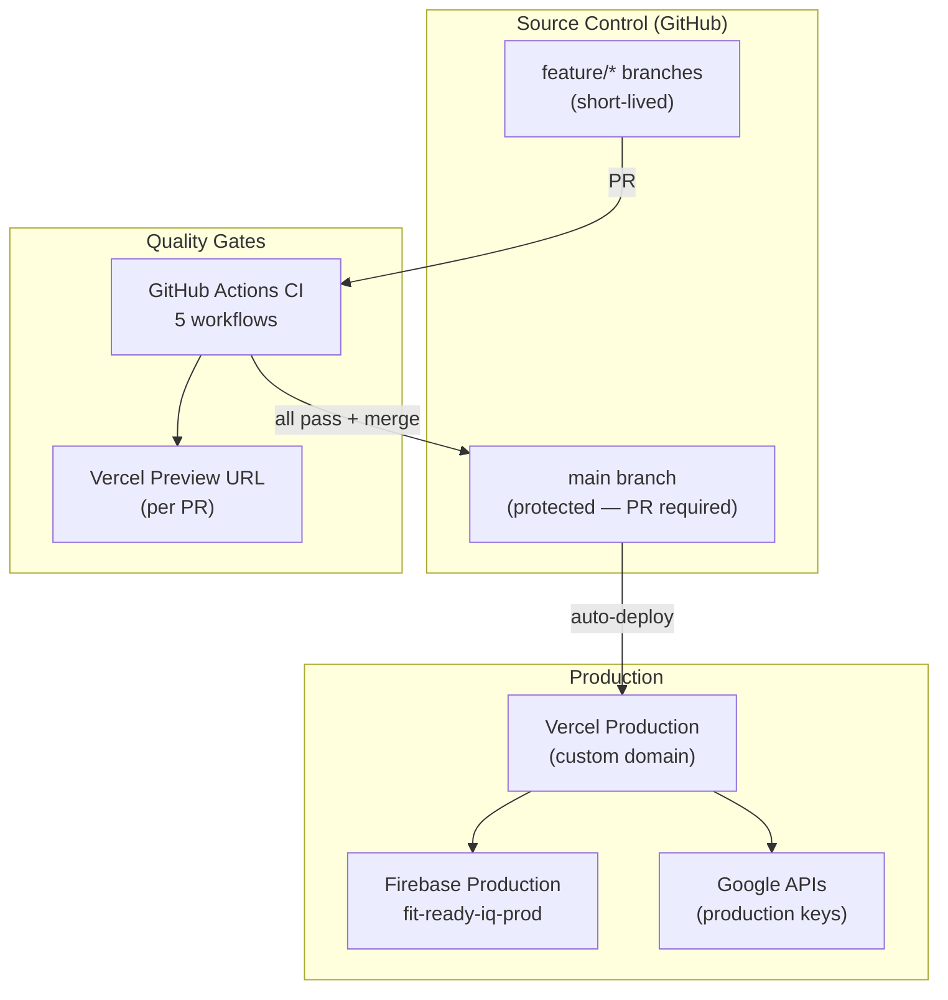
```mermaid
flowchart TD
    subgraph Source["Source Control (GitHub)"]
        Main["main branch\n(protected — PR required)"]
        Feature["feature/* branches\n(short-lived)"]
    end

    subgraph Quality["Quality Gates"]
        CI["GitHub Actions CI\n5 workflows"]
        Vercel_Preview["Vercel Preview URL\n(per PR)"]
    end

    subgraph Production["Production"]
        Vercel_Prod["Vercel Production\n(custom domain)"]
        Firebase_Prod["Firebase Production\nfit-ready-iq-prod"]
        Google_Prod["Google APIs\n(production keys)"]
    end

    Feature -->|PR| CI
    CI --> Vercel_Preview
    CI -->|all pass + merge| Main
    Main -->|auto-deploy| Vercel_Prod
    Vercel_Prod --> Firebase_Prod
    Vercel_Prod --> Google_Prod
```

### 12.3 Environments

| Environment | Platform | Firebase Project | Trigger | Purpose |
| --- | --- | --- | --- | --- |
| Development | localhost:4790 | Emulators (Docker) | `npm run dev` | Local development with hot reload |
| Preview | Vercel preview URL | fit-ready-iq-dev (planned) | PR opened/updated | PR review and QA testing |
| Production | Custom domain | fit-ready-iq-prod | Push to `main` | Live users |

### 12.4 GitHub Actions Workflows

| Workflow | File | Triggers | Duration (est.) | Purpose |
| --- | --- | --- | --- | --- |
| CI | `ci.yml` | PR to main, push to main | ~3 min | Lint, typecheck, unit tests, build (frontend + backend) |
| E2E | `e2e.yml` | PR to main | ~5 min | Playwright E2E with real secrets |
| Mutation | `mutation.yml` | PR to main (src/lib/ changed) | ~4 min | Stryker mutation testing |
| Security | `security.yml` | PR + push to main + weekly Mon | ~3 min | npm audit + gitleaks + pip-audit + CodeQL |
| AI Review | `agent-review.yml` | PR open/synchronize | ~30 s | Claude Haiku posts diff review comment |

---

## 13. Implementation Priority Summary


```mermaid
flowchart LR
    subgraph Done["DONE"]
        direction TB
        D1["CI/CD harness\n5 workflows"]
        D2["feature -> develop -> main\nbranch flow"]
        D3["Pre-commit hooks\nlint + commitlint"]
        D4["Live weather\n/api/weather"]
        D5["Health endpoint\n/api/health"]
        D6["Unit + mutation\n+ security tests"]
        D7["npm vulnerabilities fixed\nNext.js 16"]
        D8["page.tsx decomposed\nhooks + component groups"]
        D9["Client-side readiness scoring\ncomputeReadiness()"]
        D10["GPX route builder + export\nserver-side route-snapping"]
    end

    subgraph Now["NOW (Phase 0 remaining)"]
        direction TB
        N2["Server-managed Strava tokens"]
        N3[".env.example file"]
        N4["next/image migration"]
        N5["firebaseClient.ts tests"]
    end

    subgraph Next["NEXT (Phase 1-2, ADR-0004 first)"]
        direction TB
        X1["Weather Firestore cache\n(TTL 60 min)"]
        X2["Persona-specific alerts"]
        X0["Real route geometry\n(ADR-0004 producers)"]
        X3["Persona selector UI"]
        X4["Persona scoring algo\n(needs X0 first)"]
    end

    subgraph Later["LATER (Phase 3-4, ADR-0003)"]
        direction TB
        L1["Firebase Auth"]
        L2["User profiles"]
        L0["Trip entity\n(ADR-0003)"]
        L3["Server-persisted user routes"]
        L5["Training gap analysis"]
    end

    subgraph Future["FUTURE (Phase 5-6)"]
        direction TB
        F1["Context-aware AI chat\n(grounded in Trip, not ad hoc)"]
        F4["Code-split DetailsModal"]
        F5["Edge caching"]
    end

    Done --> Now --> Next --> Later --> Future
```

---

## 14. Governance

### 14.1 Decision Authority

Any architecture, deployment, or feature decision must:
1. Update **this solution plan** first (source of truth)
2. Update derived docs (`ARCHITECTURE.md`, `DEPLOYMENT.md`, `API.md`, `SECURITY.md`, `CODE-QUALITY.md`, `DATA.md`, `AI.md`) to remain consistent
3. Go through PR review — no direct pushes to `main` or `develop` for feature work; see ADR-0005 for why an architecture-changing ADR must also update this plan in the same PR

### 14.2 Change Categories

| Category | Requires | Examples |
| --- | --- | --- |
| Bug fix | PR review | Fix type error, handle edge case |
| Feature | PR review + solution plan update | New server route, new component |
| Architecture change | PR review + solution plan update + ADR | New data model, new external service |
| Security change | PR review + solution plan update + security review | New secret, auth flow change |
| Dependency update | PR review + audit check | Upgrade Next.js, add new package |
| CI/CD change | PR review + update section 10 | New workflow, gate threshold change |

### 14.3 Documentation Cascade

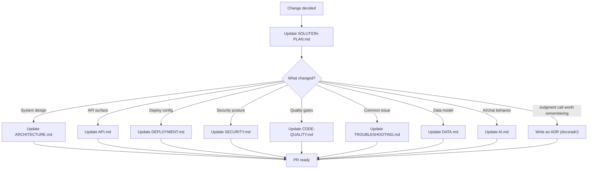
```mermaid
flowchart TD
    A["Change decided"] --> B["Update SOLUTION-PLAN.md"]
    B --> C{What changed?}
    C -->|System design| D["Update ARCHITECTURE.md"]
    C -->|Data model| K["Update DATA.md"]
    C -->|API surface| E["Update API.md"]
    C -->|Deploy config| F["Update DEPLOYMENT.md"]
    C -->|Security posture| G["Update SECURITY.md"]
    C -->|Quality gates| H["Update CODE-QUALITY.md"]
    C -->|AI/chat behavior| L["Update AI.md"]
    C -->|Common issue| I["Update TROUBLESHOOTING.md"]
    C -->|Judgment call worth remembering| M["Write an ADR (docs/adr/)"]
    D --> J["PR ready"]
    E --> J
    F --> J
    G --> J
    H --> J
    I --> J
    K --> J
    L --> J
    M --> J
```

---

## 15. Future Recommendations, Considerations, and Enhancements

### 15.1 Recommendations

- **Sequence ADR-0004 before ADR-0003's Trip UI.** Trip references a Route or Place; building Trip on top of the current fabricated-metrics Route model just moves the credibility problem ADR-0004 describes into a new feature. Land real route geometry first, even partially (GPX-upload and OSM-import producers before user-drawn), then build Trip on solid ground.
- **Activate the backend only when a real use case needs it, not before.** `src/backend/` is fully wired for one endpoint (`GET /api/routes/best-fit`) and has real Clean Architecture bones, but per `docs/wiki/DEAD-CODE-AUDIT.md` most of its API-client scaffolding (Strava, Garmin, Coros, Google Maps, Komoot) is unreferenced. Standing up a second runtime is a cost with no current payoff; keep treating it as ready-when-needed rather than deploying it speculatively.
- **Write the Trip/Route field-level schema when the first real code lands**, not ahead of it — Section 6.2's ER diagram is deliberately sparse for exactly this reason. A detailed schema written before any producer code exists is a guess wearing a diagram's clothes.
- **Extend the mechanical-gate philosophy (ADR-0002) to documentation staleness itself**, not just code — see ADR-0005. This document went five weeks and two accepted ADRs out of sync with its own "Status: Active — source of truth" claim before this audit caught it; a lighter-weight, earlier check (even just a PR template checkbox) would have caught it sooner.

### 15.2 Considerations

- **Komoot integration is blocked on partnership approval, not code.** `KomootClient` in the backend is a real, documented placeholder (its own module docstring says so) waiting on external access, not abandoned or forgotten work — don't "fix" it by deleting it.
- **The client-side readiness engine (Section 5.6) may not need a server API at all.** It already answers the product's core question ("can I finish this route") without one. Before building `/api/readiness`, confirm what a server-authoritative version would actually add — cross-device sync of the *result*, not the computation, is the more likely real need.
- **Persona differentiation (Phase 2) is UI/scoring-weight work, not new data.** The four personas already share every current feature; the feature matrix in Section 7 is a target, and building toward it does not require new external integrations, just conditional logic and, per ADR-0004, real route geometry to score against.
- **The backend's separate Firestore schema (`docs/wiki/DATA.md` Section 3) is not accidentally disconnected — it was built for the FastAPI matching pipeline independently of the frontend's schema.** Any future work connecting the two should be a deliberate integration decision (likely its own ADR), not an assumption that they already share data.

### 15.3 Enhancements (Beyond the Committed Roadmap)

- A doc-freshness spot-check as part of PR review for any PR touching `src/backend/` or changing a Firestore collection — lighter than a full gate, catches drift closer to when it happens.
- Extending `useWeather()` as a shared hook (Phase 6, still pending) would also be the natural place to add the Firestore-backed cross-tab weather cache Section 5.3 describes as target state, rather than treating them as two separate efforts.
- A `docs/adr/` entry once the first Trip/geometry producer code actually lands, recording the specific field-level schema decided at that point — closing the gap Section 6.2 deliberately leaves open today.

### 15.4 Risks and Challenges

Covered in full in Section 9, not duplicated here. The two additions from this audit worth calling out directly: the ADR-0003/0004 migration risk (Section 9.2, last row) and the documentation-drift risk this entire audit exists to address (Section 9.5) — both are new since this document's previous revision, and both should be re-read before starting Phase 2 or Phase 3 work.
