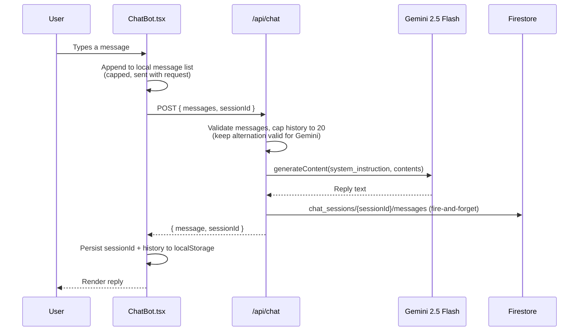
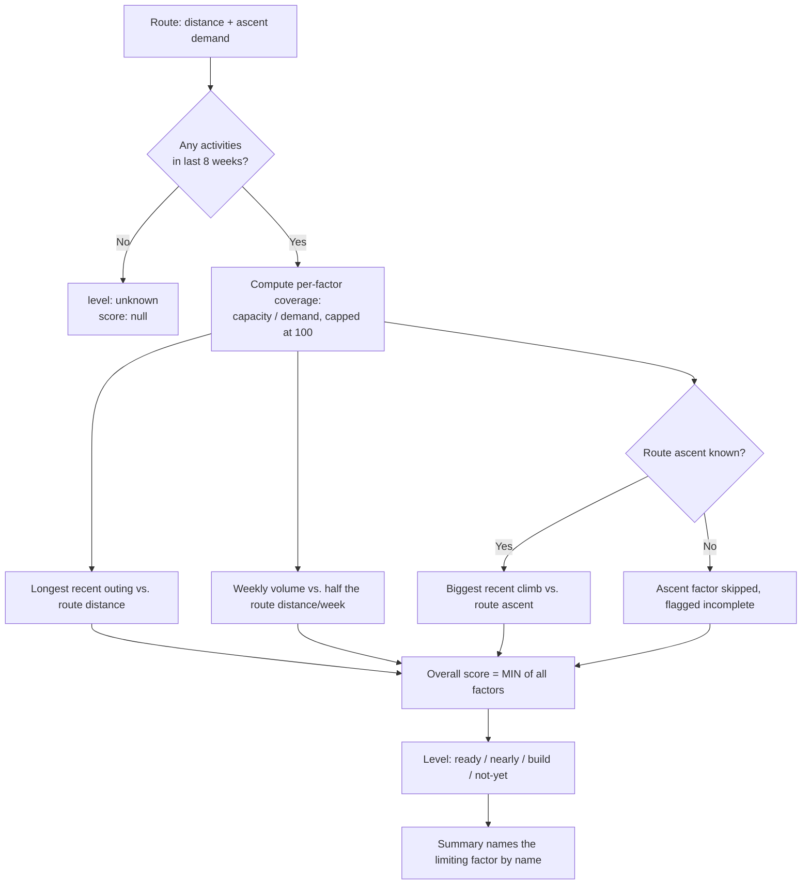

# Fit-Ready-IQ AI and Readiness Scoring

## 1. Overview

This document describes the two places intelligence lives in Fit-Ready-IQ today: the Gemini-powered chat assistant (`/api/chat`), and the client-side readiness-scoring algorithm (`src/lib/readiness.ts`) that answers the product's core question — "can this person finish this route?" Neither system currently calls the other; that integration is planned (Section 4) but not built.

---

## 2. Chat Assistant

### 2.1 Current Implementation

`POST /api/chat` (`src/frontend/src/app/api/chat/route.ts`) is a stateless prompt-completion endpoint, not an agent. It has no tool-calling, no function schema, and no ability to read or write app state beyond persisting the transcript.

Key details:

- **Model:** `gemini-2.5-flash`, called directly via the Generative Language REST API (no SDK), with a fixed `SYSTEM_PROMPT` describing the assistant's role (trail/summit/campsite discovery, fitness readiness, gear and training advice). The prompt is not grounded in any specific route, weather, or fitness data — it is the same for every conversation.
- **History cap:** the last 20 messages are sent per request (`MAX_HISTORY` in `route.ts`), trimmed to keep the first message a `user` turn since Gemini requires strict user/model alternation. This bounds per-request token cost; it does not summarize dropped history.
- **Persistence:** every exchange is written to Firestore under `chat_sessions/{sessionId}/messages` via `persistConversation()`. This is deliberately best-effort — a Firestore failure is caught, logged, and does **not** fail the chat response, since losing history is recoverable and losing the reply is not.
- **Session identity:** the client (`ChatBot.tsx`) generates and stores `sessionId` in `localStorage`, restored in an effect (never a `useState` initializer, to avoid a hydration mismatch between server and client render). The server accepts a client-supplied `sessionId` or mints a new one with `crypto.randomUUID()`.
- **Failure modes are sayable:** missing `GEMINI_API_KEY` returns `503` before any Gemini call; a non-2xx from Gemini returns `502`; a request-level exception returns `500`. None of these paths fabricate a reply.

### 2.2 What It Does Not Do Yet

- **No context grounding.** The assistant does not know which route the user has selected, current weather, or the user's fitness data — see Section 4 for the planned version.
- **No tool-use / function-calling.** The assistant cannot save a route, analyze a specific route's demands, or take any action — it can only produce text. GitHub issues #26–#30 track designing this (data-access boundaries, where tool execution should live, what "analyze route" should compute); none of it is scaffolded in code yet.
- **No save-route confirmation flow.** GitHub issue #31 ("Confirmation UX for save-route in ChatBot") has no corresponding UI or route today — pure backlog.

See `docs/wiki/DEAD-CODE-AUDIT.md` for the full cross-reference between these open issues and what (if anything) is scaffolded toward them.

---

## 3. Readiness Scoring

### 3.1 The Question It Answers

`computeReadiness()` (`src/frontend/src/lib/readiness.ts`) scores a route against a user's last 8 weeks of recorded activity (`TRAINING_WINDOW_WEEKS`) and answers one question: can this person finish this route, and if not, what is holding them back?

The score is **gated by the limiting factor, not averaged**. Someone with high weekly volume who has never climbed 200 m in one outing is not ready for a 1,200 m day — averaging distance and ascent capacity would hide exactly the thing that turns them back on the mountain. The overall score is always the *worst* of the individual factor scores, and that factor is named in the summary so the result is actionable rather than just a number.

### 3.2 Why `unknown` Is a Real State

There is no default athlete and no assumed baseline. With zero activities in the training window, or a route with no valid distance, the result is the literal `unknown` level with `score: null` — never a guessed number. This is the same "never render a number the data does not support" rule that governs elevation and difficulty display elsewhere in the app (see `.claude/CLAUDE.md`'s "Rules this codebase holds to").

Ascent works the same way at the factor level: when a route's elevation gain is `null` (the Elevation API had nothing for it), the ascent factor is skipped entirely rather than scored against a guess, and the result is marked `incomplete: true` with a summary that says so.

### 3.3 The Three Factors

| Factor | Capacity (what you've done) | Demand (what the route asks) | Why |
| --- | --- | --- | --- |
| Longest recent outing | Longest single activity distance in the window | Route distance | A single long day is the real test of "can I cover this distance" |
| Weekly volume | Average weekly distance across the window | Half the route distance, per week | Guards against one heroic outing reading as sustained fitness — a modest, defensible bar |
| Biggest recent climb | Largest single-activity elevation gain in the window | Route ascent (skipped if unknown) | Distance fitness does not imply climbing fitness |

Levels: `ready` (limiting factor >= 80), `nearly` (>= 60), `build` (>= 40), `not-yet` (below 40), `unknown` (no data). Colors for each level live in `READINESS_COLORS`, shared by the badge, the readiness card, and the detail view so the same score never renders in two different colors.

---

## 4. Planned: Context-Grounded Assistant (Phase 5)

`docs/solution-plan/SOLUTION-PLAN.md` Section 5.7 describes a planned evolution where the chat system prompt is grounded in the user's selected route, live weather, fitness summary, and persona — turning generic advice into "specific, actionable advice for THIS athlete on THIS route in THESE conditions." None of this is built; Section 2.1 above is the entire current implementation.

This plan predates ADR-0003 (Trip is the spine) and ADR-0004 (routes have real geometry). Before Phase 5 work starts, the context sources it lists ("Selected Route", "User Fitness") should be re-evaluated against the Trip entity those ADRs introduce — grounding the assistant in a Trip (which already carries route, weather window, and gear) is likely a smaller and more coherent change than grounding it in ad hoc route/weather/fitness lookups the way the original plan describes.
