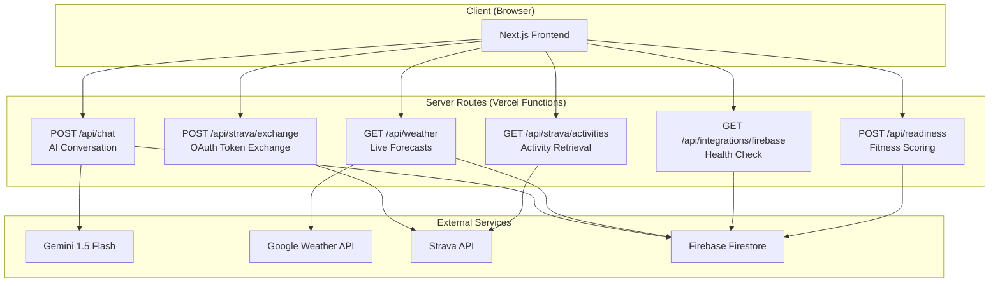
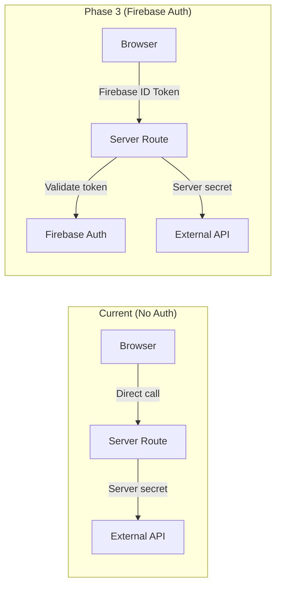
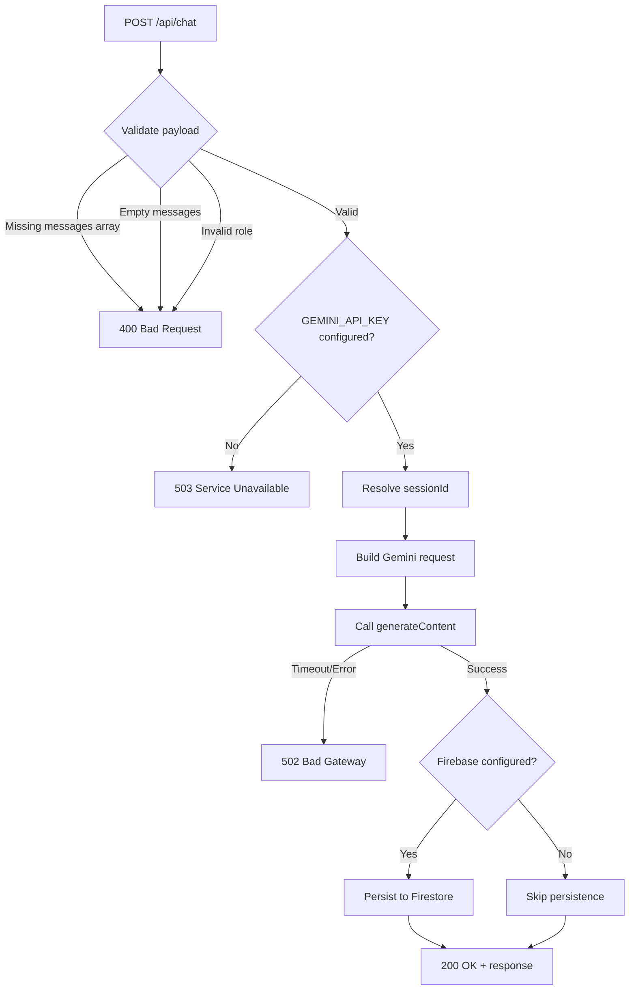
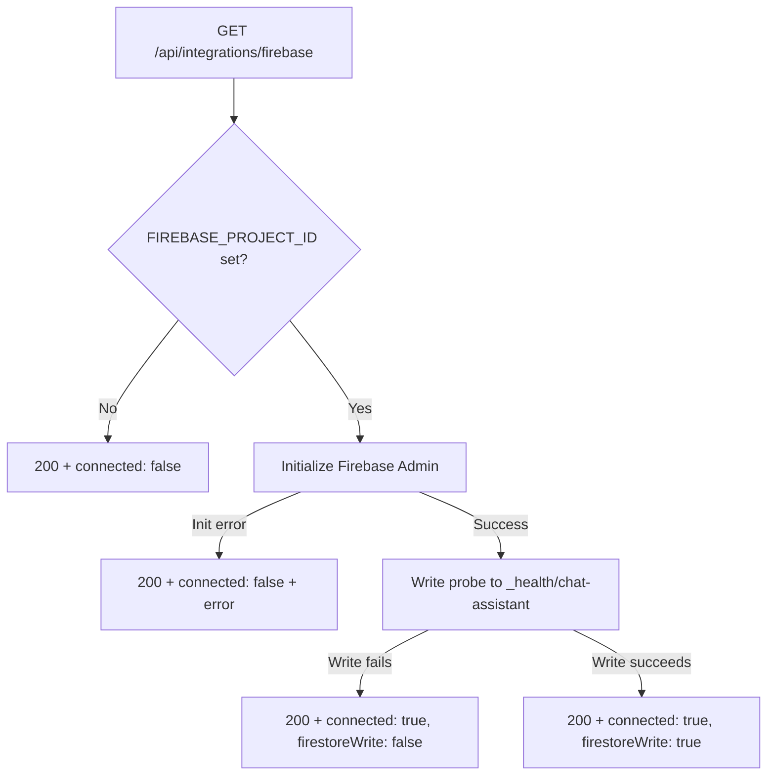
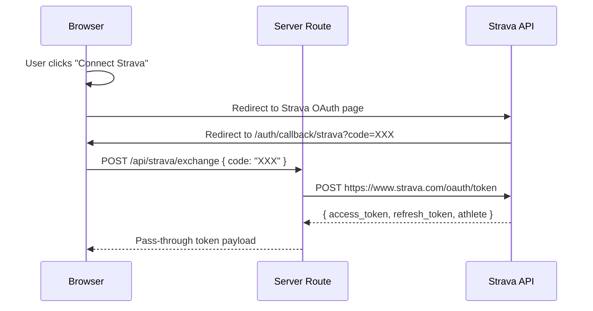
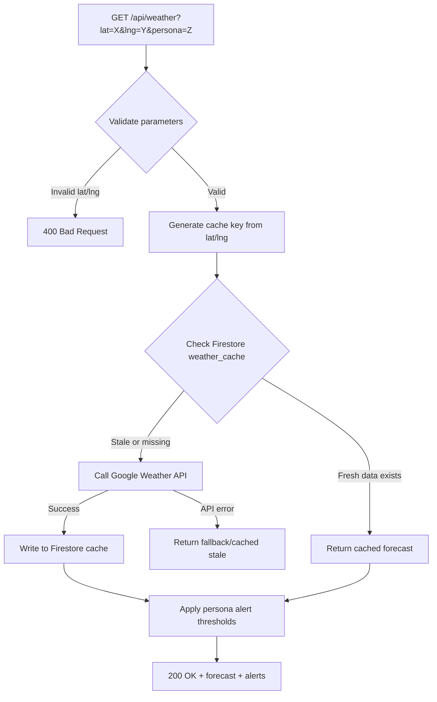
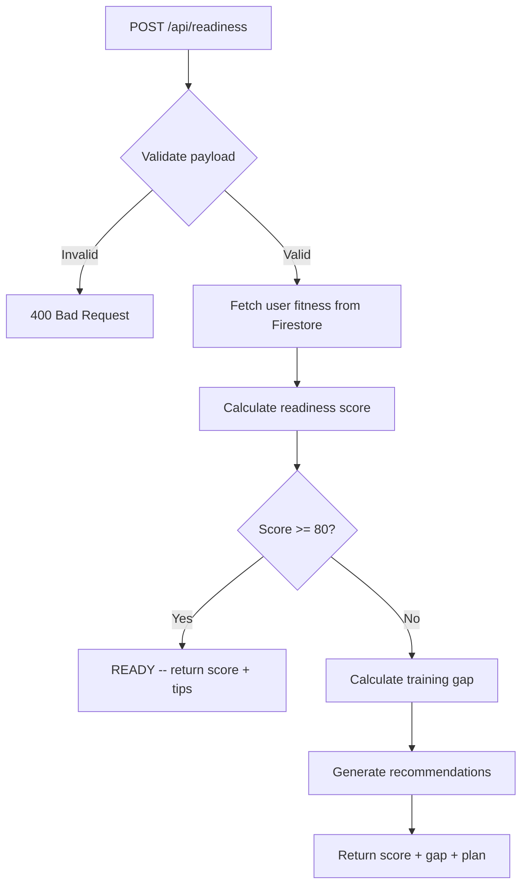
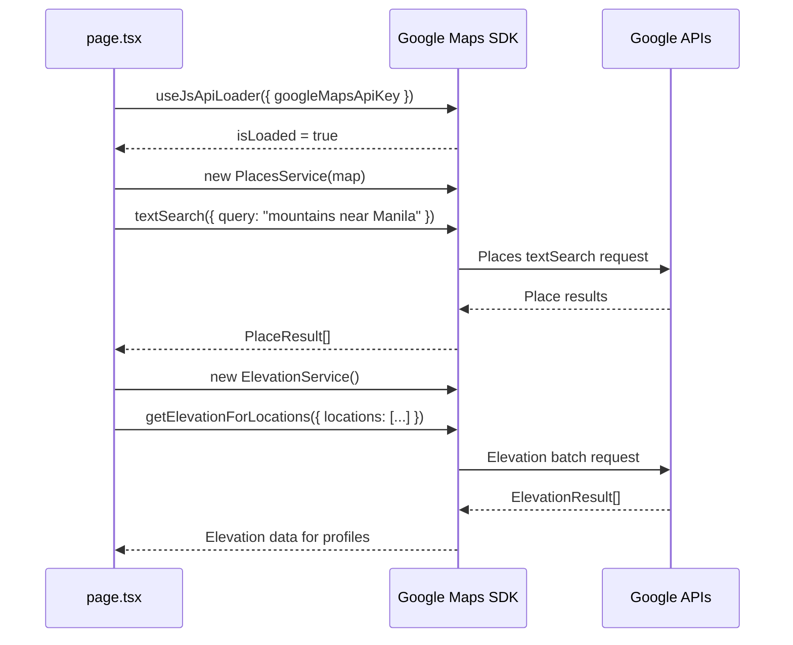
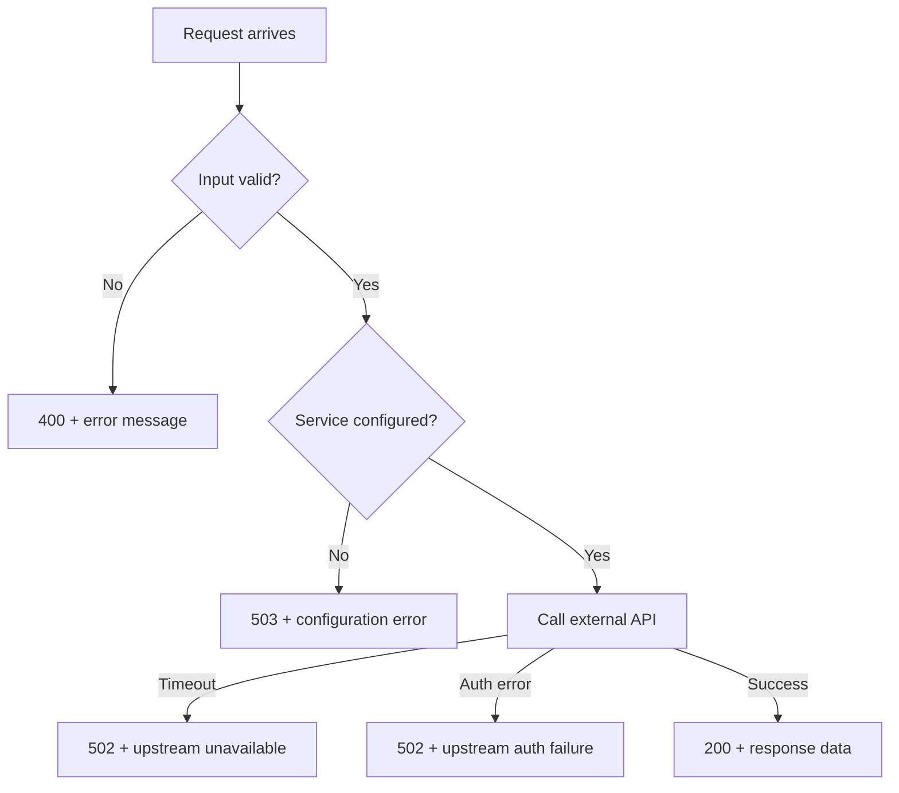
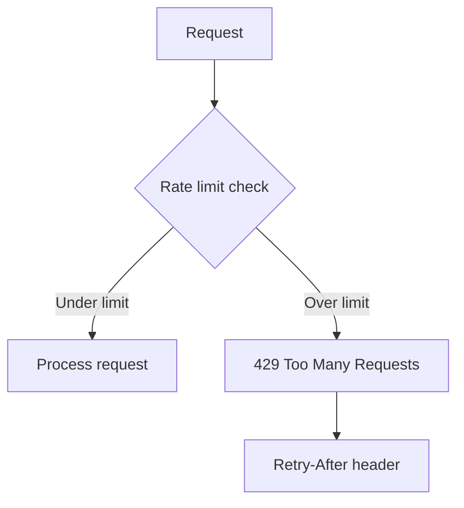

# Fit-Ready-IQ API Reference

## 1. Overview

This document provides a complete reference for all API endpoints in the Fit-Ready-IQ platform. The API surface consists of Next.js server routes (deployed as Vercel serverless functions) that proxy external service calls and manage data persistence. These routes keep secrets server-side, validate inputs, and return structured responses.

All server routes:
- Run on **Node.js runtime** (not Edge) to support Firebase Admin SDK
- Accept and return **JSON** payloads
- Validate request payloads before processing
- Return structured error responses with appropriate HTTP status codes
- Handle external API failures gracefully with fallback responses

### Base URLs

| Environment | Base URL |
| --- | --- |
| Local Development | `http://localhost:4790` |
| Vercel Preview | `https://<deployment-id>.vercel.app` |
| Vercel Production | `https://your-custom-domain.com` |

---

## 2. API Architecture

### 2.1 Route Overview



### 2.2 Authentication Model

Currently, API routes do not require authentication tokens. Routes that need secrets (Strava, Gemini, Firebase) use server-side environment variables. User authentication via Firebase Auth will be added in Phase 3, at which point routes will validate Firebase ID tokens.



---

## 3. Active Endpoints

### 3.1 POST /api/chat

**Description:** Sends a conversation message to the Gemini 1.5 Flash AI model and returns the assistant's reply. Optionally persists the conversation to Firebase Firestore for session continuity.

**Runtime:** Node.js (Firebase Admin SDK requirement)

**Flow:**



**Request:**

```http
POST /api/chat
Content-Type: application/json

{
  "sessionId": "optional-existing-session-id",
  "messages": [
    {
      "role": "user",
      "content": "What gear do I need for Mt. Pulag in December?"
    }
  ]
}
```

| Field | Type | Required | Description |
| --- | --- | --- | --- |
| `sessionId` | string | No | Existing session ID for conversation continuity. Auto-generated if omitted. |
| `messages` | array | Yes | Array of message objects. Must contain at least one message. |
| `messages[].role` | string | Yes | Either `"user"` or `"assistant"`. |
| `messages[].content` | string | Yes | Message text content. Must not be empty. |

**Responses:**

| Status | Body | Condition |
| --- | --- | --- |
| 200 | `{ "message": "AI reply text", "sessionId": "session-uuid" }` | Successful response from Gemini |
| 400 | `{ "error": "Invalid request body" }` | Missing or malformed payload |
| 502 | `{ "error": "AI service unavailable" }` | Gemini API timeout or error |
| 503 | `{ "error": "Chat service not configured" }` | GEMINI_API_KEY not set |

**Configuration:**
- `GEMINI_API_KEY` -- Required. Gemini API key.
- `FIREBASE_PROJECT_ID` -- Optional. Enables Firestore persistence.
- `FIREBASE_SERVICE_ACCOUNT_KEY_JSON` -- Optional. Authenticates Firestore writes.

---

### 3.2 GET /api/integrations/firebase

**Description:** Verifies that the Firebase Admin SDK is properly initialized and can perform write operations to Firestore. Used as a health check endpoint for deployment validation.

**Runtime:** Node.js

**Flow:**



**Request:**

```http
GET /api/integrations/firebase
```

No request body or query parameters required.

**Responses:**

| Status | Body | Condition |
| --- | --- | --- |
| 200 | `{ "connected": true, "provider": "firebase", "gcpProjectId": "...", "firestoreWrite": true }` | Fully operational |
| 200 | `{ "connected": false, "provider": "firebase", "error": "FIREBASE_PROJECT_ID is required" }` | Missing configuration |
| 200 | `{ "connected": true, "provider": "firebase", "firestoreWrite": false, "error": "..." }` | Partial failure |

**Note:** This endpoint always returns 200 to allow monitoring tools to distinguish between "endpoint reachable" and "service healthy."

---

### 3.3 POST /api/strava/exchange

**Description:** Exchanges a Strava OAuth 2.0 authorization code for access and refresh tokens. This is the server-side component of the OAuth flow -- the browser redirects to Strava, Strava redirects back with a code, and this endpoint exchanges the code for tokens.

**Runtime:** Node.js

**Flow:**



**Request:**

```http
POST /api/strava/exchange
Content-Type: application/json

{
  "code": "strava-authorization-code"
}
```

| Field | Type | Required | Description |
| --- | --- | --- | --- |
| `code` | string | Yes | Authorization code from Strava OAuth redirect |

**Responses:**

| Status | Body | Condition |
| --- | --- | --- |
| 200 | Strava token response (access_token, refresh_token, expires_at, athlete) | Successful exchange |
| 400 | `{ "error": "Missing authorization code" }` | No code provided |
| 502 | `{ "error": "Strava token exchange failed" }` | Strava API error |

**Configuration:**
- `STRAVA_CLIENT_ID` -- Required. Strava application client ID.
- `STRAVA_CLIENT_SECRET` -- Required. Strava application client secret.

---

### 3.4 GET /api/strava/activities

**Description:** Retrieves the authenticated athlete's activities from Strava. Acts as a proxy to keep the Strava access token on the server side and handle pagination.

**Runtime:** Node.js

**Request:**

```http
GET /api/strava/activities?token=ACCESS_TOKEN&page=1
```

| Parameter | Type | Required | Description |
| --- | --- | --- | --- |
| `token` | string | Yes | Strava access token (from exchange endpoint) |
| `page` | number | No | Page number for pagination (default: 1, 30 activities per page) |

**Responses:**

| Status | Body | Condition |
| --- | --- | --- |
| 200 | Array of Strava activity objects | Successful retrieval |
| 400 | `{ "error": "Missing access token" }` | No token provided |
| 401 | `{ "error": "Token expired or invalid" }` | Strava rejects the token |
| 502 | `{ "error": "Strava API unavailable" }` | Strava API error |

**Activity Object Shape (subset):**

```json
{
  "id": 12345678,
  "name": "Morning Trail Run",
  "sport_type": "TrailRun",
  "distance": 15230.5,
  "total_elevation_gain": 842.0,
  "moving_time": 5400,
  "elapsed_time": 5800,
  "start_date": "2026-06-20T06:30:00Z",
  "average_heartrate": 152,
  "max_heartrate": 178,
  "map": {
    "summary_polyline": "encoded_polyline_string"
  }
}
```

---

## 4. Planned Endpoints

### 4.1 GET /api/weather (Phase 1)

**Description:** Returns weather forecast data for a geographic location using the Google Weather API. Includes current conditions, hourly/daily forecasts, and persona-specific safety alerts. Results are cached in Firestore with a configurable TTL (default 60 minutes).

**Flow:**



**Request:**

```http
GET /api/weather?lat=14.5995&lng=120.9842&persona=mountaineer
```

| Parameter | Type | Required | Description |
| --- | --- | --- | --- |
| `lat` | number | Yes | Latitude (-90 to 90) |
| `lng` | number | Yes | Longitude (-180 to 180) |
| `persona` | string | No | One of: `mountaineer`, `hiker`, `runner`, `cyclist`. Affects alert thresholds. |

**Planned Response:**

```json
{
  "location": { "lat": 14.5995, "lng": 120.9842 },
  "current": {
    "temperature_c": 22,
    "feels_like_c": 20,
    "humidity_pct": 65,
    "wind_speed_kph": 18,
    "wind_direction": "NW",
    "condition": "Partly Cloudy",
    "visibility_km": 12,
    "uv_index": 6,
    "precipitation_mm": 0
  },
  "hourly": [
    { "time": "2026-06-21T07:00:00Z", "temperature_c": 20, "condition": "Clear", "wind_speed_kph": 12 }
  ],
  "daily": [
    { "date": "2026-06-21", "high_c": 28, "low_c": 18, "condition": "Partly Cloudy", "precipitation_chance_pct": 20 }
  ],
  "alerts": [
    { "level": "caution", "type": "wind", "message": "Wind 18 kph -- exposed ridgeline risk for mountaineers" }
  ],
  "sunrise": "05:42",
  "sunset": "18:15",
  "cached_at": "2026-06-21T06:00:00Z",
  "ttl_minutes": 60
}
```

**Persona-Specific Alert Thresholds:**

| Condition | Mountaineer | Hiker | Trail Runner | Cyclist |
| --- | --- | --- | --- | --- |
| Wind (km/h) | >40 warn | >50 warn | >30 warn | >25 warn |
| Rain (mm/h) | >5 warn | >10 warn | >8 warn | >5 warn |
| Temp low (C) | <-5 warn | <0 warn | <-3 warn | <2 warn |
| Temp high (C) | >35 warn | >35 warn | >30 warn | >38 warn |
| Visibility (km) | <1 STOP | <2 warn | <2 warn | <3 warn |
| Lightning | STOP | STOP | STOP | STOP |
| UV Index | >8 warn | >8 warn | >8 warn | >8 warn |

---

### 4.2 POST /api/readiness (Phase 4)

**Description:** Compares user fitness data against route demands and returns a readiness score with gap analysis and training recommendations.

**Flow:**



**Planned Request:**

```json
{
  "userId": "firebase-uid",
  "routeData": {
    "distance_km": 25,
    "elevation_gain_m": 1800,
    "max_grade_pct": 35,
    "technical_rating": 3,
    "activity_type": "mountaineer"
  }
}
```

**Planned Response:**

```json
{
  "readiness_score": 72,
  "status": "TRAIN_MORE",
  "gaps": [
    { "metric": "weekly_elevation", "current": 800, "required": 1200, "unit": "m" },
    { "metric": "longest_activity", "current": 18, "required": 25, "unit": "km" }
  ],
  "recommendation": "Increase weekly elevation gain by 50% over the next 3 weeks. Add one long hike (20+ km) per week.",
  "estimated_ready_in_weeks": 3
}
```

---

### 4.3 CRUD /api/user/* (Phase 3)

**Description:** User profile management endpoints for authenticated users. Requires Firebase Auth ID token.

| Method | Path | Description |
| --- | --- | --- |
| GET | `/api/user/profile` | Get current user profile |
| PUT | `/api/user/profile` | Update persona, preferences |
| GET | `/api/user/saved-routes` | List saved/bookmarked routes |
| POST | `/api/user/saved-routes` | Save a new route |
| DELETE | `/api/user/saved-routes/:id` | Remove a saved route |

---

## 5. Client-Side API Calls (Google Maps)

These calls are made directly from the browser using a browser-restricted API key. They do NOT go through server routes.

### 5.1 Google Maps JavaScript API

| API | Usage | Configuration |
| --- | --- | --- |
| Maps JS API | Map tile rendering, custom markers, info windows | Loaded via `@react-google-maps/api` with `useJsApiLoader` |
| Places API | `textSearch()` and `nearbySearch()` for route/mountain/campsite discovery | PlacesService initialized on map load |
| Elevation API | `getElevationForLocations()` for batch altitude data | ElevationService with up to 512 locations per request |

### 5.2 API Call Pattern



---

## 6. Error Handling Patterns

### 6.1 Standard Error Response Format

All server routes return errors in a consistent format:

```json
{
  "error": "Human-readable error description"
}
```

### 6.2 Error Flow



### 6.3 Retry Guidance for Clients

| Error Code | Client Action |
| --- | --- |
| 400 | Fix request payload -- do not retry |
| 401 | Re-authenticate (Phase 3) |
| 502 | Retry after 2-5 seconds (max 3 retries) |
| 503 | Do not retry -- configuration issue |

---

## 7. Rate Limiting and Quotas

### 7.1 External API Quotas

| Service | Free Tier | Cost Beyond Free | Mitigation |
| --- | --- | --- | --- |
| Google Maps JS API | 28,000 loads/month | $7 per 1,000 loads | N/A (required for map render) |
| Google Places API | $200/month credit | $17-40 per 1,000 requests | Deduplicate, cache place_ids |
| Google Elevation API | $200/month credit | $5 per 1,000 requests | Batch (512/request), cache results |
| Google Weather API | Varies by plan | Pay-per-use | Firestore cache (60-min TTL) |
| Gemini API | 15 RPM (free) | Pay-per-token | Rate limit in route, session-based |
| Strava API | 100 requests/15 min | Hard limit | Token-based rate tracking |

### 7.2 Planned Rate Limiting (Phase 1+)



---

## 8. Payload Guidelines

- Keep request payloads explicit and minimal -- only send what is needed.
- Validate `role` field in chat messages (must be `"user"` or `"assistant"`).
- Never pass long-lived credentials from the browser in query strings.
- Prefer server-side secret usage for all provider exchanges.
- All dates/times should be in ISO 8601 format (UTC).
- Coordinates should use decimal degrees (WGS84).
