# Fit-Ready-IQ Architecture

## 1. Overview

This document describes the system architecture of Fit-Ready-IQ, an adventure readiness platform built for mountaineers, hikers, trail runners, and ultra-distance cyclists. The application runs as a Next.js 14 application deployed on Vercel, with Firebase providing persistence and authentication services, and Google Cloud APIs delivering geographic and weather intelligence.

The architecture follows a **server-route pattern** where the Next.js App Router serves both the frontend UI and backend API logic. Secrets and external API calls are handled exclusively in server routes (serverless functions on Vercel), while client-side code handles rendering, user interaction, and direct Google Maps API calls (which use a browser-restricted API key).

---

## 2. System Architecture

### 2.1 High-Level Topology

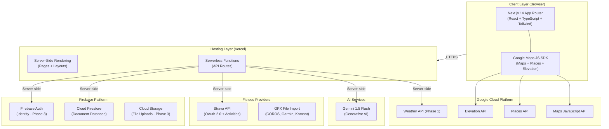

### 2.2 Request Flow Architecture

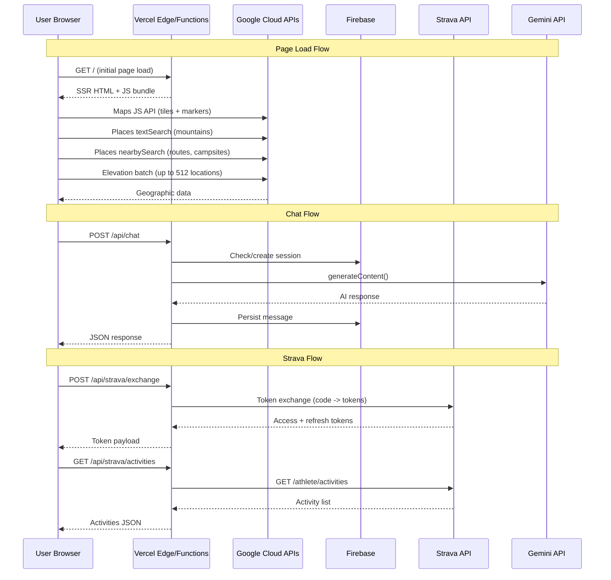

---

## 3. Frontend Architecture

### 3.1 Module Boundaries

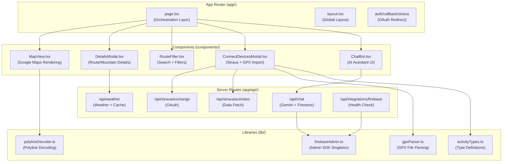

### 3.2 Component Responsibilities

| Component | Responsibility | Key Dependencies |
| --- | --- | --- |
| `page.tsx` | State orchestration, data fetching coordination, layout composition. Manages map center, selected markers, filter state, and modal visibility. | All components, Google Maps hooks |
| `MapView.tsx` | Renders Google Maps instance with custom markers (mountains, routes, campsites). Handles zoom, pan, marker click events. | `@react-google-maps/api`, polylineDecoder |
| `DetailsModal.tsx` | Displays detailed information for selected route/mountain/campsite including elevation profiles, photos, Strava segments, gear recommendations, and weather data. | Google Elevation API, weather data |
| `RouteFilter.tsx` | Provides filtering controls for activity type, difficulty, distance range, and elevation gain. Emits filter state changes to parent. | None (pure UI) |
| `ConnectDevicesModal.tsx` | Manages Strava OAuth flow, GPX file drag-and-drop import, and activity history display with source badges. | Strava routes, GPX parser |
| `ChatBot.tsx` | Conversational AI interface with message history, typing indicators, and session management. | /api/chat route |

### 3.3 State Management Strategy

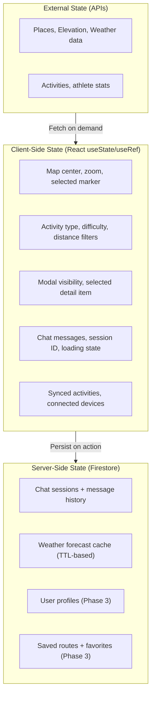

### 3.4 Design Conventions

- **Palette**: All Tailwind CSS classes use the `slate-*` color scale. No `gray-*` classes are permitted anywhere in the codebase.
- **Icons**: Lucide React icons, imported individually (tree-shaking friendly).
- **TypeScript**: Strict mode enabled. No untyped `any` without documented justification.
- **Interface Alignment**: The `Mountain` interface uses `mountain_type: string` in both `page.tsx` and `MapView.tsx` for consistency.
- **Error Handling**: `console.error` only for caught exceptions. No `console.log` in production code.

---

## 4. Server Route Architecture

### 4.1 Route Design Principles

All server routes follow these principles:

1. **Secret Isolation** -- API keys and service account credentials never reach the browser.
2. **Validation First** -- Every request is validated before processing (payload shape, required fields).
3. **Graceful Degradation** -- External API failures return structured error responses, never crash the route.
4. **Node Runtime** -- All routes that use Firebase Admin SDK are forced to Node.js runtime (not Edge) due to native module requirements.

### 4.2 Route Catalog

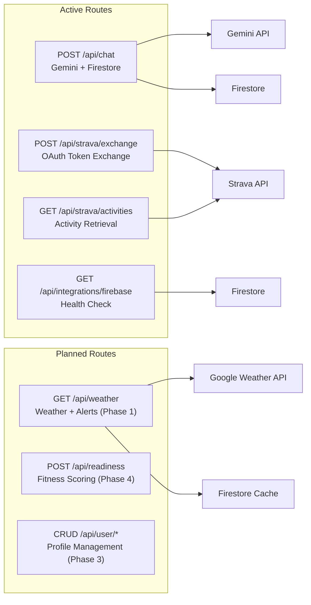

### 4.3 Chat Route Flow

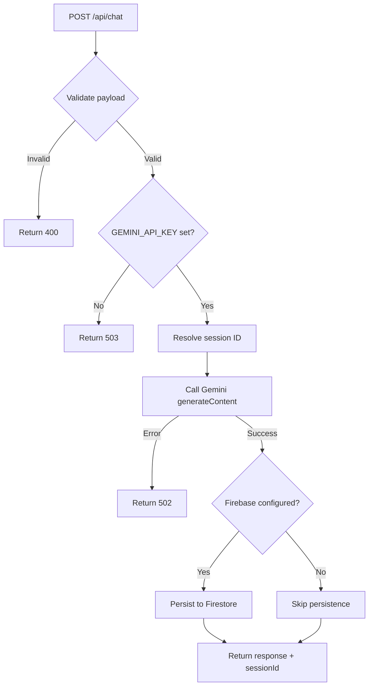

### 4.4 Weather Route Flow (Phase 1)

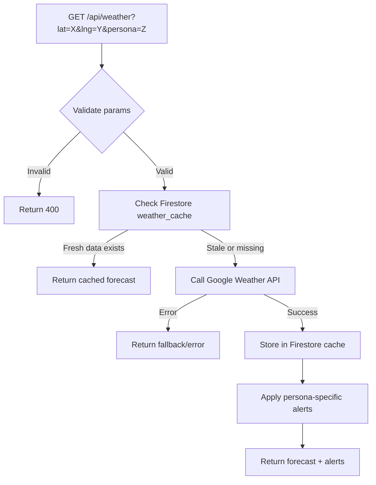

---

## 5. Data Architecture

### 5.1 Firestore Data Model

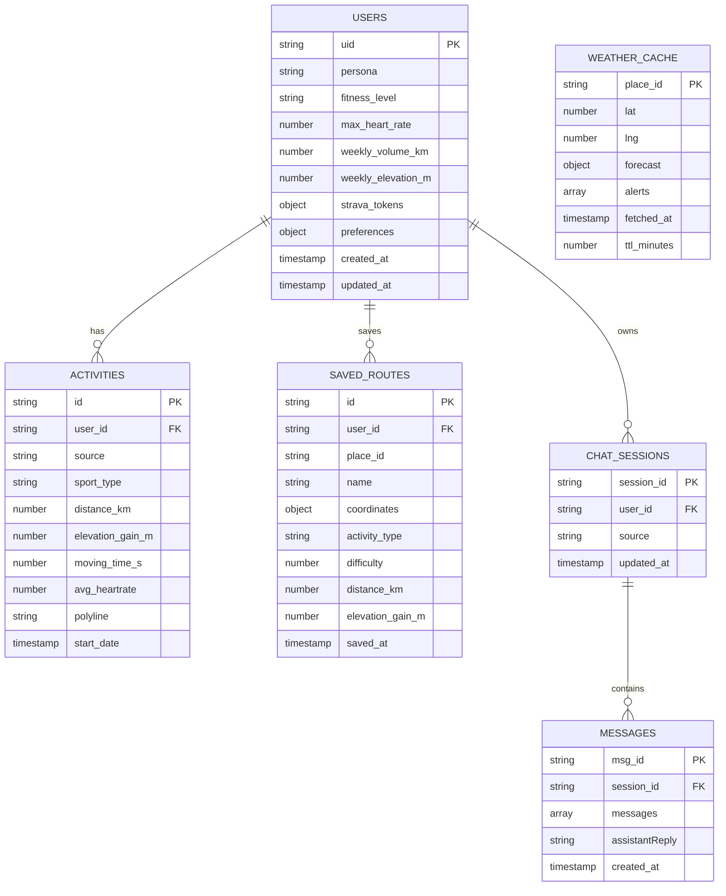

### 5.2 Data Flow Patterns

| Pattern | Description | Example |
| --- | --- | --- |
| **Client-direct** | Browser calls Google API directly using browser-restricted key | Maps tiles, Places search, Elevation batch |
| **Server-proxy** | Browser calls Next.js route, which calls external API with server secret | Strava activities, Gemini chat |
| **Cache-through** | Server checks Firestore cache, calls external API if stale, caches result | Weather forecasts (60-min TTL) |
| **Persist-on-action** | Server writes to Firestore as side-effect of processing | Chat message persistence |

---

## 6. Configuration Architecture

### 6.1 Environment Variable Flow

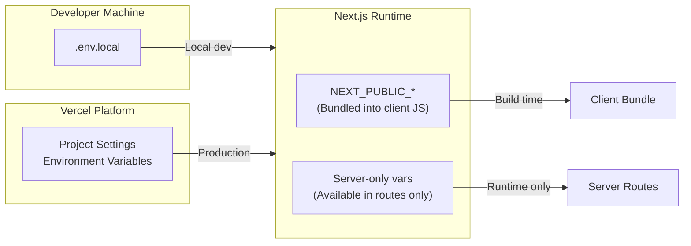

### 6.2 Variable Catalog

| Variable | Scope | Required | Description |
| --- | --- | --- | --- |
| `NEXT_PUBLIC_GOOGLE_MAPS_API_KEY` | Client (bundled) | Yes | Google Maps JS API key (browser-restricted) |
| `GOOGLE_WEATHER_API_KEY` | Server only | Phase 1 | Google Weather API key (server-restricted) |
| `GEMINI_API_KEY` | Server only | Yes | Gemini generative AI API key |
| `FIREBASE_PROJECT_ID` | Server only | Yes | GCP/Firebase project identifier |
| `FIREBASE_SERVICE_ACCOUNT_KEY_JSON` | Server only | Recommended | Full service account JSON string |
| `FIREBASE_CLIENT_EMAIL` | Server only | Alternative | Service account email |
| `FIREBASE_PRIVATE_KEY` | Server only | Alternative | Service account private key |
| `STRAVA_CLIENT_ID` | Server only | Yes | Strava OAuth application client ID |
| `STRAVA_CLIENT_SECRET` | Server only | Yes | Strava OAuth application client secret |

---

## 7. Local Development Architecture

### 7.1 Docker Compose Topology

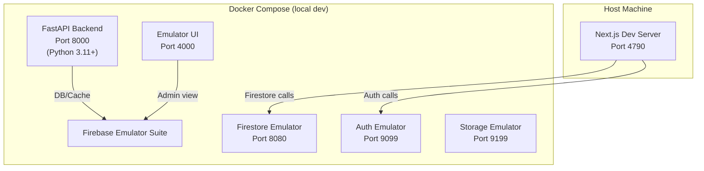

### 7.2 Backend Architecture (Local Only)

The Python FastAPI backend exists for local development experimentation. It is **not deployed** to production. It follows Clean Architecture principles:

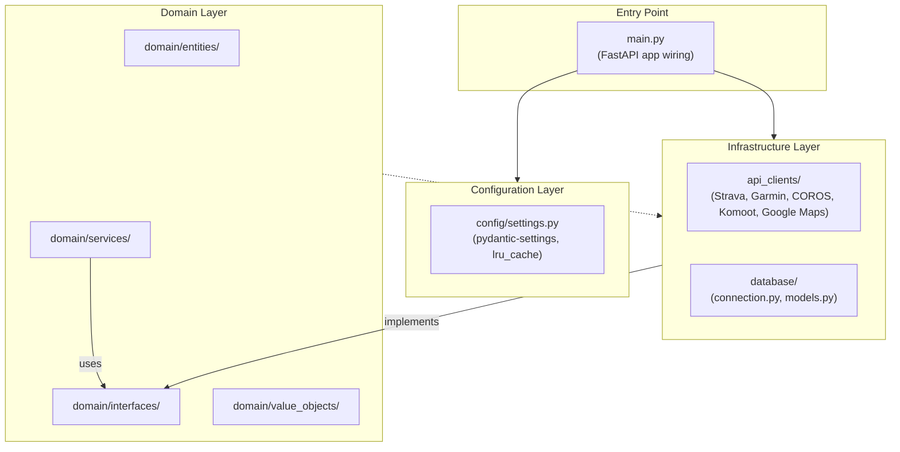

**Layer Rules:**
- Domain layer has zero imports from Infrastructure.
- Infrastructure implements Domain interfaces only.
- Config is loaded via `get_settings()` with `@lru_cache` -- never import settings directly.
- Entry point (`main.py`) handles only FastAPI app wiring -- no business logic.

---

## 8. Planned Architecture Evolution

### 8.1 Phase Roadmap

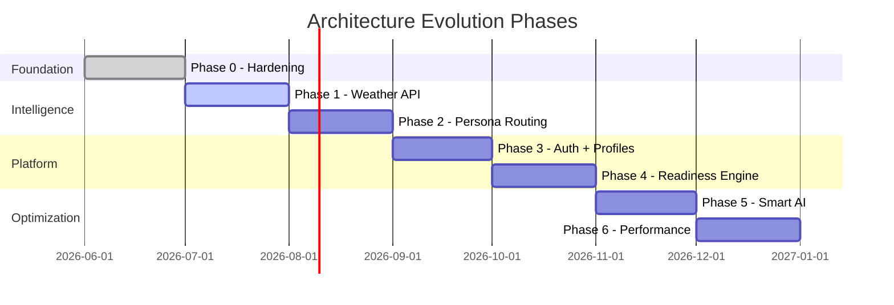

### 8.2 Target State Architecture (Phase 6)

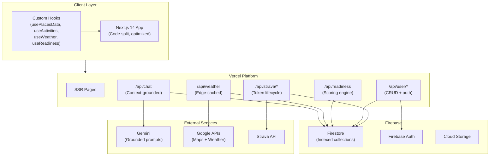

---

## 9. Security Architecture

### 9.1 Trust Boundaries

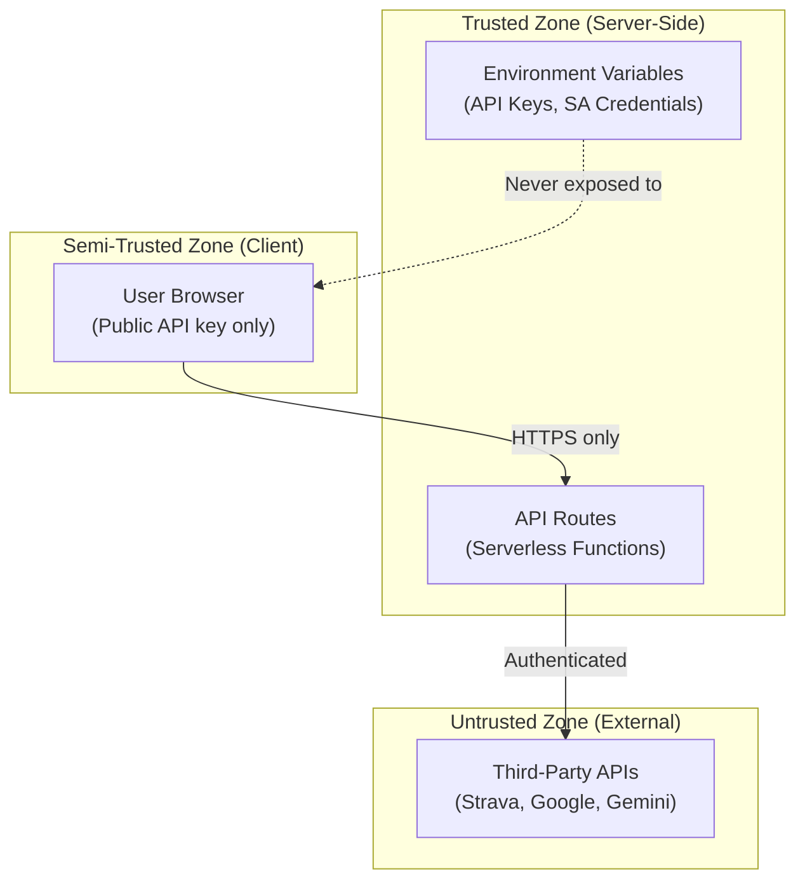

### 9.2 Key Principles

1. **No secrets in client bundle** -- Only `NEXT_PUBLIC_*` variables reach the browser, and these are browser-restricted API keys.
2. **Server-side token management** -- OAuth tokens (Strava) are exchanged server-side. Client stores only short-lived access tokens.
3. **Input validation** -- All server routes validate request payloads before processing.
4. **Structured errors** -- External API failures return controlled error responses, never raw upstream errors.

---

## 10. Performance Architecture

### 10.1 Optimization Strategies

| Strategy | Implementation | Impact |
| --- | --- | --- |
| **Batch Elevation** | `getElevationForLocations()` with up to 512 points per request | Reduces API calls by 90%+ |
| **Places Deduplication** | Merge results from textSearch + nearbySearch by place_id | Prevents duplicate markers |
| **Weather Caching** | Firestore TTL cache (60-min default) | Eliminates redundant Weather API calls |
| **Scale-to-Zero** | Vercel serverless (no always-on compute) | Zero cost when idle |
| **Code Splitting** | Dynamic imports for heavy modals (Phase 6) | Smaller initial bundle |
| **Image Optimization** | `next/image` for all media (Phase 0 migration) | WebP, srcset, lazy loading |

### 10.2 API Cost Management

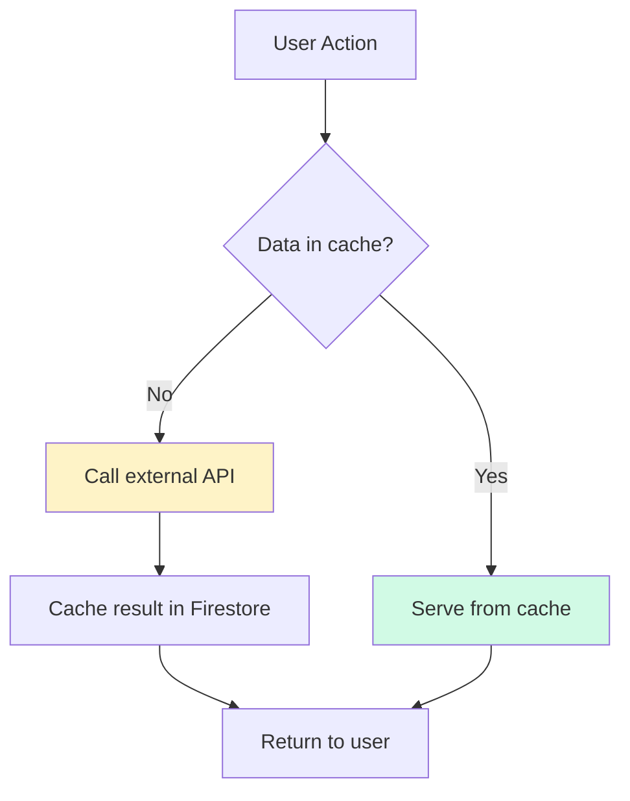

**Cache Locations:**
- Weather data: Firestore `weather_cache/{place_id}` with 60-min TTL
- Places data: In-memory during session (React state)
- Elevation data: Computed once per marker set, held in component state
- Chat sessions: Firestore `chat_sessions/{id}` (permanent)
