# Fit-Ready-IQ Architecture

## 1. Overview

This document describes the system architecture of Fit-Ready-IQ, an adventure readiness platform built for mountaineers, hikers, trail runners, and ultra-distance cyclists. The application runs as a Next.js 16 application deployed on Vercel, with Firebase providing persistence and authentication services, and Google Cloud APIs delivering geographic and weather intelligence.

The architecture follows a **server-route pattern** where the Next.js App Router serves both the frontend UI and backend API logic. Secrets and external API calls are handled exclusively in server routes (serverless functions on Vercel), while client-side code handles rendering, user interaction, and direct Google Maps API calls (which use a browser-restricted API key).

---

## 2. System Architecture

### 2.1 High-Level Topology

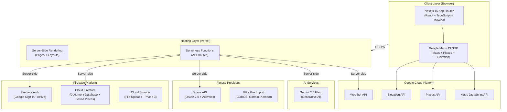
```mermaid
graph TB
    subgraph Client["Client Layer (Browser)"]
        direction TB
        NextApp["Next.js 16 App Router<br/>(React + TypeScript + Tailwind)"]
        MapsSDK["Google Maps JS SDK<br/>(Maps + Places + Elevation)"]
    end

    subgraph Vercel["Hosting Layer (Vercel)"]
        direction TB
        SSR["Server-Side Rendering<br/>(Pages + Layouts)"]
        SR["Serverless Functions<br/>(API Routes)"]
    end

    subgraph GoogleCloud["Google Cloud Platform"]
        direction TB
        MapsAPI["Maps JavaScript API"]
        PlacesAPI["Places API"]
        ElevationAPI["Elevation API"]
        WeatherAPI["Weather API"]
    end

    subgraph Firebase["Firebase Platform"]
        direction TB
        Firestore["Cloud Firestore<br/>(Document Database + Saved Places)"]
        FireAuth["Firebase Auth<br/>(Google Sign-In - Active)"]
        FireStorage["Cloud Storage<br/>(File Uploads - Phase 3)"]
    end

    subgraph Providers["Fitness Providers"]
        direction TB
        StravaAPI["Strava API<br/>(OAuth 2.0 + Activities)"]
        GPXFiles["GPX File Import<br/>(COROS, Garmin, Komoot)"]
    end

    subgraph AI["AI Services"]
        GeminiAPI["Gemini 2.5 Flash<br/>(Generative AI)"]
    end

    Client -->|HTTPS| Vercel
    NextApp --> MapsSDK
    MapsSDK --> MapsAPI
    MapsSDK --> PlacesAPI
    MapsSDK --> ElevationAPI

    SR -->|Server-side| WeatherAPI
    SR -->|Server-side| GeminiAPI
    SR -->|Server-side| StravaAPI
    SR -->|Server-side| Firestore
    SR -->|Server-side| FireAuth
```

### 2.2 Request Flow Architecture

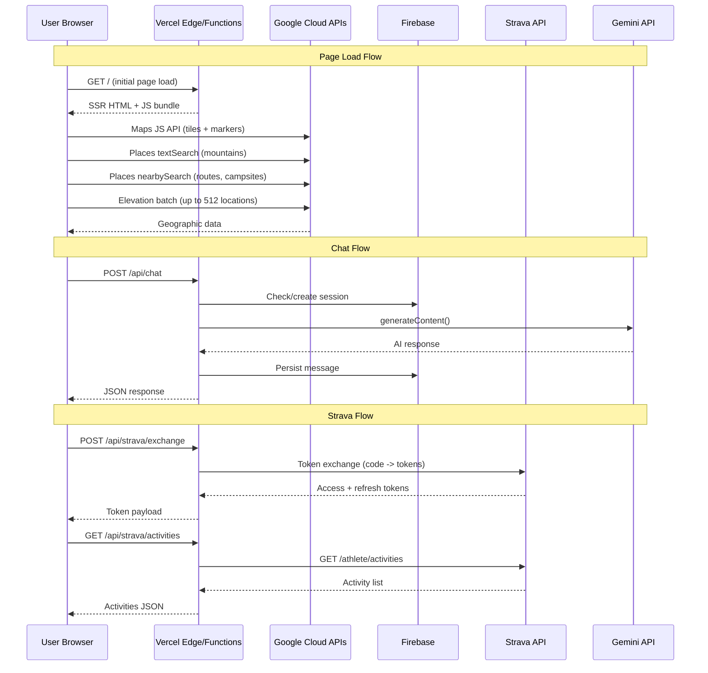
```mermaid
sequenceDiagram
    participant Browser as User Browser
    participant Vercel as Vercel Edge/Functions
    participant Google as Google Cloud APIs
    participant Firebase as Firebase
    participant Strava as Strava API
    participant Gemini as Gemini API

    Note over Browser,Gemini: Page Load Flow
    Browser->>Vercel: GET / (initial page load)
    Vercel-->>Browser: SSR HTML + JS bundle
    Browser->>Google: Maps JS API (tiles + markers)
    Browser->>Google: Places textSearch (mountains)
    Browser->>Google: Places nearbySearch (routes, campsites)
    Browser->>Google: Elevation batch (up to 512 locations)
    Google-->>Browser: Geographic data

    Note over Browser,Gemini: Chat Flow
    Browser->>Vercel: POST /api/chat
    Vercel->>Firebase: Check/create session
    Vercel->>Gemini: generateContent()
    Gemini-->>Vercel: AI response
    Vercel->>Firebase: Persist message
    Vercel-->>Browser: JSON response

    Note over Browser,Gemini: Strava Flow
    Browser->>Vercel: POST /api/strava/exchange
    Vercel->>Strava: Token exchange (code -> tokens)
    Strava-->>Vercel: Access + refresh tokens
    Vercel-->>Browser: Token payload
    Browser->>Vercel: GET /api/strava/activities
    Vercel->>Strava: GET /athlete/activities
    Strava-->>Vercel: Activity list
    Vercel-->>Browser: Activities JSON
```

---

## 3. Frontend Architecture

### 3.1 Module Boundaries

`src/app/app/page.tsx` was a single 3,239-line file as recently as this document's previous revision. It is now 818 lines and orchestration-only — every concern it used to own directly has been extracted into a named component group or a `lib/` hook. The diagram below is deliberately drawn at that group level, not per-file, so it does not need editing every time a group gains another file (see `docs/wiki/CODE-QUALITY.md` Section 5 for the size ceilings that drove this).

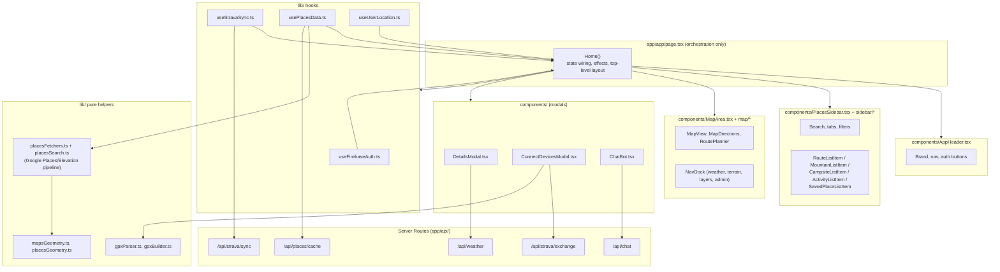
```mermaid
graph TD
    subgraph Page["app/app/page.tsx (orchestration only)"]
        Home["Home()<br/>state wiring, effects, top-level layout"]
    end

    subgraph Header["components/AppHeader.tsx"]
        AppHeader["Brand, nav, auth buttons"]
    end

    subgraph Sidebar["components/PlacesSidebar.tsx + sidebar/*"]
        SidebarTop["Search, tabs, filters"]
        ListItems["RouteListItem / MountainListItem /<br/>CampsiteListItem / ActivityListItem /<br/>SavedPlaceListItem"]
    end

    subgraph MapArea["components/MapArea.tsx + map/*"]
        MapCanvas["MapView, MapDirections, RoutePlanner"]
        NavDock["NavDock (weather, terrain, layers, admin)"]
    end

    subgraph Modals["components/ (modals)"]
        Details["DetailsModal.tsx"]
        Connect["ConnectDevicesModal.tsx"]
        Chat["ChatBot.tsx"]
    end

    subgraph Hooks["lib/ hooks"]
        AuthHook["useFirebaseAuth.ts"]
        StravaHook["useStravaSync.ts"]
        PlacesHook["usePlacesData.ts"]
        LocationHook["useUserLocation.ts"]
    end

    subgraph PureLib["lib/ pure helpers"]
        Fetchers["placesFetchers.ts + placesSearch.ts<br/>(Google Places/Elevation pipeline)"]
        Geometry["mapsGeometry.ts, placesGeometry.ts"]
        GPX["gpxParser.ts, gpxBuilder.ts"]
    end

    subgraph ServerRoutes["Server Routes (app/api/)"]
        ChatAPI["/api/chat"]
        WeatherAPI["/api/weather"]
        StravaExchange["/api/strava/exchange"]
        StravaSync["/api/strava/sync"]
        PlacesCache["/api/places/cache"]
    end

    Home --> Header
    Home --> Sidebar
    Home --> MapArea
    Home --> Modals
    Home --> Hooks

    AuthHook --> Home
    StravaHook --> Home
    PlacesHook --> Home
    PlacesHook --> Fetchers
    Fetchers --> Geometry
    LocationHook --> Home

    Chat --> ChatAPI
    Details --> WeatherAPI
    Connect --> StravaExchange
    Connect --> GPX
    StravaHook --> StravaSync
    PlacesHook --> PlacesCache
```

### 3.2 Component Responsibilities

| Component / Hook | Responsibility | Key Dependencies |
| --- | --- | --- |
| `page.tsx` (`Home`) | State wiring only: calls the hooks below, composes the four component groups, owns the handful of memos that genuinely span multiple hooks' outputs (`filteredRoutes`, `dockAlerts`, `layerCounts`). Does not fetch, parse, or render list items directly anymore. | All hooks and component groups |
| `AppHeader.tsx` | Brand, nav actions, admin-gate link, auth buttons/avatar. | `useAdminGate`, auth state passed as props |
| `PlacesSidebar.tsx` + `sidebar/*` | Search box, tab strip, filters, and the five list-item renderers (one component each) plus their loading/error/empty states. | `RouteFilter.tsx`, the five `*ListItem.tsx` components |
| `MapArea.tsx` + `map/*` | The map panel: `MapView`, `MapDirections`, `RoutePlanner`, and `NavDock` wiring (weather, terrain pulse, layers, admin/roadmap triggers). | `@react-google-maps/api`, `usePlannerRoute` |
| `DetailsModal.tsx` | Displays detailed information for a selected route/mountain/campsite/activity: elevation profile, photos, gear recommendations, weather. Does **not** show Strava segments — that field was removed as fabricated data (see `placesTypes.ts`). | Google Elevation API, weather data |
| `ConnectDevicesModal.tsx` | Strava OAuth flow, GPX/Apple Health file import, activity history display with source badges. Accepts `.gpx` only — `gpxParser.ts` reads `<trkpt>`, which TCX does not use. | Strava routes, `gpxParser.ts`, `appleHealthParser.ts` |
| `ChatBot.tsx` | Conversational AI interface — message history, session persistence to `localStorage` + Firestore. No tool-use yet; see `docs/wiki/AI.md`. | `/api/chat` route |
| `useFirebaseAuth.ts` | Auth-listener effect, sign-in/out handlers, auth error state (not `alert()`). | `firebaseClient.ts` |
| `useStravaSync.ts` | Paginated Strava activity fetch (capped at 10 pages), localStorage load, Firestore background sync. | `stravaAuth.ts`, `/api/strava/sync` |
| `usePlacesData.ts` | The three-tier places cache (sessionStorage -> Firestore -> live fetch), delegates the actual Google API calls to `placesFetchers.ts`/`placesSearch.ts`. | `placesFetchers.ts`, `/api/places/cache` |
| `useSavedPlaces.ts` | Real-time Firestore listener hook for the authenticated user's saved places. Subscribes on mount, unsubscribes on unmount. | Firebase client SDK, Firestore |

### 3.3 State Management Strategy

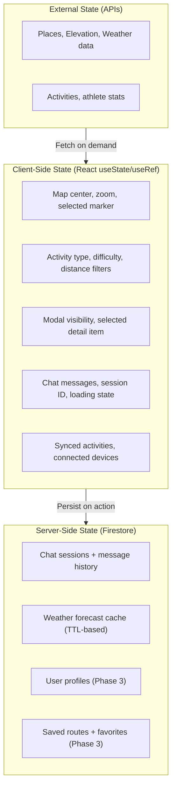
```mermaid
flowchart TD
    subgraph ClientState["Client-Side State (React useState/useRef)"]
        MapState["Map center, zoom, selected marker"]
        FilterState["Activity type, difficulty, distance filters"]
        ModalState["Modal visibility, selected detail item"]
        ChatState["Chat messages, session ID, loading state"]
        ActivityState["Synced activities, connected devices"]
    end

    subgraph ServerState["Server-Side State (Firestore)"]
        ChatSessions["Chat sessions + message history"]
        WeatherCache["Weather forecast cache (TTL-based)"]
        UserProfiles["User profiles (Phase 3)"]
        SavedRoutes["Saved routes + favorites (Phase 3)"]
    end

    subgraph ExternalState["External State (APIs)"]
        GoogleData["Places, Elevation, Weather data"]
        StravaData["Activities, athlete stats"]
    end

    ClientState -->|Persist on action| ServerState
    ExternalState -->|Fetch on demand| ClientState
```

### 3.4 Design Conventions

- **Palette**: All Tailwind CSS classes use the `slate-*` color scale. No `gray-*` classes are permitted anywhere in the codebase.
- **Icons**: Lucide React icons, imported individually (tree-shaking friendly).
- **TypeScript**: Strict mode enabled. No untyped `any` without documented justification.
- **Interface Alignment**: The `Mountain` interface uses `mountain_type: string` in both `page.tsx` and `MapView.tsx` for consistency.
- **Error Handling**: `console.error` only for caught exceptions. No `console.log` in production code.

---

## 4. Server Route Architecture

### 4.1 Route Design Principles

All server routes follow these principles:

1. **Secret Isolation** -- API keys and service account credentials never reach the browser.
2. **Validation First** -- Every request is validated before processing (payload shape, required fields).
3. **Graceful Degradation** -- External API failures return structured error responses, never crash the route.
4. **Node Runtime** -- All routes that use Firebase Admin SDK are forced to Node.js runtime (not Edge) due to native module requirements.

### 4.2 Route Catalog

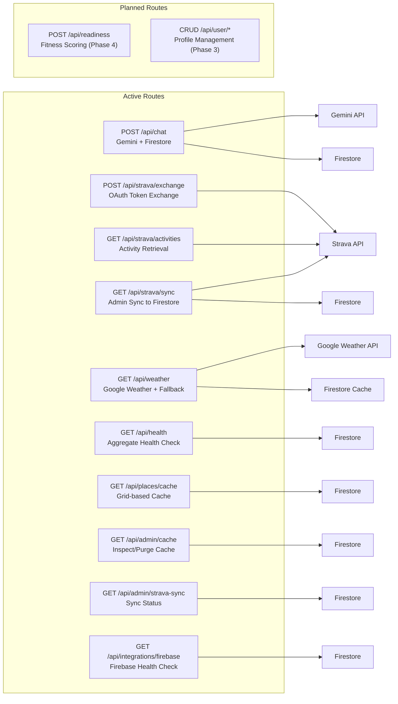
```mermaid
graph LR
    subgraph Active["Active Routes"]
        Chat["POST /api/chat<br/>Gemini + Firestore"]
        StravaEx["POST /api/strava/exchange<br/>OAuth Token Exchange"]
        StravaAct["GET /api/strava/activities<br/>Activity Retrieval"]
        StravaSync["GET /api/strava/sync<br/>Admin Sync to Firestore"]
        Weather["GET /api/weather<br/>Google Weather + Fallback"]
        Health["GET /api/health<br/>Aggregate Health Check"]
        PlacesCache["GET /api/places/cache<br/>Grid-based Cache"]
        AdminCache["GET /api/admin/cache<br/>Inspect/Purge Cache"]
        AdminStrava["GET /api/admin/strava-sync<br/>Sync Status"]
        FBHealth["GET /api/integrations/firebase<br/>Firebase Health Check"]
    end

    subgraph Planned["Planned Routes"]
        Readiness["POST /api/readiness<br/>Fitness Scoring (Phase 4)"]
        UserAPI["CRUD /api/user/*<br/>Profile Management (Phase 3)"]
    end

    Chat --> Gemini["Gemini API"]
    Chat --> FS1["Firestore"]
    StravaEx --> Strava["Strava API"]
    StravaAct --> Strava
    StravaSync --> Strava
    StravaSync --> FS2["Firestore"]
    Weather --> GW["Google Weather API"]
    Weather --> FS3["Firestore Cache"]
    Health --> FS4["Firestore"]
    PlacesCache --> FS5["Firestore"]
    AdminCache --> FS6["Firestore"]
    AdminStrava --> FS7["Firestore"]
    FBHealth --> FS8["Firestore"]
```

### 4.3 Chat Route Flow

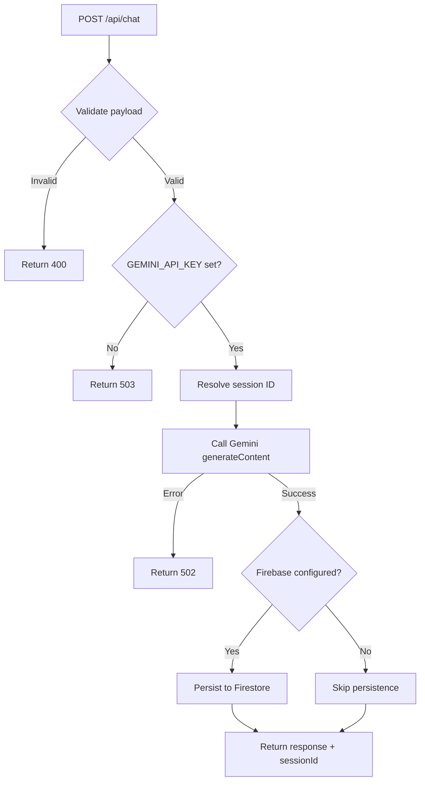
```mermaid
flowchart TD
    A[POST /api/chat] --> B{Validate payload}
    B -->|Invalid| C[Return 400]
    B -->|Valid| D{GEMINI_API_KEY set?}
    D -->|No| E[Return 503]
    D -->|Yes| F[Resolve session ID]
    F --> G[Call Gemini generateContent]
    G -->|Error| H[Return 502]
    G -->|Success| I{Firebase configured?}
    I -->|Yes| J[Persist to Firestore]
    I -->|No| K[Skip persistence]
    J --> L[Return response + sessionId]
    K --> L
```

### 4.4 Weather Route Flow

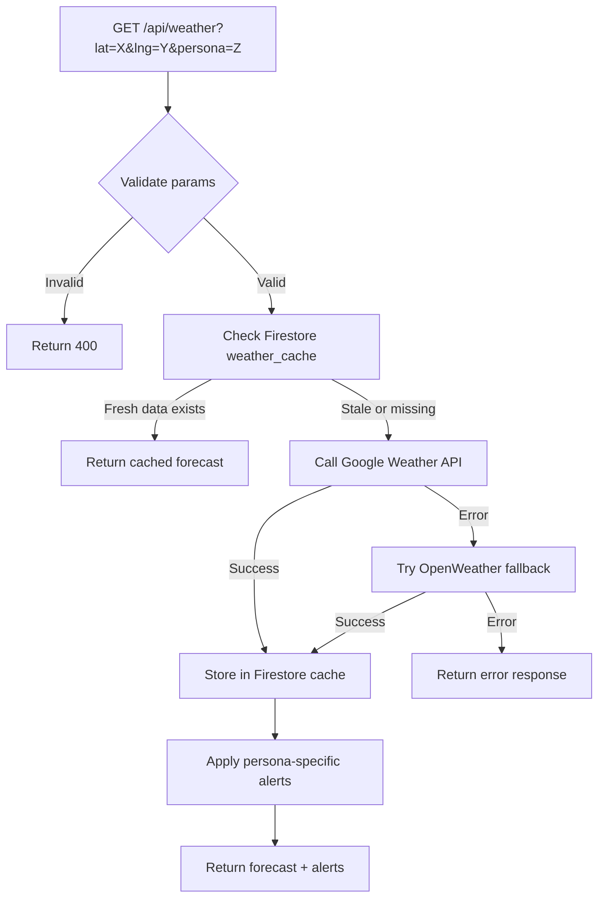
```mermaid
flowchart TD
    A["GET /api/weather?lat=X&lng=Y&persona=Z"] --> B{Validate params}
    B -->|Invalid| C[Return 400]
    B -->|Valid| D[Check Firestore weather_cache]
    D -->|Fresh data exists| E[Return cached forecast]
    D -->|Stale or missing| F[Call Google Weather API]
    F -->|Error| G[Try OpenWeather fallback]
    G -->|Success| H[Store in Firestore cache]
    G -->|Error| I[Return error response]
    F -->|Success| H
    H --> J[Apply persona-specific alerts]
    J --> K[Return forecast + alerts]
```

### 4.5 Health Route

`GET /api/health` aggregates connectivity checks for all six integrated services in a single call. It is used for post-deployment validation and monitoring dashboards.

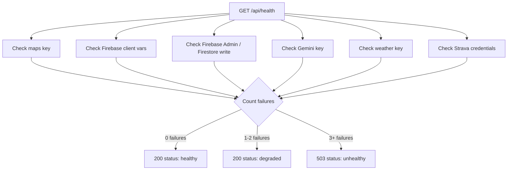
```mermaid
flowchart TD
    A["GET /api/health"] --> B[Check maps key]
    A --> C[Check Firebase client vars]
    A --> D[Check Firebase Admin / Firestore write]
    A --> E[Check Gemini key]
    A --> F[Check weather key]
    A --> G[Check Strava credentials]
    B & C & D & E & F & G --> H{Count failures}
    H -->|0 failures| I["200 status: healthy"]
    H -->|1-2 failures| J["200 status: degraded"]
    H -->|3+ failures| K["503 status: unhealthy"]
```

The endpoint always returns a response (even on failures), so monitoring tools can distinguish between "route unreachable" and "service degraded." See [API.md](API.md) for the full response schema.

### 4.6 Places Cache Route

`GET /api/places/cache` implements a grid-based cache for Google Places results stored in Firestore.

**Cache key strategy:** Incoming `lat`/`lng` coordinates are rounded to the nearest 0.5 degree boundary. This means all users within the same 0.5° grid cell (roughly 55 km x 55 km at mid-latitudes) share the same cached result, dramatically reducing Places API calls.

**TTL:** 24 hours. Stale documents are refreshed on the next cache miss.

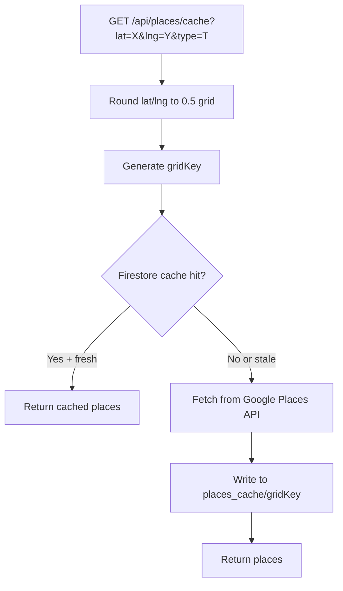
```mermaid
flowchart TD
    A["GET /api/places/cache?lat=X&lng=Y&type=T"] --> B[Round lat/lng to 0.5 grid]
    B --> C[Generate gridKey]
    C --> D{Firestore cache hit?}
    D -->|Yes + fresh| E[Return cached places]
    D -->|No or stale| F[Fetch from Google Places API]
    F --> G[Write to places_cache/gridKey]
    G --> H[Return places]
```

---

## 5. Data Architecture

### 5.1 Firestore Data Model

The full schema — every Firestore collection, which SDK writes it, and the non-Firestore client-side caches — lives in `docs/wiki/DATA.md`. It is not duplicated here so there is exactly one place to update when the schema changes; the frontend and backend currently use separate, unrelated Firestore collections under the same project (see `DATA.md` Sections 2 and 3), and two accepted ADRs (0003, 0004) describe a planned Trip/route-geometry model not yet reflected in either.

### 5.2 Data Flow Patterns

| Pattern | Description | Example |
| --- | --- | --- |
| **Client-direct** | Browser calls Google API directly using browser-restricted key | Maps tiles, Places search, Elevation batch |
| **Server-proxy** | Browser calls Next.js route, which calls external API with server secret | Strava activities, Gemini chat |
| **Cache-through** | Server checks Firestore cache, calls external API if stale, caches result | Weather forecasts (60-min TTL) |
| **Persist-on-action** | Server writes to Firestore as side-effect of processing | Chat message persistence |

---

## 6. Configuration Architecture

### 6.1 Environment Variable Flow

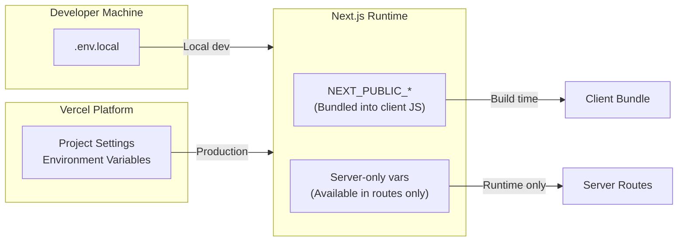
```mermaid
flowchart LR
    subgraph Developer["Developer Machine"]
        EnvLocal[".env.local"]
    end

    subgraph Vercel["Vercel Platform"]
        EnvVars["Project Settings<br/>Environment Variables"]
    end

    subgraph Runtime["Next.js Runtime"]
        Public["NEXT_PUBLIC_*<br/>(Bundled into client JS)"]
        Server["Server-only vars<br/>(Available in routes only)"]
    end

    EnvLocal -->|Local dev| Runtime
    EnvVars -->|Production| Runtime
    Public -->|Build time| Browser["Client Bundle"]
    Server -->|Runtime only| Routes["Server Routes"]
```

### 6.2 Variable Catalog

| Variable | Scope | Required | Description |
| --- | --- | --- | --- |
| `NEXT_PUBLIC_GOOGLE_MAPS_API_KEY` | Client (bundled) | Yes | Google Maps JS API key (browser-restricted) |
| `GOOGLE_WEATHER_API_KEY` | Server only | Phase 1 | Google Weather API key (server-restricted) |
| `GEMINI_API_KEY` | Server only | Yes | Gemini generative AI API key |
| `FIREBASE_PROJECT_ID` | Server only | Yes | GCP/Firebase project identifier |
| `FIREBASE_SERVICE_ACCOUNT_KEY_JSON` | Server only | Recommended | Full service account JSON string |
| `FIREBASE_CLIENT_EMAIL` | Server only | Alternative | Service account email |
| `FIREBASE_PRIVATE_KEY` | Server only | Alternative | Service account private key |
| `STRAVA_CLIENT_ID` | Server only | Yes | Strava OAuth application client ID |
| `STRAVA_CLIENT_SECRET` | Server only | Yes | Strava OAuth application client secret |

---

## 7. Local Development Architecture

### 7.1 Docker Compose Topology

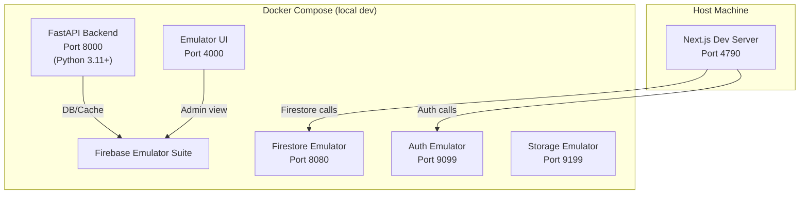
```mermaid
graph TB
    subgraph DockerCompose["Docker Compose (local dev)"]
        Emulators["Firebase Emulator Suite"]
        FirestoreEmu["Firestore Emulator<br/>Port 8080"]
        AuthEmu["Auth Emulator<br/>Port 9099"]
        StorageEmu["Storage Emulator<br/>Port 9199"]
        EmulatorUI["Emulator UI<br/>Port 4000"]
        Backend["FastAPI Backend<br/>Port 8000<br/>(Python 3.11+)"]
    end

    subgraph Local["Host Machine"]
        Frontend["Next.js Dev Server<br/>Port 4790"]
    end

    Frontend -->|Firestore calls| FirestoreEmu
    Frontend -->|Auth calls| AuthEmu
    Backend -->|DB/Cache| Emulators
    EmulatorUI -->|Admin view| Emulators
```

### 7.2 Backend Architecture (Local Only)

The Python FastAPI backend exists for local development experimentation. It is **not deployed** to production. It follows Clean Architecture principles:

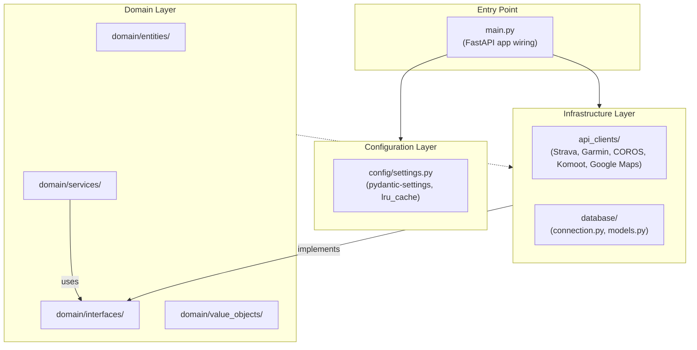
```mermaid
graph TD
    subgraph EntryPoint["Entry Point"]
        Main["main.py<br/>(FastAPI app wiring)"]
    end

    subgraph Config["Configuration Layer"]
        Settings["config/settings.py<br/>(pydantic-settings, lru_cache)"]
    end

    subgraph Domain["Domain Layer"]
        Entities["domain/entities/"]
        Interfaces["domain/interfaces/"]
        Services["domain/services/"]
        ValueObjects["domain/value_objects/"]
    end

    subgraph Infrastructure["Infrastructure Layer"]
        APIClients["api_clients/<br/>(Strava, Garmin, COROS, Komoot, Google Maps)"]
        Database["database/<br/>(connection.py, models.py)"]
    end

    Main --> Config
    Main --> Infrastructure
    Infrastructure -->|implements| Interfaces
    Services -->|uses| Interfaces
    Domain -.->|NO imports from| Infrastructure
```

**Layer Rules:**
- Domain layer has zero imports from Infrastructure.
- Infrastructure implements Domain interfaces only.
- Config is loaded via `get_settings()` with `@lru_cache` -- never import settings directly.
- Entry point (`main.py`) handles only FastAPI app wiring -- no business logic.

---

## 8. Planned Architecture Evolution

### 8.1 Phase Roadmap

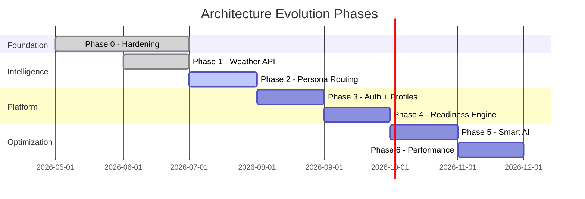
```mermaid
gantt
    title Architecture Evolution Phases
    dateFormat YYYY-MM
    section Foundation
        Phase 0 - Hardening        :done, p0, 2026-05, 2026-07
    section Intelligence
        Phase 1 - Weather API      :done, p1, 2026-06, 2026-07
        Phase 2 - Persona Routing  :active, p2, 2026-07, 2026-08
    section Platform
        Phase 3 - Auth + Profiles  :p3, 2026-08, 2026-09
        Phase 4 - Readiness Engine :p4, 2026-09, 2026-10
    section Optimization
        Phase 5 - Smart AI         :p5, 2026-10, 2026-11
        Phase 6 - Performance      :p6, 2026-11, 2026-12
```

### 8.2 Target State Architecture (Phase 6)

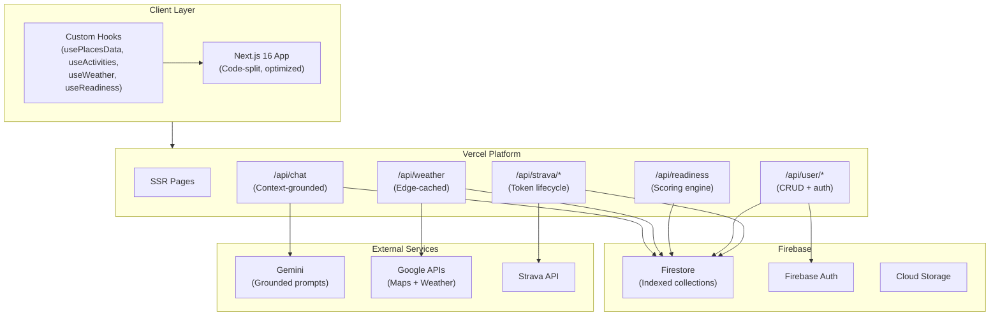
```mermaid
graph TB
    subgraph Client["Client Layer"]
        App["Next.js 16 App<br/>(Code-split, optimized)"]
        Hooks["Custom Hooks<br/>(usePlacesData, useActivities,<br/>useWeather, useReadiness)"]
    end

    subgraph Vercel["Vercel Platform"]
        Pages["SSR Pages"]
        ChatRoute["/api/chat<br/>(Context-grounded)"]
        WeatherRoute["/api/weather<br/>(Edge-cached)"]
        ReadinessRoute["/api/readiness<br/>(Scoring engine)"]
        UserRoute["/api/user/*<br/>(CRUD + auth)"]
        StravaRoute["/api/strava/*<br/>(Token lifecycle)"]
    end

    subgraph Services["External Services"]
        Gemini["Gemini<br/>(Grounded prompts)"]
        Google["Google APIs<br/>(Maps + Weather)"]
        Strava["Strava API"]
    end

    subgraph Firebase["Firebase"]
        FS["Firestore<br/>(Indexed collections)"]
        Auth["Firebase Auth"]
        Storage["Cloud Storage"]
    end

    Client --> Vercel
    Hooks --> App
    ChatRoute --> Gemini
    ChatRoute --> FS
    WeatherRoute --> Google
    WeatherRoute --> FS
    ReadinessRoute --> FS
    UserRoute --> Auth
    UserRoute --> FS
    StravaRoute --> Strava
    StravaRoute --> FS
```

---

## 9. Security Architecture

### 9.1 Trust Boundaries

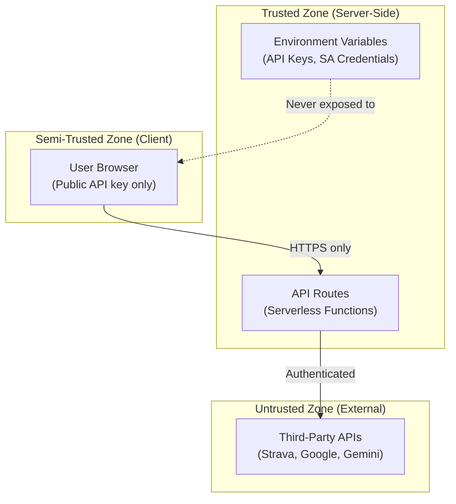
```mermaid
flowchart TD
    subgraph Trusted["Trusted Zone (Server-Side)"]
        Routes["API Routes<br/>(Serverless Functions)"]
        Secrets["Environment Variables<br/>(API Keys, SA Credentials)"]
    end

    subgraph SemiTrusted["Semi-Trusted Zone (Client)"]
        Browser["User Browser<br/>(Public API key only)"]
    end

    subgraph Untrusted["Untrusted Zone (External)"]
        APIs["Third-Party APIs<br/>(Strava, Google, Gemini)"]
    end

    Browser -->|HTTPS only| Routes
    Routes -->|Authenticated| APIs
    Secrets -.->|Never exposed to| Browser
```

### 9.2 Key Principles

1. **No secrets in client bundle** -- Only `NEXT_PUBLIC_*` variables reach the browser, and these are browser-restricted API keys.
2. **Server-side token management** -- OAuth tokens (Strava) are exchanged server-side. Client stores only short-lived access tokens.
3. **Input validation** -- All server routes validate request payloads before processing.
4. **Structured errors** -- External API failures return controlled error responses, never raw upstream errors.

---

## 10. Performance Architecture

### 10.1 Optimization Strategies

| Strategy | Implementation | Impact |
| --- | --- | --- |
| **Batch Elevation** | `getElevationForLocations()` with up to 512 points per request | Reduces API calls by 90%+ |
| **Places Deduplication** | Merge results from textSearch + nearbySearch by place_id | Prevents duplicate markers |
| **Weather Caching** | Firestore TTL cache (60-min default) | Eliminates redundant Weather API calls |
| **Scale-to-Zero** | Vercel serverless (no always-on compute) | Zero cost when idle |
| **Code Splitting** | Dynamic imports for heavy modals (Phase 6) | Smaller initial bundle |
| **Image Optimization** | `next/image` for all media (Phase 0 migration) | WebP, srcset, lazy loading |

### 10.2 API Cost Management

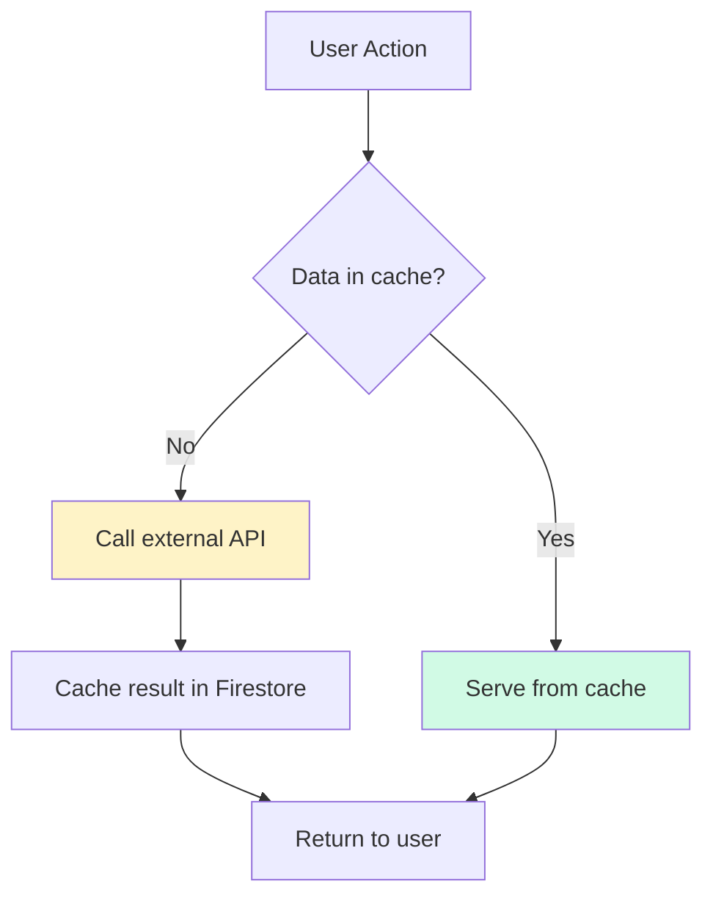
```mermaid
flowchart TD
    A[User Action] --> B{Data in cache?}
    B -->|Yes| C[Serve from cache]
    B -->|No| D[Call external API]
    D --> E[Cache result in Firestore]
    E --> F[Return to user]
    C --> F

    style C fill:#d1fae5
    style D fill:#fef3c7
```

**Cache Locations:**
- Weather data: Firestore `weather_cache/{place_id}` with 60-min TTL
- Places data: In-memory during session (React state)
- Elevation data: Computed once per marker set, held in component state
- Chat sessions: Firestore `chat_sessions/{id}` (permanent)
