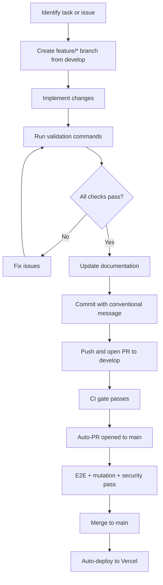
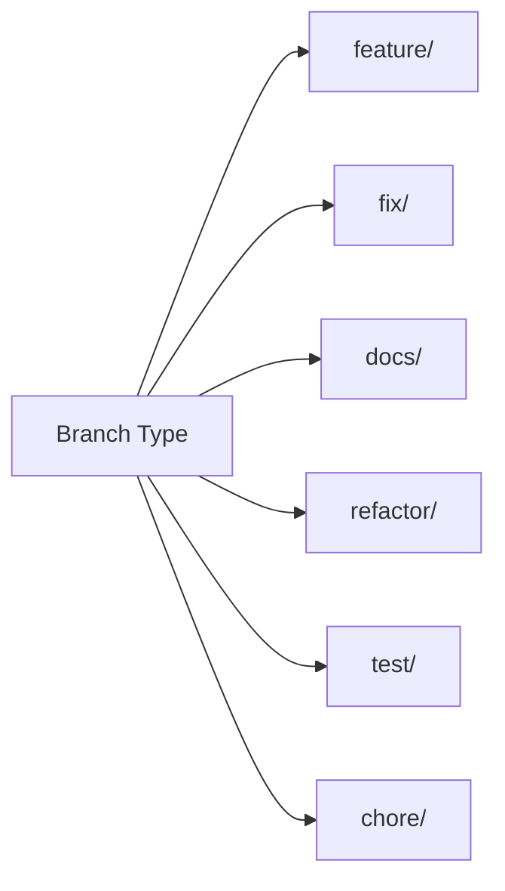
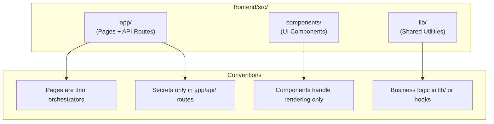
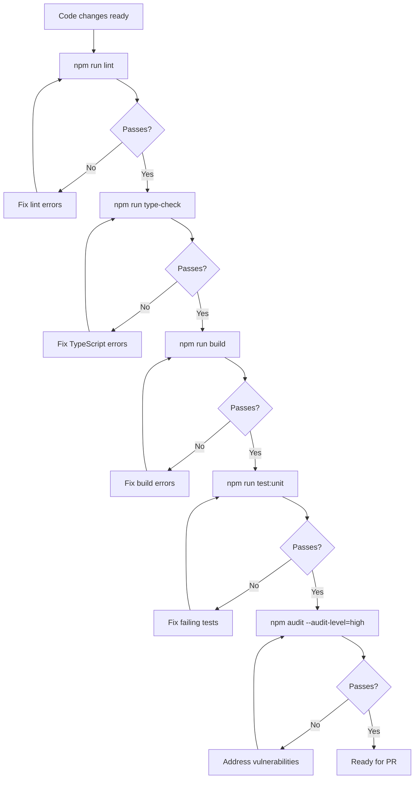
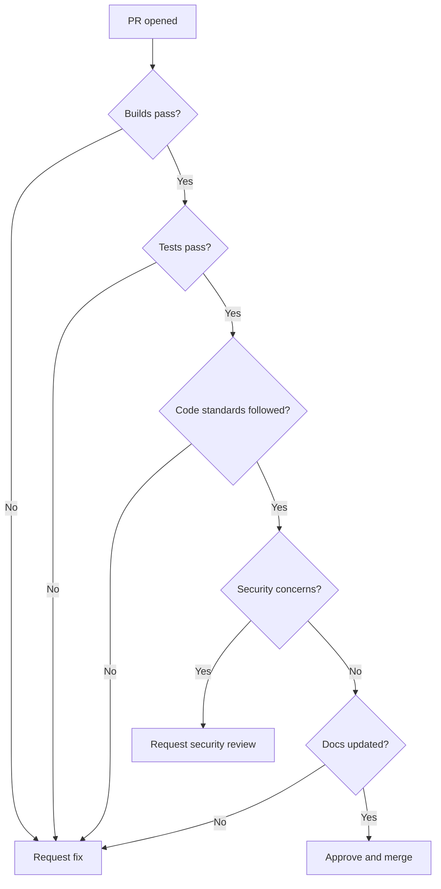

# Contributing to Fit-Ready-IQ

## 1. Overview

Thank you for contributing to Fit-Ready-IQ. This document describes the contribution workflow, code standards, validation requirements, and review process for the project. All contributors -- whether fixing bugs, adding features, or improving documentation -- should follow these guidelines to maintain code quality and project coherence.

Fit-Ready-IQ serves four outdoor athlete personas (mountaineers, hikers, trail runners, ultra-distance cyclists) and integrates with multiple external services (Google Maps, Google Weather, Strava, Gemini, Firebase). Contributions should respect the platform's multi-persona architecture and existing conventions.

---

## 2. Contribution Goals

Contributions should improve one or more of:

| Area | Examples |
| --- | --- |
| **User Experience** | Better map interactions, clearer elevation profiles, faster load times |
| **Persona Features** | Persona-specific scoring, weather alerts, gear recommendations |
| **Integration Reliability** | Better error handling for Maps, Elevation, Weather, Strava, Gemini, Firebase |
| **Security** | Vulnerability fixes, secret handling improvements, input validation |
| **Performance** | Reduced API calls, code splitting, caching improvements |
| **Documentation** | Clearer guides, updated diagrams, new troubleshooting entries |
| **Testing** | New unit tests, E2E coverage, edge case handling |

---

## 3. Contribution Workflow

### 3.1 Process Overview



### 3.2 Detailed Steps

1. **Branch** -- Create a `feature/*` branch from `develop` (not from `main`).
2. **Implement** -- Make changes following code standards (Section 5).
3. **Validate** -- Run all validation commands (Section 6) and ensure zero errors.
4. **Document** -- Update relevant docs if behavior changed (Section 7).
5. **Commit** -- Use conventional commit messages (Section 4). The `commit-msg` hook enforces format automatically.
6. **PR** -- Open a pull request to `develop`. A PR template is pre-filled on GitHub -- complete all sections.
7. **CI gate** -- `ci.yml` runs lint, type-check, unit tests, and build. All must pass before merge.
8. **Auto-PR** -- Once CI passes on `develop`, `auto-pr.yml` automatically opens a PR from `develop` to `main`.
9. **Review** -- Address reviewer feedback. The `agent-review.yml` workflow posts an AI review comment automatically.
10. **Merge** -- After E2E, mutation, and security checks pass on the `develop`-to-`main` PR, merge to `main`. Vercel deploys automatically.

---

## 4. Branch and Commit Standards

### 4.1 Branch Naming



| Type | Pattern | Example |
| --- | --- | --- |
| Feature | `feature/<description>` | `feature/weather-api-integration` |
| Bug fix | `fix/<description>` | `fix/strava-callback-validation` |
| Documentation | `docs/<description>` | `docs/architecture-mermaid-diagrams` |
| Refactor | `refactor/<description>` | `refactor/extract-places-hook` |
| Testing | `test/<description>` | `test/weather-route-unit-tests` |
| Maintenance | `chore/<description>` | `chore/upgrade-next-14.2` |

All branches should be created from `develop`, not `main`.

### 4.2 Commit Message Format

Use [Conventional Commits](https://www.conventionalcommits.org/). The `commit-msg` Husky hook enforces this format automatically on every commit.

```
<type>(<scope>): <description>

[optional body]
[optional footer]
```

Max subject length: 100 characters.

**Examples:**

```
feat(weather): add Google Weather API server route

Implements /api/weather with Firestore caching (60-min TTL)
and persona-specific alert thresholds.

Closes #42
```

```
fix(strava): handle expired token in activities endpoint

Return 401 with clear error message when Strava rejects
the access token, instead of a generic 502.
```

```
docs(architecture): replace ASCII diagrams with Mermaid

Update all documentation files to use Mermaid flowcharts
and sequence diagrams for better rendering on GitHub.
```

**Types:** `feat`, `fix`, `docs`, `style`, `refactor`, `perf`, `test`, `chore`, `revert`, `ci`, `build`

**Scopes:** `maps`, `weather`, `chat`, `strava`, `firebase`, `elevation`, `ui`, `build`, `deps`, `health`, `admin`, `places`

### 4.3 Pre-commit Hooks (Husky)

Husky installs two Git hooks automatically when you run `npm install`:

| Hook | Trigger | What It Does |
| --- | --- | --- |
| `pre-commit` | Before every commit | Runs `lint-staged`: ESLint `--fix` + Prettier on staged `*.ts(x)` files. Auto-fixes are re-staged. |
| `commit-msg` | After writing commit message | Runs `commitlint` to validate Conventional Commits format. Rejects the commit if the message is invalid. |

These hooks run without any manual setup. If a commit is rejected by `commit-msg`, fix the message and try again -- the staged changes are preserved.

---

## 5. Code Standards

### 5.1 TypeScript / React (Frontend)

| Standard | Rule |
| --- | --- |
| Naming (components) | PascalCase: `DetailsModal.tsx`, `MapView.tsx` |
| Naming (functions/vars) | camelCase: `fetchElevations`, `selectedMarker` |
| Naming (constants) | UPPER_SNAKE_CASE: `MAX_BATCH_SIZE` |
| Types | No untyped `any` without documented justification |
| Logging | No `console.log` in production code. Use `console.error` for caught exceptions only. |
| Palette | All Tailwind classes use `slate-*` only. No `gray-*` anywhere. |
| Comments | JSX comments must be properly closed: `{/* comment */}` |
| Imports | Import Lucide icons individually (tree-shaking) |
| State | No `useState` + `useEffect` for server data (use proper fetching patterns) |

### 5.2 Python (Backend -- local dev only)

| Standard | Rule |
| --- | --- |
| Naming (functions/vars) | snake_case: `fetch_elevation_data`, `route_difficulty` |
| Naming (classes) | PascalCase: `MountainEntity`, `RouteService` |
| Naming (constants) | UPPER_SNAKE_CASE: `DATABASE_URL` |
| Formatting | Ruff format (configured in `pyproject.toml`) |
| Linting | Ruff check with zero errors |
| Architecture | Domain layer must not import from Infrastructure |
| Async | All DB operations must be async. No blocking I/O in async functions. |

### 5.3 File Organization



---

## 6. Validation Commands

### 6.1 Required Before Every PR

All of these must pass with zero errors:

```bash
cd frontend

# Lint check (ESLint)
npm run lint

# TypeScript type check
npm run type-check

# Build check (Next.js)
npm run build

# Unit tests (Vitest)
npm run test:unit

# Security audit
npm audit --audit-level=high
```

### 6.2 Backend Validation (if backend/ files changed)

```bash
cd backend

# Install dependencies
poetry install

# Lint check
poetry run ruff check .

# Format check
poetry run ruff format --check .

# Unit tests
poetry run pytest tests/ -v --tb=short
```

### 6.3 Validation Flow



---

## 7. Documentation Requirements

### 7.1 When to Update Documentation

If your change affects any of the following, update the corresponding document:

| Change Type | Update Required |
| --- | --- |
| New feature or behavior change | `docs/solution-plan/SOLUTION-PLAN.md` (source of truth -- always update first) |
| New/modified API endpoint | `docs/wiki/API.md` |
| Architecture or module boundary change | `docs/wiki/ARCHITECTURE.md` |
| Deployment config or env var change | `docs/wiki/DEPLOYMENT.md` |
| Security practice or secret change | `docs/wiki/SECURITY.md` |
| New common issue or fix | `docs/wiki/TROUBLESHOOTING.md` |

### 7.2 Documentation Standards

- Use Mermaid diagrams for all flowcharts, sequence diagrams, and architecture views.
- Keep content detailed and actionable -- not vague or aspirational.
- Include code examples for configuration and API usage.
- Reference other docs with relative links.
- Do not introduce new documentation files unless explicitly requested.

---

## 8. Review Checklist

### 8.1 Self-Review (Before Opening PR)

- [ ] Code builds and lints with zero errors
- [ ] TypeScript type-check passes (`npm run type-check`)
- [ ] All unit tests pass
- [ ] No hardcoded secrets or API keys in any file
- [ ] No `console.log` in production code
- [ ] All Tailwind classes use `slate-*` palette (no `gray-*`)
- [ ] New environment variables documented in DEPLOYMENT.md
- [ ] Mermaid diagrams updated where architecture changed
- [ ] Solution plan updated if behavior/feature changed
- [ ] Commit messages follow conventional format (enforced by commitlint hook)
- [ ] PR template on GitHub is fully completed

### 8.2 Reviewer Checklist



---

## 9. Design Principles

These principles guide all contributions:

| Principle | Description |
| --- | --- |
| **Pages are thin** | `page.tsx` handles orchestration only. Rendering lives in components. |
| **Secrets stay server-side** | External API calls with secrets must go through `/api/` routes. |
| **Persona-aware** | Features should consider all four personas (mountaineer, hiker, runner, cyclist). |
| **Graceful degradation** | If an external API fails, show fallback content -- never a blank screen. |
| **Explicit error messages** | Users should understand what went wrong and what to do next. |
| **Minimal dependencies** | Prefer built-in APIs over adding new npm packages. |
| **Modular and reversible** | Changes should be easy to revert without cascading side effects. |
| **Cache aggressively** | External API results should be cached to reduce costs and latency. |

---

## 10. Development Environment Setup

### 10.1 Prerequisites

| Tool | Version | Purpose |
| --- | --- | --- |
| Node.js | 20+ | Frontend runtime |
| npm | 10+ | Package management |
| Git | 2.x | Version control |
| VS Code | Latest | Recommended editor |
| Docker Desktop | Latest | Firebase Emulators (optional) |
| Python | 3.11+ | Backend development (optional) |
| Poetry | 1.x | Python deps (optional) |

### 10.2 First-Time Setup

```bash
# Clone
git clone https://github.com/Oweeboi011/Fit-Ready-IQ.git
cd Fit-Ready-IQ

# Frontend setup
cd frontend
npm install  # Also installs Husky hooks automatically via the prepare script
cp ../frontend/.env.example .env.local  # Copy from frontend/.env.example, then fill in API keys

# Start development
npm run dev
# App at http://localhost:4790
```

Husky hooks are active immediately after `npm install`. No separate install step is required.

### 10.3 VS Code Extensions (Recommended)

- ESLint
- Tailwind CSS IntelliSense
- TypeScript + JavaScript
- Prettier (format on save)
- Mermaid Preview (for documentation)
