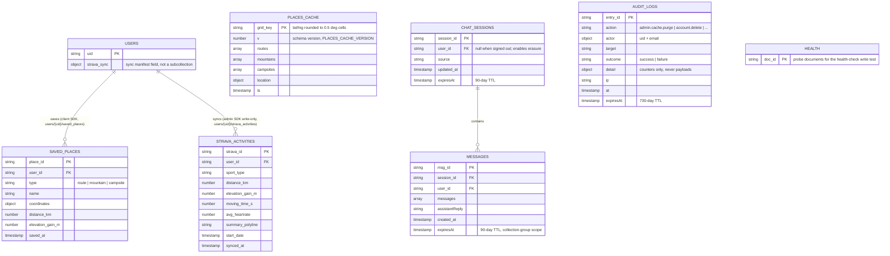

# Fit-Ready-IQ Data Model

## 1. Overview

This document is the canonical description of where Fit-Ready-IQ's data lives — Firestore collections (frontend and backend, which use separate and currently-unrelated schemas), and the non-Firestore client-side caches. It supersedes the Firestore diagram that used to be duplicated inside `docs/wiki/ARCHITECTURE.md` Section 5; `ARCHITECTURE.md` links here instead of repeating the schema.

Every collection below was verified against actual `.collection(...)` calls in the codebase, not inferred from a plan — where a previous version of this documentation described a collection (`SAVED_ROUTES`, `WEATHER_CACHE`) that does not exist in code, it has been corrected here.

---

## 2. Current Firestore Schema (Frontend, Production)

The frontend uses the Firebase Admin SDK (server routes) and the client SDK (`useSavedPlaces.ts`) against the same Firestore project.

### 2.1 Collection Notes

| Collection | Path | Writer | Notes |
| --- | --- | --- | --- |
| `users/{uid}` | Firestore doc | Admin SDK | Carries a `strava_sync` object field (`last_synced_at`, `total_activities`, `errors`) written as a merge after each sync — this is a field on the user document, not a separate collection. |
| `users/{uid}/saved_places/{placeId}` | Subcollection | Client SDK (`useSavedPlaces.ts`) | Only collection the browser writes to directly; everything else goes through a server route with the Admin SDK. |
| `users/{uid}/strava_activities/{stravaId}` | Subcollection | Admin SDK, write-only from `POST /api/strava/sync` | Idempotent upsert keyed on the Strava activity ID; batched (up to 30 per write). |
| `places_cache/{gridKey}` | Top-level, shared | Admin SDK | Public-read, grid key = coordinates rounded to 0.5 degrees (~55 km) so nearby users share cached results. `v` field gates the schema — see `PLACES_CACHE_VERSION` in `src/frontend/src/app/app/page.tsx`; bump it whenever a cached field's meaning changes, not just its shape. 24-hour TTL enforced client-side on read. |
| `chat_sessions/{sessionId}` + `.../messages/{msgId}` | Top-level + subcollection | Admin SDK, fire-and-forget from `/api/chat` | A Firestore write failure here is caught and logged, never fails the chat response — see `docs/wiki/AI.md` Section 2.1. Carries `user_id` when the caller is signed in, which is what makes a transcript erasable; documents written before that stamp are unattributable and drain via TTL. |
| `audit_logs/{entryId}` | Top-level | Admin SDK only, via `src/lib/auditLog.ts` | Append-only: no update or delete path exists in the codebase, and clients are denied in both directions. Holds a uid, an action, a target and counters — never the data it describes, so an erasure record does not become a surviving copy of what was erased. Retained through account deletion as the evidence the deletion happened (GDPR Art. 17(3)(b)). |
| `rate_limits/{bucketId}` | Top-level | Admin SDK only | One document per caller per window. The bucket id embeds a *hashed* credential, never a live one. |
| `_health/` | Top-level | Admin SDK | Probe documents written and read by `/api/health`'s Firestore write-test check; not application data. |

### 2.1.1 Retention

`rate_limits`, `chat_sessions` (+ `messages`, at collection-group scope) and
`audit_logs` each carry an `expiresAt` timestamp — **which does nothing until a
Firestore TTL policy names it.** Without the policies these collections grow
without bound and retain data past the period the product claims. See
`docs/runbooks/firestore-ttl.md`.

### 2.1.2 Where user data lives

`src/frontend/src/lib/userDataFootprint.ts` is the single enumeration of every
user-scoped collection. `/api/account/export` and `/api/account/delete` both
walk it rather than listing collections themselves, because the classic failure
mode is drift: a collection is added, the export learns about it, the deletion
does not, and the product silently keeps data it reported as erased. **Adding a
user-scoped collection means adding it there in the same change.**

### 2.2 Confirmed Dormant

`itineraries` — referenced in `src/backend/src/domain/entities/__init__.py` as an `Itinerary` dataclass, but no Firestore collection of that name is ever read or written anywhere in the frontend or backend. ADR-0003 renames this concept to **Trip** as part of making it live (Section 4).

---

## 3. Current Firestore Schema (Backend, Not Deployed)

`src/backend/` (FastAPI, Clean Architecture) uses its **own**, currently-unrelated Firestore collections — same Firestore project, different top-level collection names, no cross-references to the frontend's schema above:

| Collection | Repository | Notes |
| --- | --- | --- |
| `users` | `FirestoreUserRepository` | Backend's own `User` entity — not the same document shape as the frontend's `users/{uid}`. |
| `activities` | `FirestoreActivityRepository` | Backend's own `Activity` entity, used by the fitness-scoring pipeline. |
| `routes` | `FirestoreRouteRepository` | Backend's own `Route` entity, used by `GET /api/routes/best-fit`. |

These three collections back the single wired route the backend currently exposes (`MatchRoutesUseCase`). Per `.claude/CLAUDE.md`, this backend is not called by the frontend in production — see `docs/wiki/DEAD-CODE-AUDIT.md` for the full wired-vs-orphaned inventory of everything else under `src/backend/`.

---

## 4. Planned: Trip and Route Geometry (ADR-0003, ADR-0004)

Two accepted ADRs change the data model in ways not yet reflected in the schema above:

- **ADR-0003** (`docs/adr/0003-trip-is-the-spine-and-safety-is-a-server-side-timer.md`): makes **Trip** the central entity — a Route or Place, a readiness judgement, a weather window, a gear list, an emergency contact, and the resulting Activity once completed. The dormant `Itinerary` entity and unused `itineraries` collection (Section 2.2) are the same concept and get renamed rather than built fresh. Trip logic is planned to live in Next.js route handlers plus a scheduled function, not the backend — a second runtime is not justified for one feature when the serverless stack already does the job.
- **ADR-0004** (`docs/adr/0004-routes-have-real-geometry.md`): a Route becomes an ordered `[lng, lat]` line with length and elevation gain computed along that line, from three producers (OSM/Overpass import, GPX upload, user-drawn routes snapped via OpenRouteService). This replaces the fabricated-metrics model where a "route" was a Google Places pin with driving distance to the trailhead standing in for trail distance.

Neither ADR specifies field-level schema yet — that is deliberate; write it when the first Trip/geometry-producing code lands, not speculatively here. When it does, update the Section 2 diagram in the same PR (see ADR-0005, `docs/adr/0005-documentation-governance-harnessing.md`, for why that discipline is now explicit).

---

## 5. Non-Firestore Caching

Not every cache in the app is Firestore — a previous version of `ARCHITECTURE.md` implied a `WEATHER_CACHE` Firestore collection that has never existed. The real caches:

| What | Where | TTL | Notes |
| --- | --- | --- | --- |
| Weather + photos | Module-level JS objects in `DetailsModal.tsx` | 30 min (weather), session lifetime (photos) | In-memory, per browser tab, never persisted. |
| Reverse geocode | `sessionStorage` | 24 h | Keyed to a 0.1-degree coordinate grid, `fri_geocode_*`. |
| Last user location | `localStorage` | Until overwritten | `fri_last_location`, restored in an effect on load so the map centers instantly. |
| Places (session tier) | `sessionStorage` | 30 min | First tier of the three-tier places cache, ahead of the Firestore `places_cache` tier described in Section 2. |
