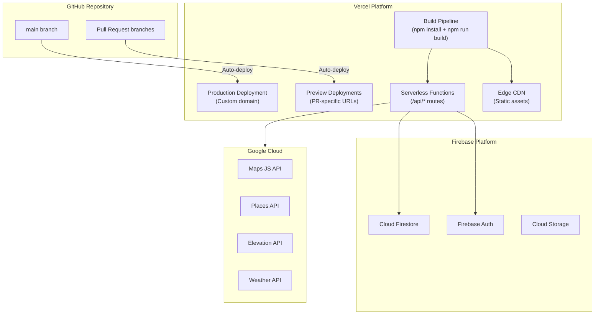
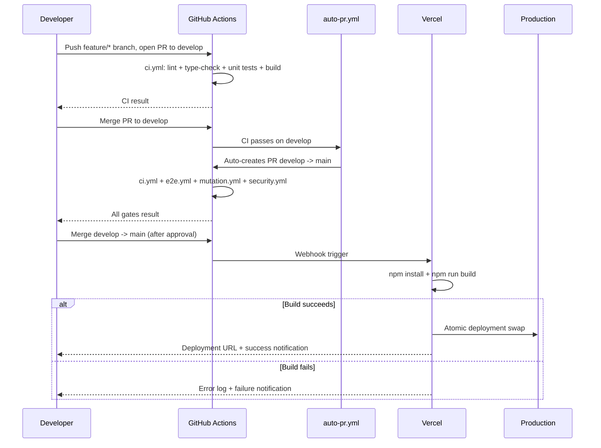
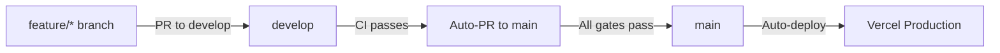
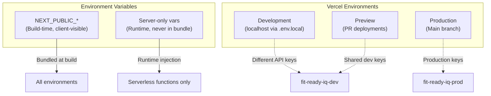
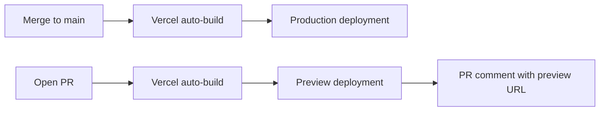
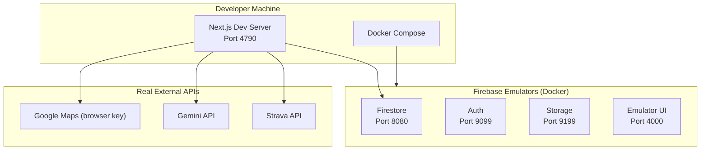
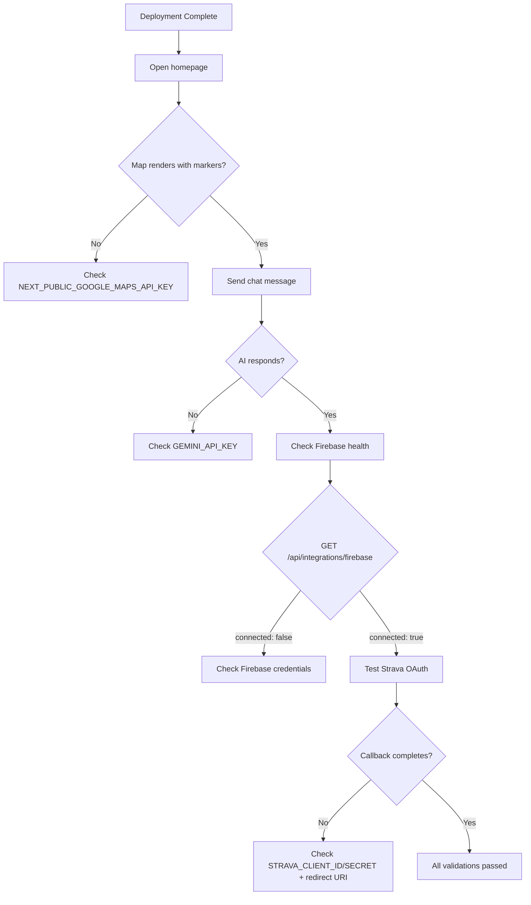
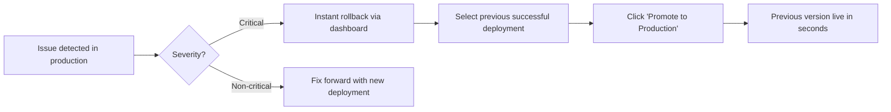

# Fit-Ready-IQ Deployment Guide

## 1. Overview

This document provides a comprehensive guide to deploying Fit-Ready-IQ to production. The application is deployed exclusively on **Vercel** as a Next.js 14 application with serverless functions. All persistent data resides in **Firebase** (Firestore for documents, Auth for identity, Storage for files). There are no backend containers, databases, or custom infrastructure to manage in production.

The deployment model is designed for simplicity, scalability, and cost efficiency:
- **Zero-configuration scaling** -- Vercel automatically scales serverless functions based on traffic.
- **Edge CDN** -- Static assets are served from Vercel's global edge network.
- **Scale-to-zero** -- No compute costs when the application is idle.
- **Immutable deployments** -- Every deployment is a snapshot that can be instantly rolled back.
- **Preview deployments** -- Every pull request gets its own isolated preview URL.

---

## 2. Deployment Architecture

### 2.1 Production Topology



### 2.2 Deploy Flow

Changes reach production only after passing CI on `develop`, an auto-generated PR to `main`, and additional E2E + security gates on that PR.



### 2.3 CI/CD Pipeline

The project uses GitHub Actions workflows to enforce quality gates before any change reaches production.

**Branch flow:** `feature/*` -> `develop` -> `main` -> Vercel



**Workflow table:**

| Workflow | Trigger | What It Does |
| --- | --- | --- |
| `ci.yml` | PR to `develop`/`main`, push to `develop` | Lint + type-check + unit tests + build (frontend); ruff + mypy + pytest (backend) |
| `e2e.yml` | PR to `main` | Playwright E2E tests on Chromium (uses real secrets from GitHub Secrets) |
| `mutation.yml` | PR to `main` when `frontend/src/lib/**` changed | Stryker mutation tests |
| `security.yml` | PRs, push to `main`, weekly Monday | npm audit + gitleaks secret scan + CodeQL |
| `agent-review.yml` | PR open/synchronize | Posts AI code review comment via Claude Haiku. Needs `ANTHROPIC_API_KEY` secret. |
| `auto-pr.yml` | After CI passes on `develop` | Auto-creates PR from `develop` to `main` |

**Required GitHub Secrets** (Settings -> Secrets and variables -> Actions):

| Secret | Required By |
| --- | --- |
| `ANTHROPIC_API_KEY` | `agent-review.yml` |
| `NEXT_PUBLIC_GOOGLE_MAPS_API_KEY` | `ci.yml`, `e2e.yml` |
| `NEXT_PUBLIC_FIREBASE_API_KEY` | `ci.yml`, `e2e.yml` |
| `NEXT_PUBLIC_FIREBASE_AUTH_DOMAIN` | `ci.yml`, `e2e.yml` |
| `NEXT_PUBLIC_FIREBASE_PROJECT_ID` | `ci.yml`, `e2e.yml` |
| `NEXT_PUBLIC_FIREBASE_STORAGE_BUCKET` | `ci.yml`, `e2e.yml` |
| `NEXT_PUBLIC_FIREBASE_MESSAGING_SENDER_ID` | `ci.yml`, `e2e.yml` |
| `NEXT_PUBLIC_FIREBASE_APP_ID` | `ci.yml`, `e2e.yml` |
| `GEMINI_API_KEY` | `ci.yml`, `e2e.yml` |
| `FIREBASE_PROJECT_ID` | `ci.yml`, `e2e.yml` |
| `FIREBASE_CLIENT_EMAIL` | `ci.yml`, `e2e.yml` |
| `FIREBASE_PRIVATE_KEY` | `ci.yml`, `e2e.yml` |
| `STRAVA_CLIENT_ID` | `ci.yml`, `e2e.yml` |
| `STRAVA_CLIENT_SECRET` | `ci.yml`, `e2e.yml` |
| `GOOGLE_WEATHER_API_KEY` | `ci.yml` |
| `GITHUB_TOKEN` | `auto-pr.yml`, `security.yml` (automatic) |

### 2.4 Branch Protection Setup (One-Time, GitHub UI)

Configure branch protection in **Settings -> Branches** after pushing the workflows.

**`develop` branch:**
- Require status checks: `Frontend Quality`, `Backend Quality`
- Require branches to be up to date before merging
- Restrict direct pushes (no commits directly to `develop`)

**`main` branch:**
- Require status checks: `Frontend Quality`, `Backend Quality`, `Playwright E2E`, `Secret Scan`
- Enable merge queue (Settings -> Branches -> Edit -> Merge queue)
- Require 1 approving review
- Dismiss stale reviews on new commits
- Restrict direct pushes

---

## 3. Vercel Project Configuration

### 3.1 Project Settings

| Setting | Value | Notes |
| --- | --- | --- |
| Framework Preset | Next.js | Auto-detected from `next.config.js` |
| Root Directory | `frontend` | Vercel builds from this subdirectory |
| Build Command | `npm run build` | Runs `next build` |
| Install Command | `npm install` | Installs all dependencies |
| Output Directory | (default) | Next.js manages `.next/` output |
| Node.js Version | 20.x | Matches local development environment |

### 3.2 Function Configuration

Server routes are configured in `frontend/vercel.json`:

```json
{
  "functions": {
    "src/app/api/chat/route.ts": {
      "maxDuration": 30
    },
    "src/app/api/integrations/firebase/route.ts": {
      "maxDuration": 15
    }
  }
}
```

All routes using Firebase Admin SDK are forced to **Node.js runtime** (not Edge) because the Admin SDK requires Node.js native modules. This is configured per-route with `export const runtime = 'nodejs'`.

---

## 4. Environment Variables

### 4.1 Required Variables

Set these in **Vercel Project Settings > Environment Variables**. Apply to both Production and Preview environments unless noted.

| Variable | Required | Scope | Description |
| --- | --- | --- | --- |
| `NEXT_PUBLIC_GOOGLE_MAPS_API_KEY` | Yes | Client + Server | Google Maps JS API key. Bundled into client JS at build time. Restrict to your domain in Google Cloud Console. |
| `GEMINI_API_KEY` | Yes | Server only | Gemini 1.5 Flash API key for AI chat functionality. |
| `NEXT_PUBLIC_FIREBASE_API_KEY` | Yes | Client | Firebase web API key (public -- safe to expose). |
| `NEXT_PUBLIC_FIREBASE_AUTH_DOMAIN` | Yes | Client | Firebase Auth domain (e.g., `fit-ready-iq.firebaseapp.com`). |
| `NEXT_PUBLIC_FIREBASE_PROJECT_ID` | Yes | Client + Server | Firebase project ID (e.g., `fit-ready-iq`). |
| `NEXT_PUBLIC_FIREBASE_STORAGE_BUCKET` | Yes | Client | Firebase Storage bucket URL. |
| `NEXT_PUBLIC_FIREBASE_MESSAGING_SENDER_ID` | Yes | Client | Firebase Cloud Messaging sender ID. |
| `NEXT_PUBLIC_FIREBASE_APP_ID` | Yes | Client | Firebase web app ID. |
| `NEXT_PUBLIC_APP_URL` | Yes | Client | Full URL of the deployment (e.g., `https://fit-ready-iq.vercel.app`). Used for OAuth redirects. |
| `FIREBASE_SERVICE_ACCOUNT_KEY_JSON` | Recommended | Server only | Complete service account JSON string. Preferred method for Firebase Admin authentication. |
| `FIREBASE_CLIENT_EMAIL` | Alternative | Server only | Service account email (use if not providing full JSON). |
| `FIREBASE_PRIVATE_KEY` | Alternative | Server only | Service account private key (preserve `\n` characters). |
| `STRAVA_CLIENT_ID` | Yes | Server only | Strava OAuth application client ID. |
| `STRAVA_CLIENT_SECRET` | Yes | Server only | Strava OAuth application client secret. |
| `GOOGLE_WEATHER_API_KEY` | Phase 1 | Server only | OpenWeather API key for forecast integration. Also accepted as `OPENWEATHER_API_KEY`.

### 4.2 Environment Scoping



### 4.3 Setting Environment Variables

**Via Vercel CLI:**
```bash
cd frontend
npx vercel env add GEMINI_API_KEY production
npx vercel env add GEMINI_API_KEY preview
```

**Via Vercel Dashboard:**
1. Go to Project Settings > Environment Variables
2. Add variable name and value
3. Select applicable environments (Production, Preview, Development)
4. Click Save

---

## 5. Deployment Methods

### 5.1 Automatic Deployment (Recommended)

Connect the GitHub repository to Vercel. Merges to `main` (after passing all CI/CD gates on the `develop`-to-`main` PR) trigger a production deployment. Every pull request gets a preview deployment for early validation.



Changes reach `main` only after the full gate sequence: feature PR to `develop` -> CI passes -> auto-PR to `main` -> E2E + mutation + security pass -> approval -> merge. Direct pushes to `main` are blocked by branch protection.

### 5.2 Manual Deployment

```bash
cd frontend

# Deploy to production
npx vercel --prod

# Deploy preview (for testing)
npx vercel
```

### 5.3 First-Time Setup

```bash
# Install Vercel CLI
npm install -g vercel

# Login to Vercel
vercel login

# Link project (from frontend/ directory)
cd frontend
vercel link

# Set environment variables
vercel env add NEXT_PUBLIC_GOOGLE_MAPS_API_KEY production
vercel env add GEMINI_API_KEY production
vercel env add FIREBASE_PROJECT_ID production
vercel env add FIREBASE_SERVICE_ACCOUNT_KEY_JSON production
vercel env add STRAVA_CLIENT_ID production
vercel env add STRAVA_CLIENT_SECRET production

# Deploy
vercel --prod
```

---

## 6. Environments

### 6.1 Environment Matrix

| Environment | Platform | URL | Firebase Project | Trigger |
| --- | --- | --- | --- | --- |
| **Development** | localhost:4790 | http://localhost:4790 | Emulators (Docker Compose) | `npm run dev` |
| **Preview** | Vercel preview | `*.vercel.app` (auto-generated) | fit-ready-iq-dev | Pull request opened/updated |
| **Production** | Vercel production | Custom domain | fit-ready-iq-prod | Push to `main` branch |

### 6.2 Local Development Setup



```bash
# Terminal 1: Start Firebase emulators
docker-compose up -d

# Terminal 2: Start frontend
cd frontend
npm run dev
```

---

## 7. Post-Deployment Validation

### 7.1 Validation Checklist

After every production deployment, verify these critical paths:



### 7.2 Validation Commands

```bash
# Verify build passes (run before deploying)
cd frontend
npm run lint
npm run build
npm run test:unit

# Verify npm dependencies are secure
npm audit --audit-level=high
```

### 7.3 Health Endpoint (Single-Shot Deployment Check)

The `/api/health` route aggregates all service checks in one call.

```bash
# Run immediately after deployment
curl -s https://YOUR_VERCEL_URL/api/health | jq .
```

Expected fully-healthy response:

```json
{
  "status": "healthy",
  "timestamp": "2026-06-26T...",
  "services": {
    "maps":             { "ok": true, "message": "API key present" },
    "firebase_client":  { "ok": true, "message": "Project: fit-ready-iq" },
    "firebase_admin":   { "ok": true, "message": "Firestore write OK (project: fit-ready-iq)" },
    "gemini":           { "ok": true, "message": "API key present and valid format" },
    "weather":          { "ok": true, "message": "OpenWeather API reachable" },
    "strava":           { "ok": true, "message": "Client ID: 260217" }
  }
}
```

`status` values:
- `healthy` -- all 6 services green
- `degraded` -- 1-2 services failing (non-critical features affected)
- `unhealthy` -- 3+ services failing (HTTP 503 returned)

### 7.4 Per-Service Recovery Guide

| Service | Health check `ok: false` message | Fix |
|---------|----------------------------------|-----|
| maps | `NEXT_PUBLIC_GOOGLE_MAPS_API_KEY not configured` | Add key in Vercel env vars, redeploy |
| firebase_client | `NEXT_PUBLIC_FIREBASE_* vars missing` | Add all `NEXT_PUBLIC_FIREBASE_*` vars |
| firebase_admin | `No service account credentials` | Paste service account JSON into `FIREBASE_SERVICE_ACCOUNT_KEY_JSON` |
| firebase_admin | `Firestore write failed` | Check IAM permissions; service account needs Firestore Editor role |
| gemini | `GEMINI_API_KEY not configured` | Get key from [aistudio.google.com](https://aistudio.google.com/app/apikey) |
| weather | `OPENWEATHER_API_KEY not configured` | Get free key from [openweathermap.org](https://openweathermap.org/api) |
| strava | `STRAVA_CLIENT_SECRET missing` | Add both `NEXT_PUBLIC_STRAVA_CLIENT_ID` and `STRAVA_CLIENT_SECRET` |

### 7.5 Runtime Endpoint Checks

| Endpoint | Method | Expected Response |
| --- | --- | --- |
| `/` | GET | HTML page with Google Maps rendering |
| `/api/health` | GET | `{ "status": "healthy", ... }` |
| `/api/integrations/firebase` | GET | `{ "connected": true, "firestoreWrite": true }` |
| `/api/chat` | POST | `{ "message": "...", "sessionId": "..." }` |
| `/api/strava/exchange` | POST | Strava token payload (requires valid code) |
| `/api/weather?lat=14.5&lng=121.0` | GET | Weather forecast JSON |

---

## 8. Rollback Strategy

Vercel deployments are **immutable snapshots**. Rolling back is instant and risk-free.

### 8.1 Rollback Methods



**Via Vercel Dashboard:**
1. Go to Project > Deployments
2. Find the last known-good deployment
3. Click "..." menu > "Promote to Production"
4. Deployment is live immediately

**Via CLI:**
```bash
# List recent deployments
vercel ls

# Promote a specific deployment
vercel promote <deployment-url>
```

---

## 9. Monitoring and Observability

### 9.1 Vercel Monitoring

| Metric | Where | Alert Threshold |
| --- | --- | --- |
| Function invocations | Vercel Dashboard > Analytics | Budget-dependent |
| Function duration (p95) | Vercel Dashboard > Functions | > 10s for chat, > 5s for others |
| Error rate | Vercel Dashboard > Logs | > 1% of requests |
| Build time | Vercel Dashboard > Deployments | > 120s (indicates dependency issues) |

### 9.2 Google Cloud Monitoring

| Metric | Where | Alert Threshold |
| --- | --- | --- |
| Maps API calls | Cloud Console > APIs & Services | Monthly budget quota |
| Places API calls | Cloud Console > APIs & Services | Monthly budget quota |
| Elevation API calls | Cloud Console > APIs & Services | Monthly budget quota |
| Weather API calls | Cloud Console > APIs & Services | Monthly budget quota |

### 9.3 Firebase Monitoring

| Metric | Where | Alert Threshold |
| --- | --- | --- |
| Firestore reads/writes | Firebase Console > Usage | Daily budget limit |
| Storage bandwidth | Firebase Console > Storage | Monthly quota |
| Auth sign-ins | Firebase Console > Auth | Anomaly detection |

---

## 10. Operational Best Practices

### 10.1 Security

- Rotate all API keys quarterly.
- Use separate API keys for Preview vs Production environments.
- Restrict Google Maps API key to production domain(s) in Cloud Console.
- Never commit `.env.local` or service account JSON files to the repository.
- Review Vercel access logs for unusual patterns.

### 10.2 Cost Management

- Set billing alerts in Google Cloud Console for Maps/Places/Elevation/Weather APIs.
- Monitor Firebase Firestore read/write counts -- cache aggressively.
- Use Vercel's included free tier for preview deployments (check plan limits).
- Weather API caching (60-min TTL) significantly reduces API costs.

### 10.3 Reliability

- Keep `package-lock.json` committed -- ensures reproducible builds.
- Pin Node.js version in Vercel project settings to match local development.
- Test all server routes locally before deploying.
- Use preview deployments to validate changes before merging to main.
- Monitor Vercel function cold start times -- Firebase Admin SDK initialization can add latency.
