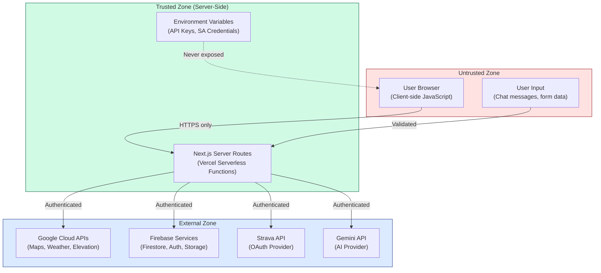
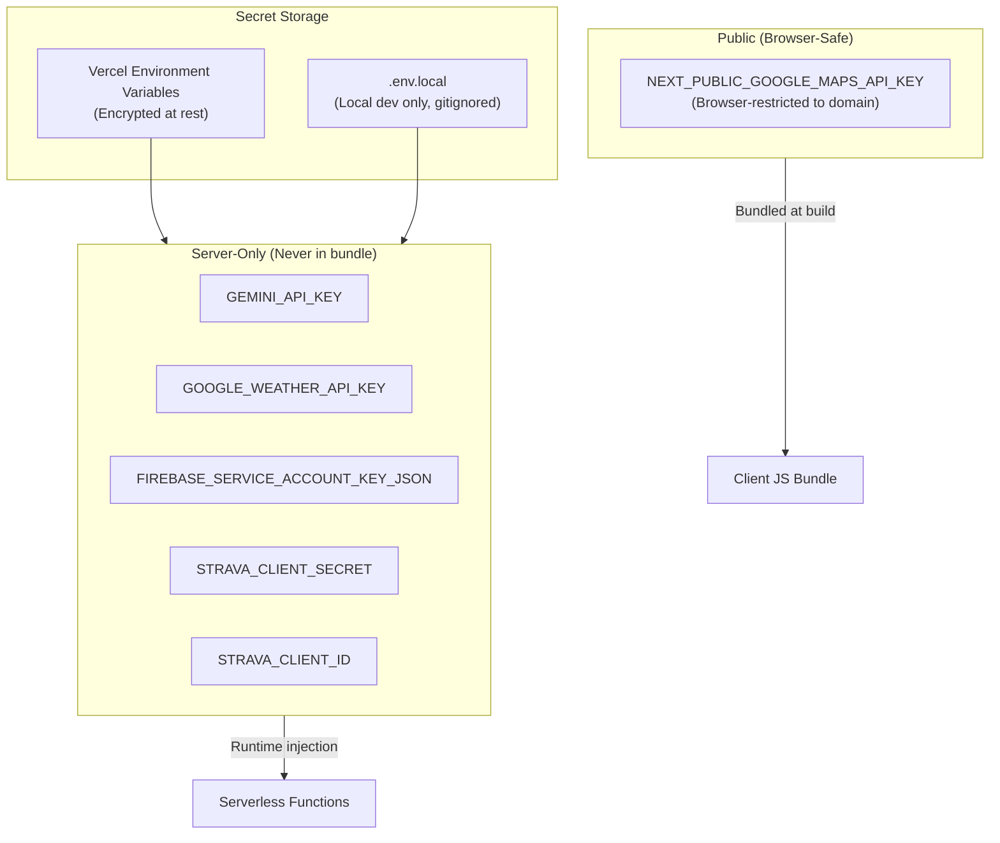
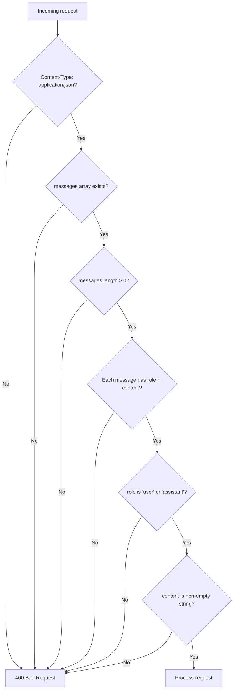
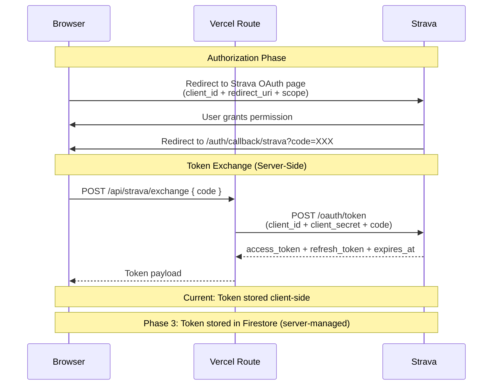
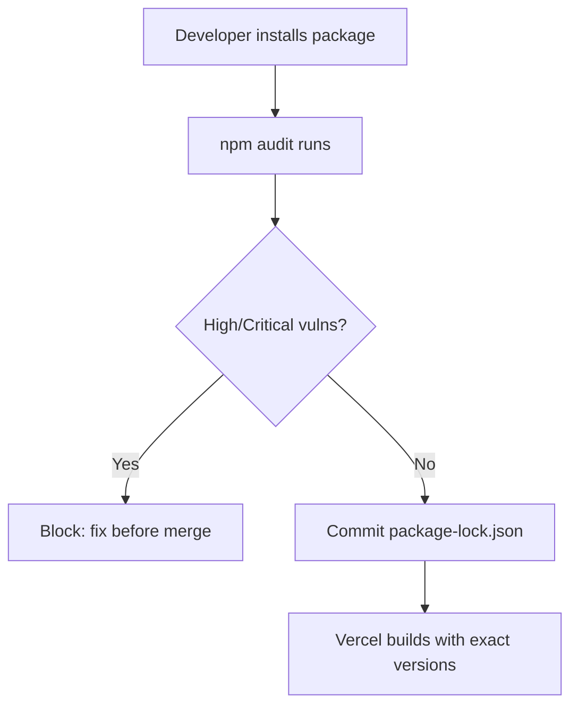
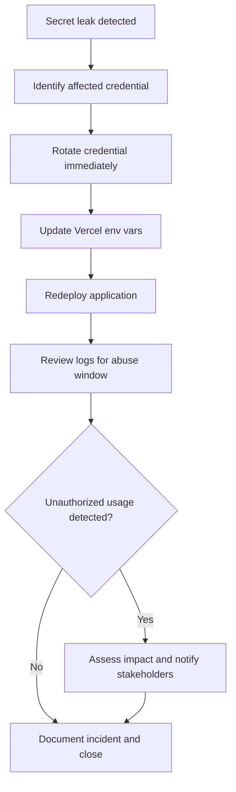

# Fit-Ready-IQ Security Guide

## 1. Overview

This document describes the security architecture, threat model, and hardening practices for the Fit-Ready-IQ platform. The application handles sensitive data including API keys for paid services, OAuth tokens for fitness platforms, and (in future phases) user credentials and personal health data.

The security posture is built on these principles:
- **Secret isolation** -- API keys and credentials never reach the client browser.
- **Minimal exposure** -- Only browser-restricted public keys are bundled into client JavaScript.
- **Server-side validation** -- All inputs are validated before processing in server routes.
- **Defense in depth** -- Multiple layers of protection at each trust boundary.
- **Least privilege** -- Service accounts have minimum required permissions.

---

## 2. Trust Boundaries

### 2.1 Security Zone Model



### 2.2 Trust Boundary Rules

| Boundary | Rule | Enforcement |
| --- | --- | --- |
| Browser → Server | All requests over HTTPS. No secrets in request bodies from legitimate clients. | Vercel enforces HTTPS. Server validates all inputs. |
| Server → External APIs | Authenticate with server-side secrets only. Never forward raw user input to APIs without sanitization. | Environment variables, input validation in route handlers. |
| Client JavaScript | Only `NEXT_PUBLIC_*` variables are accessible. These must be browser-restricted API keys. | Next.js build-time bundling. Google Cloud API key restrictions. |

---

## 3. Secret Management

### 3.1 Secret Categories



### 3.2 Secret Handling Rules

| Rule | Description |
| --- | --- |
| Never commit secrets | `.env.local`, service account JSON files, and API keys must never be committed to Git. |
| Use `.gitignore` | Ensure `.env.local`, `*.json` (service accounts), and `node_modules/` are ignored. |
| Scope variables properly | Use `NEXT_PUBLIC_` prefix only for browser-safe values. All other secrets stay server-only. |
| Restrict API keys | In Google Cloud Console, restrict `NEXT_PUBLIC_GOOGLE_MAPS_API_KEY` to your production domain(s). |
| Rotate quarterly | Rotate all API keys and credentials every 90 days minimum. |
| Separate by environment | Use different API keys for development, preview, and production environments. |
| Never log secrets | Server routes must never log environment variable values, even in error handlers. |
| Never store in Firestore | API keys and service credentials must not be written to Firestore or any client-accessible storage. |

### 3.3 Google Maps API Key Security

The `NEXT_PUBLIC_GOOGLE_MAPS_API_KEY` is the only secret exposed to the client. Protect it with:

1. **HTTP referrer restriction** -- In Google Cloud Console, restrict the key to your production domain(s) and `localhost` for development.
2. **API restriction** -- Limit the key to only Maps JavaScript API, Places API, and Elevation API.
3. **Quota limits** -- Set daily request quotas to prevent abuse if the key is leaked.
4. **Monitoring** -- Set up billing alerts for unexpected usage spikes.

---

## 4. Input Validation

### 4.1 Chat Route Validation



### 4.2 Validation Patterns by Route

| Route | Validation Applied |
| --- | --- |
| POST /api/chat | Message array shape, role enum, non-empty content, max token limit (512) |
| POST /api/strava/exchange | Authorization code presence, string type |
| GET /api/strava/activities | Token presence, page number (positive integer) |
| GET /api/weather (Phase 1) | lat/lng numeric range (-90/90, -180/180), persona enum |
| POST /api/readiness (Phase 4) | userId presence, routeData shape, numeric ranges |

### 4.3 Injection Prevention

- **No raw SQL** -- Firebase Firestore uses structured document queries (no SQL injection vector).
- **No template injection** -- Gemini prompts are constructed with template literals, not user-controlled templates.
- **No command injection** -- No shell commands are executed in any server route.
- **XSS prevention** -- React's JSX escaping handles HTML output. No `dangerouslySetInnerHTML` in the codebase.

---

## 5. OAuth Security (Strava)

### 5.1 OAuth Flow Security



### 5.2 Current Limitations and Planned Fixes

| Issue | Risk | Status | Fix |
| --- | --- | --- | --- |
| Token stored in client localStorage | Token theft via XSS | Current | Phase 3: Store in Firestore, server-managed lifecycle |
| No token refresh flow | Token expires, user must re-auth | Current | Phase 3: Auto-refresh via server route |
| Client-id visible in OAuth redirect | Low risk (public value by design) | Acceptable | N/A |

---

## 6. Firebase Security

### 6.1 Admin SDK Security

- Firebase Admin SDK is initialized only in server routes (never in client code).
- Uses `FIREBASE_SERVICE_ACCOUNT_KEY_JSON` for authentication (or `CLIENT_EMAIL` + `PRIVATE_KEY` separately).
- The Admin SDK singleton is cached per cold start via `lib/firebaseAdmin.ts`.
- No `metadata.create_all()` or equivalent -- Firestore collections are schemaless.

### 6.2 Firestore Security Rules (Phase 3)

When Firebase Auth is integrated, Firestore security rules will enforce:

```
rules_version = '2';
service cloud.firestore {
  match /databases/{database}/documents {
    // Users can only read/write their own profile
    match /users/{uid} {
      allow read, write: if request.auth != null && request.auth.uid == uid;
    }

    // Users can only access their own activities
    match /activities/{activityId} {
      allow read, write: if request.auth != null
        && resource.data.user_id == request.auth.uid;
    }

    // Chat sessions accessible by owner
    match /chat_sessions/{sessionId} {
      allow read, write: if request.auth != null
        && resource.data.user_id == request.auth.uid;
    }

    // Weather cache is read-only for clients, write-only for server
    match /weather_cache/{placeId} {
      allow read: if true;
      allow write: if false; // Only server (Admin SDK) writes
    }
  }
}
```

---

## 7. Transport Security

### 7.1 HTTPS Enforcement

- All traffic to Vercel is served over HTTPS (HTTP redirects to HTTPS automatically).
- All external API calls from server routes use HTTPS.
- Google Maps SDK loads over HTTPS by default.
- No mixed content -- all resources (scripts, styles, images) load over HTTPS.

### 7.2 CORS Policy

- Vercel handles CORS automatically for same-origin requests.
- API routes do not set custom CORS headers (same-origin only).
- In Phase 3, specific CORS headers may be needed for mobile app integration.

---

## 8. Dependency Security

### 8.1 Current Status

The dependency graph has known vulnerabilities that are tracked as Phase 0 tasks:

| Package | Severity | Issue | Fix |
| --- | --- | --- | --- |
| next 14.1.0 | Critical (3) | Various CVEs | Upgrade to 14.2.x+ |
| axios | High | Prototype pollution | Upgrade to latest |
| lodash | High | Prototype pollution | Remove or replace |
| follow-redirects | High | Redirect bypass | Transitive dep fix |

### 8.2 Dependency Management Practices



| Practice | Description |
| --- | --- |
| Lock file committed | `package-lock.json` ensures reproducible builds |
| `npm audit` in CI | Block merges with high/critical vulnerabilities |
| No `*` or `latest` versions | All deps pinned to specific semver ranges |
| Quarterly review | Check `npm outdated` and upgrade dependencies |
| Minimal dependencies | Prefer built-in Node.js APIs over third-party packages |

---

## 9. Incident Response

### 9.1 Secret Leakage Response



### 9.2 Step-by-Step Response

1. **Identify** -- Determine which secret was exposed and where (commit history, logs, error messages).
2. **Rotate** -- Generate a new key/credential in the respective provider console (Google Cloud, Strava, Firebase).
3. **Update** -- Set the new value in Vercel environment variables for all affected environments.
4. **Redeploy** -- Trigger a new deployment to pick up the rotated credentials.
5. **Audit** -- Review provider usage logs for the exposure window. Check for unauthorized API calls.
6. **Document** -- Record the incident, root cause, and preventive measures taken.

### 9.3 Prevention Measures

| Measure | Implementation |
| --- | --- |
| `.gitignore` coverage | `.env.local`, `*.json` (service accounts), `.env` |
| Pre-commit hooks | (Recommended) Use `detect-secrets` or similar tool |
| GitHub secret scanning | Enable GitHub's built-in secret scanning alerts |
| Code review | All PRs reviewed for accidental secret inclusion |

---

## 10. Security Checklist

### 10.1 Pre-Deployment Checklist

- [ ] All required secrets are configured in Vercel environment variables
- [ ] No secrets committed to repository (check git history)
- [ ] `npm audit --audit-level=high` passes with zero high/critical findings
- [ ] Google Maps API key is domain-restricted in Cloud Console
- [ ] Firebase service account has minimum required permissions
- [ ] Server routes validate all input payloads
- [ ] No `console.log` statements that could leak sensitive data
- [ ] `.env.local` is in `.gitignore`
- [ ] HTTPS enforced for all external API calls

### 10.2 Periodic Review Checklist (Quarterly)

- [ ] Rotate all API keys and credentials
- [ ] Review and update dependency versions
- [ ] Check Google Cloud Console for unusual API usage patterns
- [ ] Review Vercel function logs for error patterns
- [ ] Verify Firestore security rules are applied (Phase 3+)
- [ ] Audit OAuth token lifecycle for Strava integration
- [ ] Review and update this security document

---

## 11. Known Gaps and Remediation Plan

| Gap | Risk Level | Current Status | Remediation Phase |
| --- | --- | --- | --- |
| Strava token in localStorage | Medium | Active | Phase 3 (server-managed tokens) |
| npm high/critical vulnerabilities | High | Tracked | Phase 0 (dependency upgrade sprint) |
| No rate limiting on server routes | Medium | Planned | Phase 1 (rate limiter middleware) |
| No user authentication | Low (no user data yet) | Planned | Phase 3 (Firebase Auth) |
| No Firestore security rules | Low (server-only writes) | Planned | Phase 3 (per-user isolation) |
| Weather API key server-only access | Low | Planned | Phase 1 (route-only access) |
| No request logging/audit trail | Low | Planned | Phase 4 (structured logging) |
