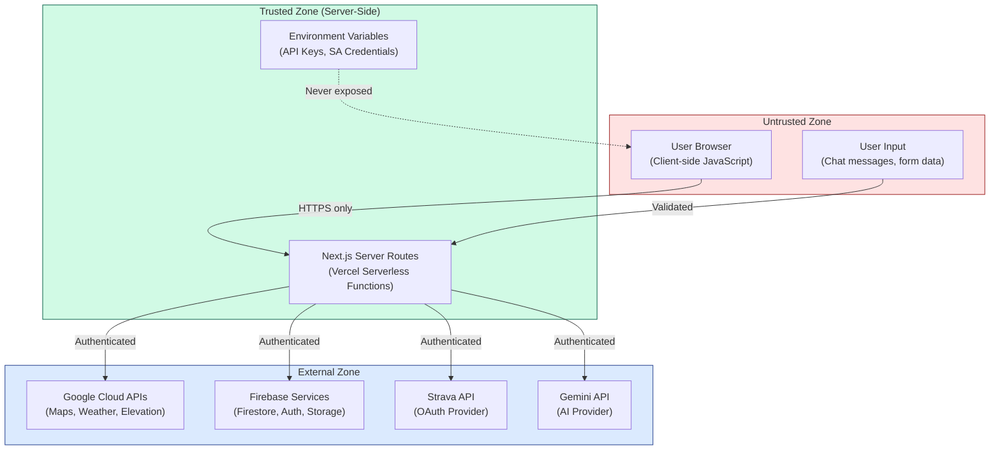
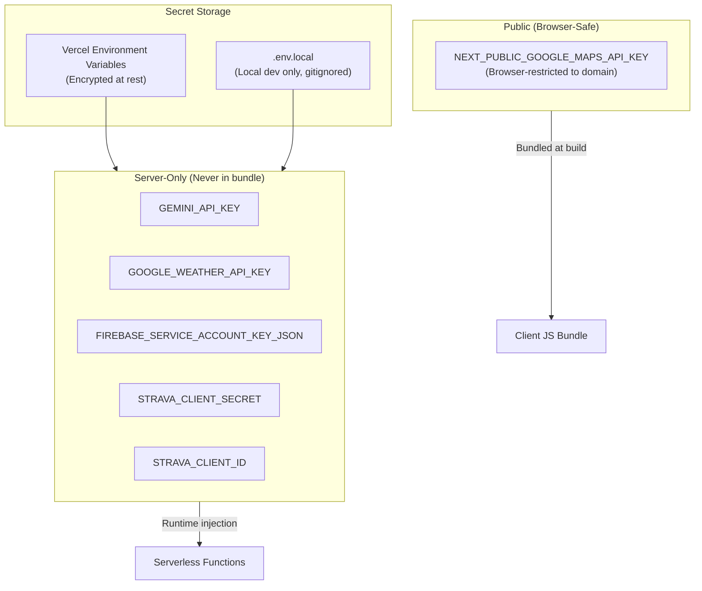
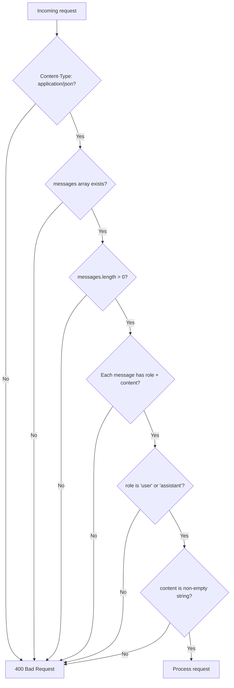
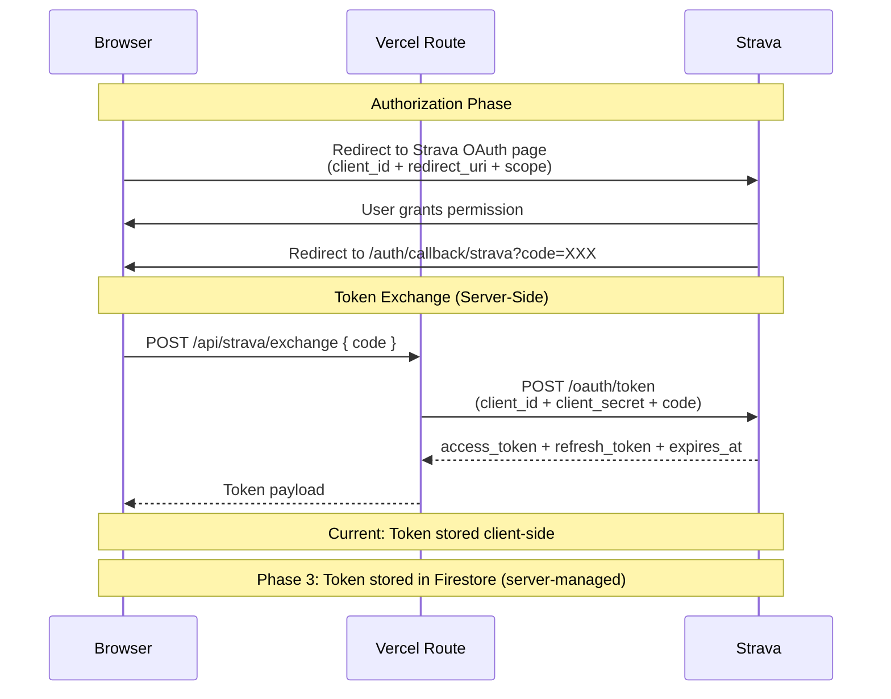
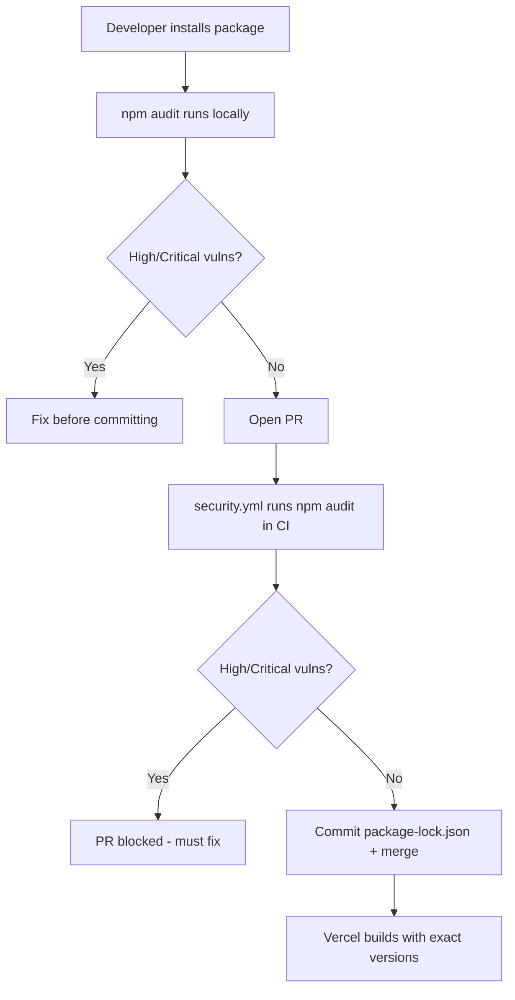
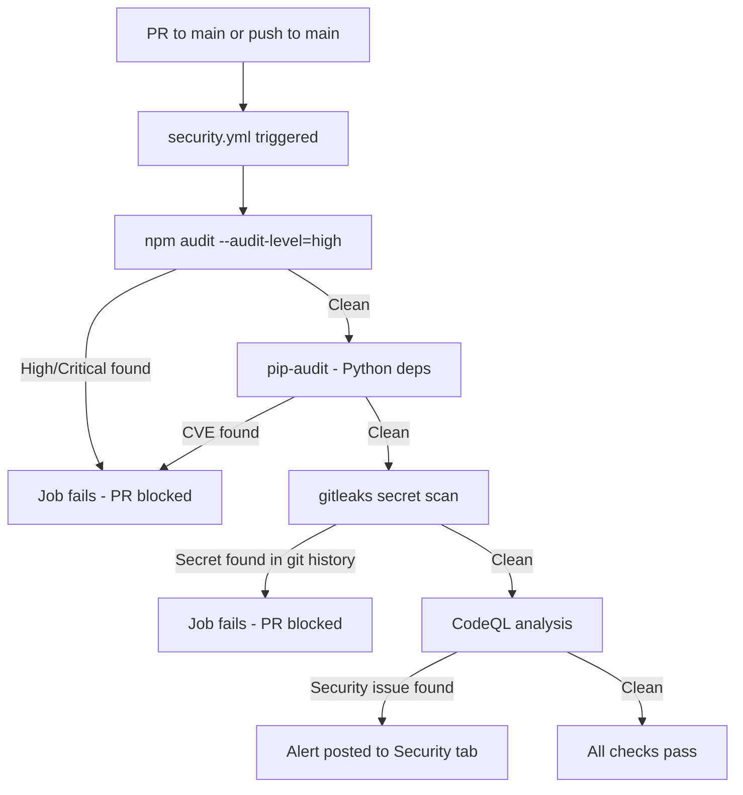
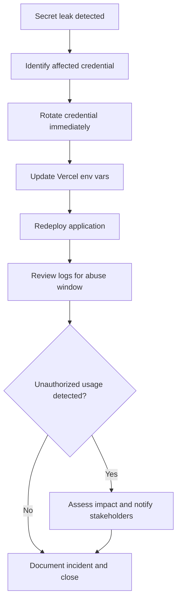

# Fit-Ready-IQ Security Guide

## 1. Overview

This document describes the security architecture, threat model, and hardening practices for the Fit-Ready-IQ platform. The application handles sensitive data including API keys for paid services, OAuth tokens for fitness platforms, and (in future phases) user credentials and personal health data.

The security posture is built on these principles:
- **Secret isolation** -- API keys and credentials never reach the client browser.
- **Minimal exposure** -- Only browser-restricted public keys are bundled into client JavaScript.
- **Server-side validation** -- All inputs are validated before processing in server routes.
- **Defense in depth** -- Multiple layers of protection at each trust boundary.
- **Least privilege** -- Service accounts have minimum required permissions.

---

## 2. Trust Boundaries

### 2.1 Security Zone Model


```mermaid
flowchart TD
    subgraph Untrusted["Untrusted Zone"]
        Browser["User Browser<br/>(Client-side JavaScript)"]
        UserInput["User Input<br/>(Chat messages, form data)"]
    end

    subgraph Trusted["Trusted Zone (Server-Side)"]
        Routes["Next.js Server Routes<br/>(Vercel Serverless Functions)"]
        EnvVars["Environment Variables<br/>(API Keys, SA Credentials)"]
    end

    subgraph External["External Zone"]
        Google["Google Cloud APIs<br/>(Maps, Weather, Elevation)"]
        Firebase["Firebase Services<br/>(Firestore, Auth, Storage)"]
        Strava["Strava API<br/>(OAuth Provider)"]
        Gemini["Gemini API<br/>(AI Provider)"]
    end

    Browser -->|HTTPS only| Routes
    UserInput -->|Validated| Routes
    Routes -->|Authenticated| Google
    Routes -->|Authenticated| Firebase
    Routes -->|Authenticated| Strava
    Routes -->|Authenticated| Gemini
    EnvVars -.->|Never exposed| Browser

    style Untrusted fill:#fee2e2,stroke:#991b1b
    style Trusted fill:#d1fae5,stroke:#065f46
    style External fill:#dbeafe,stroke:#1e3a8a
```

### 2.2 Trust Boundary Rules

| Boundary | Rule | Enforcement |
| --- | --- | --- |
| Browser → Server | All requests over HTTPS. No secrets in request bodies from legitimate clients. | Vercel enforces HTTPS. Server validates all inputs. |
| Server → External APIs | Authenticate with server-side secrets only. Never forward raw user input to APIs without sanitization. | Environment variables, input validation in route handlers. |
| Client JavaScript | Only `NEXT_PUBLIC_*` variables are accessible. These must be browser-restricted API keys. | Next.js build-time bundling. Google Cloud API key restrictions. |

---

## 3. Secret Management

### 3.1 Secret Categories


```mermaid
graph TD
    subgraph Public["Public (Browser-Safe)"]
        MapsKey["NEXT_PUBLIC_GOOGLE_MAPS_API_KEY<br/>(Browser-restricted to domain)"]
    end

    subgraph ServerOnly["Server-Only (Never in bundle)"]
        GeminiKey["GEMINI_API_KEY"]
        WeatherKey["GOOGLE_WEATHER_API_KEY"]
        FirebaseSA["FIREBASE_SERVICE_ACCOUNT_KEY_JSON"]
        StravaSecret["STRAVA_CLIENT_SECRET"]
        StravaID["STRAVA_CLIENT_ID"]
    end

    subgraph Storage["Secret Storage"]
        Vercel["Vercel Environment Variables<br/>(Encrypted at rest)"]
        EnvLocal[".env.local<br/>(Local dev only, gitignored)"]
    end

    Public -->|Bundled at build| ClientJS["Client JS Bundle"]
    ServerOnly -->|Runtime injection| Functions["Serverless Functions"]
    Vercel --> ServerOnly
    EnvLocal --> ServerOnly
```

### 3.2 Secret Handling Rules

| Rule | Description |
| --- | --- |
| Never commit secrets | `.env.local`, service account JSON files, and API keys must never be committed to Git. |
| Use `.gitignore` | Ensure `.env.local`, `*.json` (service accounts), and `node_modules/` are ignored. |
| Scope variables properly | Use `NEXT_PUBLIC_` prefix only for browser-safe values. All other secrets stay server-only. |
| Restrict API keys | In Google Cloud Console, restrict `NEXT_PUBLIC_GOOGLE_MAPS_API_KEY` to your production domain(s). |
| Rotate quarterly | Rotate all API keys and credentials every 90 days minimum. |
| Separate by environment | Use different API keys for development, preview, and production environments. |
| Never log secrets | Server routes must never log environment variable values, even in error handlers. |
| Never store in Firestore | API keys and service credentials must not be written to Firestore or any client-accessible storage. |

### 3.3 Google Maps API Key Security

The `NEXT_PUBLIC_GOOGLE_MAPS_API_KEY` is the only secret exposed to the client. Protect it with:

1. **HTTP referrer restriction** -- In Google Cloud Console, restrict the key to your production domain(s) and `localhost` for development.
2. **API restriction** -- Limit the key to only Maps JavaScript API, Places API, and Elevation API.
3. **Quota limits** -- Set daily request quotas to prevent abuse if the key is leaked.
4. **Monitoring** -- Set up billing alerts for unexpected usage spikes.

---

## 4. Input Validation

### 4.1 Chat Route Validation


```mermaid
flowchart TD
    A[Incoming request] --> B{Content-Type: application/json?}
    B -->|No| C[400 Bad Request]
    B -->|Yes| D{messages array exists?}
    D -->|No| C
    D -->|Yes| E{messages.length > 0?}
    E -->|No| C
    E -->|Yes| F{Each message has role + content?}
    F -->|No| C
    F -->|Yes| G{role is 'user' or 'assistant'?}
    G -->|No| C
    G -->|Yes| H{content is non-empty string?}
    H -->|No| C
    H -->|Yes| I[Process request]
```

### 4.2 Validation Patterns by Route

| Route | Validation Applied |
| --- | --- |
| POST /api/chat | Message array shape, role enum, non-empty content, max token limit (512) |
| POST /api/strava/exchange | Authorization code presence, string type |
| GET /api/strava/activities | Token presence, page number (positive integer) |
| GET /api/weather (Phase 1) | lat/lng numeric range (-90/90, -180/180), persona enum |
| POST /api/readiness (Phase 4) | userId presence, routeData shape, numeric ranges |

### 4.3 Injection Prevention

- **No raw SQL** -- Firebase Firestore uses structured document queries (no SQL injection vector).
- **No template injection** -- Gemini prompts are constructed with template literals, not user-controlled templates.
- **No command injection** -- No shell commands are executed in any server route.
- **XSS prevention** -- React's JSX escaping handles HTML output. No `dangerouslySetInnerHTML` in the codebase.

---

## 5. OAuth Security (Strava)

### 5.1 OAuth Flow Security


```mermaid
sequenceDiagram
    participant B as Browser
    participant V as Vercel Route
    participant S as Strava

    Note over B,S: Authorization Phase
    B->>S: Redirect to Strava OAuth page<br/>(client_id + redirect_uri + scope)
    S->>B: User grants permission
    S->>B: Redirect to /auth/callback/strava?code=XXX

    Note over B,S: Token Exchange (Server-Side)
    B->>V: POST /api/strava/exchange { code }
    V->>S: POST /oauth/token<br/>(client_id + client_secret + code)
    S-->>V: access_token + refresh_token + expires_at
    V-->>B: Token payload

    Note over B,S: Current: Token stored client-side
    Note over B,S: Phase 3: Token stored in Firestore (server-managed)
```

### 5.2 Current Limitations and Planned Fixes

| Issue | Risk | Status | Fix |
| --- | --- | --- | --- |
| Token stored in client localStorage | Token theft via XSS | Current | Phase 3: Store in Firestore, server-managed lifecycle |
| No token refresh flow | Token expires, user must re-auth | Current | Phase 3: Auto-refresh via server route |
| Client-id visible in OAuth redirect | Low risk (public value by design) | Acceptable | N/A |

---

## 6. Firebase Security

### 6.1 Admin SDK Security

- Firebase Admin SDK is initialized only in server routes (never in client code).
- Uses `FIREBASE_SERVICE_ACCOUNT_KEY_JSON` for authentication (or `CLIENT_EMAIL` + `PRIVATE_KEY` separately).
- The Admin SDK singleton is cached per cold start via `lib/firebaseAdmin.ts`.
- No `metadata.create_all()` or equivalent -- Firestore collections are schemaless.

### 6.2 Firestore Security Rules (Phase 3)

When Firebase Auth is integrated, Firestore security rules will enforce:

```
rules_version = '2';
service cloud.firestore {
  match /databases/{database}/documents {
    // Users can only read/write their own profile
    match /users/{uid} {
      allow read, write: if request.auth != null && request.auth.uid == uid;
    }

    // Users can only access their own activities
    match /activities/{activityId} {
      allow read, write: if request.auth != null
        && resource.data.user_id == request.auth.uid;
    }

    // Chat sessions accessible by owner
    match /chat_sessions/{sessionId} {
      allow read, write: if request.auth != null
        && resource.data.user_id == request.auth.uid;
    }

    // Weather cache is read-only for clients, write-only for server
    match /weather_cache/{placeId} {
      allow read: if true;
      allow write: if false; // Only server (Admin SDK) writes
    }
  }
}
```

---

## 7. Transport Security

### 7.1 HTTPS Enforcement

- All traffic to Vercel is served over HTTPS (HTTP redirects to HTTPS automatically).
- All external API calls from server routes use HTTPS.
- Google Maps SDK loads over HTTPS by default.
- No mixed content -- all resources (scripts, styles, images) load over HTTPS.

### 7.2 CORS Policy

- Vercel handles CORS automatically for same-origin requests.
- API routes do not set custom CORS headers (same-origin only).
- In Phase 3, specific CORS headers may be needed for mobile app integration.

---

## 8. Dependency Security

### 8.1 Historical Baseline (Phase 0)

The dependency graph had known high/critical vulnerabilities tracked and resolved as Phase 0 tasks, before the framework was upgraded to its current Next.js 16. This table is a historical record of what was fixed, not a current-state claim:

| Package (at the time) | Severity | Issue | Fix applied |
| --- | --- | --- | --- |
| next 14.1.0 | Critical (3) | Various CVEs | Upgraded past 14.2.x, later to Next.js 16 |
| axios | High | Prototype pollution | Upgraded to latest |
| lodash | High | Prototype pollution | Removed |
| follow-redirects | High | Redirect bypass | Transitive dep fix |

The `npm audit --audit-level=high` check in `security.yml` now blocks all PRs and pushes to `main`/`develop` with high or critical findings, making dependency hygiene a hard CI gate rather than a manual task. As of the last local audit, only moderate-severity advisories remain (below the CI gate's threshold) — see `npm audit` output in `src/frontend/` for the current list.

### 8.2 Dependency Management Practices


```mermaid
flowchart TD
    A[Developer installs package] --> B[npm audit runs locally]
    B --> C{High/Critical vulns?}
    C -->|Yes| D[Fix before committing]
    C -->|No| E[Open PR]
    E --> F[security.yml runs npm audit in CI]
    F --> G{High/Critical vulns?}
    G -->|Yes| H[PR blocked - must fix]
    G -->|No| I[Commit package-lock.json + merge]
    I --> J[Vercel builds with exact versions]
```

| Practice | Description |
| --- | --- |
| Lock file committed | `package-lock.json` ensures reproducible builds |
| `npm audit` in CI | `security.yml` blocks merges with high/critical vulnerabilities |
| Dependabot | `.github/dependabot.yml` opens weekly PRs for npm, pip, and GitHub Actions updates targeting `main` |
| No `*` or `latest` versions | All deps pinned to specific semver ranges |
| Quarterly review | Check `npm outdated` and upgrade dependencies |
| Minimal dependencies | Prefer built-in Node.js APIs over third-party packages |

---

## 9. Automated Security Scanning (CI)

The `security.yml` workflow runs automated security checks on every PR to `main`, on every push to `main`, and on a weekly Monday schedule. This provides continuous coverage without relying on manual checks.

### 9.1 Scanning Pipeline


```mermaid
flowchart TD
    A[PR to main or push to main] --> B[security.yml triggered]
    B --> C[npm audit --audit-level=high]
    C -->|High/Critical found| D[Job fails - PR blocked]
    C -->|Clean| E[pip-audit - Python deps]
    E -->|CVE found| D
    E -->|Clean| F[gitleaks secret scan]
    F -->|Secret found in git history| G[Job fails - PR blocked]
    F -->|Clean| H[CodeQL analysis]
    H -->|Security issue found| I[Alert posted to Security tab]
    H -->|Clean| J[All checks pass]
```

### 9.2 Tools and Coverage

| Tool | What It Checks | Failure Action |
| --- | --- | --- |
| `npm audit --audit-level=high` | Frontend npm dependencies for high and critical CVEs | Blocks the PR / push |
| `pip-audit --vulnerability-service osv` | Backend Python dependencies for CVEs via OSV database | Blocks the PR / push |
| `gitleaks` | Full git history for leaked credentials, API keys, tokens | Blocks the PR / push |
| CodeQL | JavaScript/TypeScript source code for security issues (query suite: `security-extended`) | Posts to GitHub Security tab |

**npm audit** catches vulnerabilities in direct and transitive dependencies. Any high or critical finding fails the job and prevents the PR from merging.

**gitleaks** scans the entire commit history, not just the diff. This catches secrets that were committed in the past even if they were later removed from the latest commit. It uses the default gitleaks ruleset plus any custom rules in `.gitleaks.toml` if present.

**CodeQL** provides static application security testing (SAST) using the `security-extended` query set, which covers injection flaws, prototype pollution, path traversal, and other OWASP Top 10 categories relevant to JavaScript/TypeScript applications.

### 9.3 Weekly Schedule

`security.yml` also runs on a `cron: '0 6 * * 1'` schedule (every Monday at 06:00 UTC). This ensures that new vulnerability disclosures against existing dependencies are caught even without code changes triggering a PR.

---

## 10. Incident Response

### 10.1 Secret Leakage Response


```mermaid
flowchart TD
    A[Secret leak detected] --> B[Identify affected credential]
    B --> C[Rotate credential immediately]
    C --> D[Update Vercel env vars]
    D --> E[Redeploy application]
    E --> F[Review logs for abuse window]
    F --> G{Unauthorized usage detected?}
    G -->|Yes| H[Assess impact and notify stakeholders]
    G -->|No| I[Document incident and close]
    H --> I
```

### 10.2 Step-by-Step Response

1. **Identify** -- Determine which secret was exposed and where (commit history, logs, error messages).
2. **Rotate** -- Generate a new key/credential in the respective provider console (Google Cloud, Strava, Firebase).
3. **Update** -- Set the new value in Vercel environment variables for all affected environments.
4. **Redeploy** -- Trigger a new deployment to pick up the rotated credentials.
5. **Audit** -- Review provider usage logs for the exposure window. Check for unauthorized API calls.
6. **Document** -- Record the incident, root cause, and preventive measures taken.

### 10.3 Prevention Measures

| Measure | Implementation |
| --- | --- |
| `.gitignore` coverage | `.env.local`, `*.json` (service accounts), `.env` |
| gitleaks in CI | `security.yml` scans full git history for leaked credentials on every PR |
| GitHub secret scanning | GitHub's built-in secret scanning alerts enabled on the repository |
| Code review | All PRs reviewed for accidental secret inclusion; `agent-review.yml` posts automated review comments |

---

## 11. Security Checklist

### 11.1 Pre-Deployment Checklist

- [ ] All required secrets are configured in Vercel environment variables
- [ ] No secrets committed to repository (check git history)
- [ ] `npm audit --audit-level=high` passes with zero high/critical findings
- [ ] Google Maps API key is domain-restricted in Cloud Console
- [ ] Firebase service account has minimum required permissions
- [ ] Server routes validate all input payloads
- [ ] No `console.log` statements that could leak sensitive data
- [ ] `.env.local` is in `.gitignore`
- [ ] HTTPS enforced for all external API calls

### 11.2 Periodic Review Checklist (Quarterly)

- [ ] Rotate all API keys and credentials
- [ ] Review and update dependency versions
- [ ] Check Google Cloud Console for unusual API usage patterns
- [ ] Review Vercel function logs for error patterns
- [ ] Verify the deployed Firestore rules match `firestore.rules`, and that every
      subcollection the browser touches has its own `match` block — rules do not
      cascade, and a missing block fails silently in both directions
- [ ] Audit OAuth token lifecycle for Strava integration
- [ ] Confirm no route derives a user identity from a request body or query parameter
      instead of `requireUser()`
- [ ] Review and update this security document

---

## 12. Known Gaps and Remediation Plan

| Gap | Risk Level | Current Status | Remediation Phase |
| --- | --- | --- | --- |
| Strava token in localStorage | Medium | Active — reachable by any XSS on the origin | Phase 3 (server-managed tokens) |
| CSP resource directives not enforced **by default** | Medium | Ready to enforce — set `CSP_ENFORCE_RESOURCES=true` to promote the full policy from Report-Only. See §12.3 for the rollout | Flip in production, then make it the default |
| `script-src` needs `unsafe-inline`/`unsafe-eval` | Medium | Active — Next's hydration bootstrap and the Maps SDK both require it; removing it needs per-request nonces | Phase 2 (nonce-based CSP) |
| No multi-tenancy or enterprise SSO | Medium | Absent — access is per-user with a two-tier role; there is no org/team boundary and no SAML/OIDC. See §13 | Requires Firebase → Identity Platform (GCIP) |
| Chat transcripts written before the `user_id` stamp | Low | Unattributable, so erasure cannot reach them; they drain via the 90-day TTL on `expiresAt` | Self-resolving |
| `/api/chat` is unauthenticated | Low | Rate-limited to 20/hour per caller and input-bounded; anonymous access is a product choice, not an oversight | Reassess with the paywall |
| Rate-limit counters are best-effort | Low | Firestore-backed and shared across instances, but fails **open** if Firestore is unreachable | Accepted — see §12.2 |
| Weather API key server-only access | Low | Implemented (route-only) | Done |
| No request logging/audit trail | — | **Closed** — `src/lib/auditLog.ts`, append-only `audit_logs`, 730-day TTL | Done |

### 12.2 Why the rate limiter fails open

`src/frontend/src/lib/rateLimit.ts` allows the request when Firestore is
unreachable. That is deliberate: a limiter that fails closed converts a degraded
dependency into a total outage, which is a worse failure than the overspend it
prevents. Every such event is logged at `error` level — silently not
rate-limiting is how you discover the limiter was broken on the invoice.

The counters live in `rate_limits/{bucketId}`. **Configure a Firestore TTL policy
on the `expiresAt` field of that collection**, or one document per caller per
window accumulates indefinitely.

Three collections now depend on a TTL policy — `rate_limits`, `chat_sessions`
(and its `messages` subcollection, at collection-group scope) and `audit_logs`.
None of them expire without one; the `expiresAt` field is inert on its own. See
`docs/runbooks/firestore-ttl.md`.

### 12.3 Promoting the CSP from Report-Only

`CSP_ENFORCE_RESOURCES` in `next.config.js` decides whether the full resource
policy is enforced or merely reported. It is an environment variable rather than
a code edit so the rollout has an instant rollback: unset it and the next
request recovers, with no deploy.

While it is off, both headers are sent, so violations keep being reported. While
it is on, the Report-Only header is dropped — otherwise the browser evaluates
the same policy twice and every violation is reported twice.

Rollout, in order: enable it on a preview deployment, exercise the map, the
Google and Apple sign-in popups, the radar layer and Places photos, then enable
it in production. Once a release has run enforced, make it the default and
delete the flag. See `docs/runbooks/csp-enforcement.md`.

### 12.4 Data subject rights (GDPR / CCPA)

Two authenticated endpoints, both keyed on the uid from the verified token and
never on a caller-supplied one:

| Right | Endpoint | Notes |
| --- | --- | --- |
| Access (Art. 15) | `GET /api/account/export` | Every collection the user owns, as one JSON document, plus an explicit list of what is *not* included and why |
| Erasure (Art. 17) | `POST /api/account/delete` | Requires `{"confirm":"DELETE"}`. Firestore first, Auth account last, so a partial failure leaves a working account that can retry |

Both walk `src/lib/userDataFootprint.ts` rather than enumerating collections
themselves. That module is the single list of where user data lives, and it
exists because the classic failure here is drift — a collection gets added, the
export learns about it, the deletion does not, and the product keeps data it
reported as erased.

`audit_logs` is deliberately retained through erasure: the record is the
evidence the erasure happened, and it holds a uid and counters, never any of the
erased content. Art. 17(3)(b).

### 12.0 Closed in the 2026-08-16 enterprise-readiness pass

| Was | Why it mattered | Fix |
| --- | --- | --- |
| Eleven of fourteen API routes had no rate limit | `/api/strava/exchange` and `/api/strava/refresh` drove our Strava client's token endpoint unmetered — and Strava throttles the *client*, so abuse locks out every real user at once. `/api/strava/sync` fanned one request into ten Strava round trips and up to 300 Firestore writes, the largest amplification factor in the product | Budgets for every route, enumerated in `src/lib/rateLimitRules.ts`; `rateLimitCoverage.test.ts` fails the build if a route ships without one or an explicit, reasoned exemption |
| `callerKey` ignored `X-Strava-Token` | `/api/strava/activities` carries no Firebase credential, so every caller behind one NAT shared a single bucket — the exact case the token branch was written to avoid | Hashed Strava-token branch, below the Firebase one |
| No audit trail for privileged or irreversible actions | "Who purged the cache?" and "did we honour that deletion request?" had no answer beyond Vercel function logs, which roll off and cannot be queried | Append-only `audit_logs` via `src/lib/auditLog.ts`: admin reads, purges, exports, erasures and **denied** admin attempts. No update or delete path exists in the codebase |
| Admin access was all-or-nothing | The only way to let somebody watch sync health was to also hand them the destructive controls and the user directory — the opposite of least privilege | Two roles (`viewer`, `admin`) on a Firebase custom claim, with `ADMIN_EMAILS` as the bootstrap that always outranks the claim, so a bad claim cannot lock out the last administrator |
| No way to export or delete an account | GDPR Art. 15 and Art. 17 were unexercisable except by hand in the Firebase console — not auditable, and not something you can commit to in a DPA | `/api/account/export` and `/api/account/delete`, both driven from one shared data-footprint module |
| Chat transcripts retained indefinitely with no identity | The session id was minted by the browser and kept in `localStorage`, so free-text health information had no server-side link to an account and no way to be erased or aged out | `user_id` stamped when the caller is signed in; 90-day `expiresAt` on both the session and its `messages` |
| `/api/admin/users` was called by the UI but never existed | The Users tab 404'd on every load and its empty state told the operator to go implement it | Implemented against Firebase Auth (not Firestore, which omits anyone who has not yet synced or saved) |
| Full CSP was Report-Only with no way to enforce it | The directives that stop an injected script reaching an attacker's host had been advisory since introduction | `CSP_ENFORCE_RESOURCES` promotes the policy without a code change; see §12.3 |

### 12.1 Closed in the 2026-08-16 review

These were live defects, not deferred work. Recorded so the fix is not undone by
someone reading the old row above and assuming it still applies.

| Was | Why it mattered | Fix |
| --- | --- | --- |
| `/api/strava/sync` took `uid` from the request body with no auth | The Admin SDK bypasses Firestore rules, so any unauthenticated caller could write activity documents into any user's collection by naming their uid | `requireUser()`; uid now comes from the verified Firebase ID token |
| `saved_places` had no Firestore rule | Rules do not cascade into subcollections, so every bookmark read and write was default-denied in production | Explicit `match /users/{userId}/saved_places/{placeId}` |
| `/api/places/cache` POST was unauthenticated | `places_cache` is world-readable and shared by everyone within a 55 km cell for 24 h — an open write endpoint could feed invented trails and elevations to a whole region | Requires a Firebase ID token; payload shape and item counts validated; writer uid recorded |
| Strava OAuth had no `state` parameter | A crafted callback link could bind a victim's session to the attacker's Strava account | One-shot `sessionStorage` nonce, verified and consumed in the callback |
| Strava access token passed as a query parameter | Live OAuth tokens written into access logs, browser history and any outbound `Referer` | Moved to the `X-Strava-Token` request header |
| `chat` `sessionId` interpolated into a Firestore path | `.doc()` splits on `/`, so a crafted id resolved to a different collection | Accepted only if it matches the UUID shape we mint |
| Admin gate accepted unverified email addresses | Enabling any password or link provider in the Firebase console would let an attacker self-register an admin's address | `email_verified` required; `verifyIdToken(token, true)` so revocation takes effect immediately |
| `/api/integrations/firebase` was public | Unauthenticated Firestore write plus a readout of the GCP project id and raw Admin SDK errors | Admin-gated; `/api/health` remains the public probe |
| User-scoped collections checked only the *existing* `user_id` on update | A user could rewrite `user_id` and push a document into a stranger's collection | `updatesOwnDoc()` — ownership is fixed at create |
| Strava token routes echoed upstream error bodies, with no timeout | Leaked configuration detail; a slow Strava held the function open until the platform killed it | Logged server-side only; 10 s `AbortSignal.timeout` |
| No security headers at all | Clickjacking, MIME sniffing, full-URL `Referer` leakage, inherited permissions | `X-Frame-Options`, `frame-ancestors`, `nosniff`, `Referrer-Policy`, `Permissions-Policy`, HSTS in `next.config.js` |
| `nanoid < 3.3.18` (high, via `postcss`) | `npm audit --audit-level=high` in `security.yml` was failing the build | `npm audit fix` |
| 10 further advisories under `firebase-admin` and `autocannon` | npm's suggested "fix" was a *downgrade* to `firebase-admin@10.3.0`; we are already on the latest `14.2.0`, so there was no upgrade path | `overrides` in `package.json` pinning the patched transitive versions (`gaxios`, `teeny-request`, `retry-request`, `qs`, `typed-rest-client`, `uuid`). **npm audit now reports zero.** Verified with a smoke test exercising Admin SDK app init, Firestore document/query/batch construction and Auth — re-run it if these overrides change |
| No rate limiting anywhere | `/api/chat`, `/api/directions` and `/api/weather` are unauthenticated and bill per call; the backend declared `slowapi` but never installed a limiter | Firestore-backed limiter on the frontend (§12.2); `slowapi` wired on the backend with per-caller keying |
| `datetime.utcnow()` compared against timezone-aware activity dates | **`calculate_fitness_score` raised `TypeError` for every non-empty activity list** — the backend's core scoring path was entirely broken, and untested, so nothing caught it | `datetime.now(UTC)`; 36 domain-service tests added |
| Consistency score keyed weeks on ISO week number alone | An 8-week window spanning New Year merged week 1 of two different years, so training through the holidays scored as *less* consistent | Keyed on `(ISO year, ISO week)` |
| Backend coverage unenforced, at 68% | The crash above lived in a module at 25% coverage | `--cov-fail-under=85`; coverage now 94% across 165 tests |

Backend (`src/backend/`, FastAPI — not yet deployed, so these were latent rather
than live, and are cheapest to fix before it ships):

| Was | Why it mattered | Fix |
| --- | --- | --- |
| `/docs`, `/redoc` and `/openapi.json` served unconditionally | Publishes every route, schema and field name to anyone who asks | Enabled everywhere except `ENVIRONMENT=production` |
| `verify_firebase_token` awaited a blocking call | `auth.verify_id_token` is synchronous and does network I/O, so it stalled the event loop and every other in-flight request on the worker | `asyncio.to_thread` |
| Firebase tokens verified without revocation checking | A signed-out or disabled account kept access until its hour-long token expired | `check_revoked=True`, matching the frontend |
| Missing `Authorization` header answered 422 | Reports an authentication failure as a malformed request | Header made optional; explicit 401 |
| Bearer scheme matched case-sensitively | A token accepted by the frontend gate could be refused by the backend one | Case-insensitive, per RFC 7235 |
| `/api/routes/best-fit` returned raw `ValueError` text | Internal identifiers and control flow described to the caller | Logged server-side; generic 404 detail |
| `CORS_ORIGINS` defaulted to ports 3000/3001 | The frontend dev server runs on 4790, so the default matched neither runtime | Defaults to 4790; `*` now refused at startup, since it cannot combine with `allow_credentials` |
| `CORS_ORIGINS` absent from `.env.example` | The one setting with a JSON-array-only gotcha was undocumented, and the comma form takes the app down at startup | Added, with the constraint spelled out |

---

## 13. Multi-tenancy and enterprise SSO

**Status: not implemented.** This is the one enterprise requirement that code in
this repository cannot close on its own, so it is described rather than claimed.

### 13.1 What exists today

Access is per-user. A Firebase account owns its data, Firestore rules scope
every collection to `request.auth.uid`, and `src/lib/adminAuth.ts` adds a
two-tier operator role (`viewer`, `admin`) on top. That is a sound single-tenant
model and it is genuinely enforced — but it has no concept of an organisation.
There is no boundary such that "everyone at Acme sees Acme's routes", no
org-scoped admin, no per-tenant billing, and no way for an IT department to
provision or deprovision its people.

### 13.2 Why it is not a code change

Enterprise SSO on Firebase requires **Google Cloud Identity Platform (GCIP)** —
the paid upgrade of Firebase Auth. Plain Firebase Auth supports OIDC and SAML
providers only through GCIP's multi-tenancy feature, and the tenant becomes part
of the auth call (`auth.tenantId`) and of every issued token.

So the work is gated on decisions and provisioning that are not ours to make in
a commit:

1. **Billing and project configuration** — enabling GCIP, which changes the auth
   pricing model for every user, not only enterprise ones.
2. **A tenant per customer**, created in GCIP, each with its own IdP metadata
   (Okta, Entra ID, Google Workspace) supplied by the customer.
3. **A data-model migration.** Every user-scoped collection is keyed on `uid`
   alone. Org scoping means an `org_id` on every document, matching rules
   (`request.auth.token.org_id == resource.data.org_id`), a backfill for
   existing data, and new composite indexes.
4. **SCIM or equivalent** for provisioning, if the customer expects automatic
   deprovisioning — which is usually the actual procurement requirement behind
   "we need SSO".

### 13.3 What this pass did lay down

The role work is the first piece of that model and was built to extend into it.
Roles ride on a **custom claim**, not on a hard-coded list, and claims are
exactly where `org_id` and `tenantId` will live. `requireRole(request, minimum)`
already centralises every authorisation decision in one function, so org scoping
becomes a change to that function and the rules file rather than an edit to
every route.

Estimated shape of the remaining work: the GCIP enablement and one pilot tenant
are days; the `org_id` migration across collections, rules and indexes is the
substantial part; SCIM is a separate project. **Do not represent the product as
SSO-capable until 13.2 is done.**
