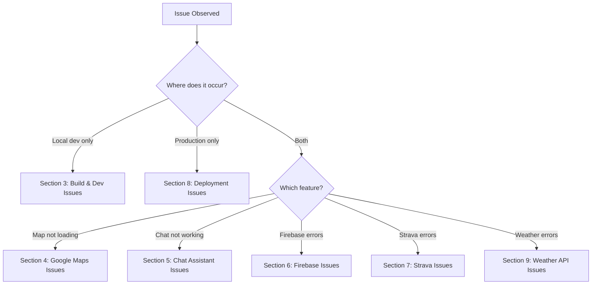
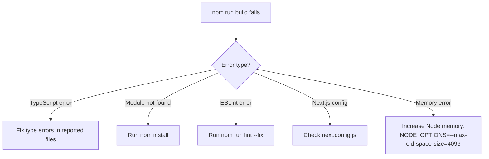
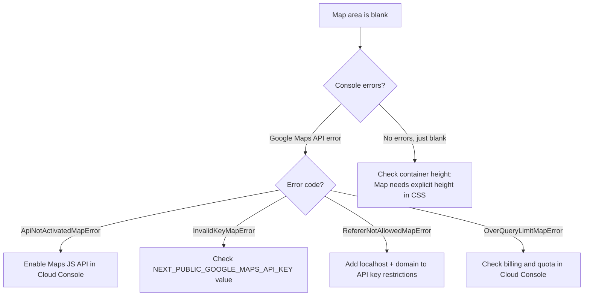
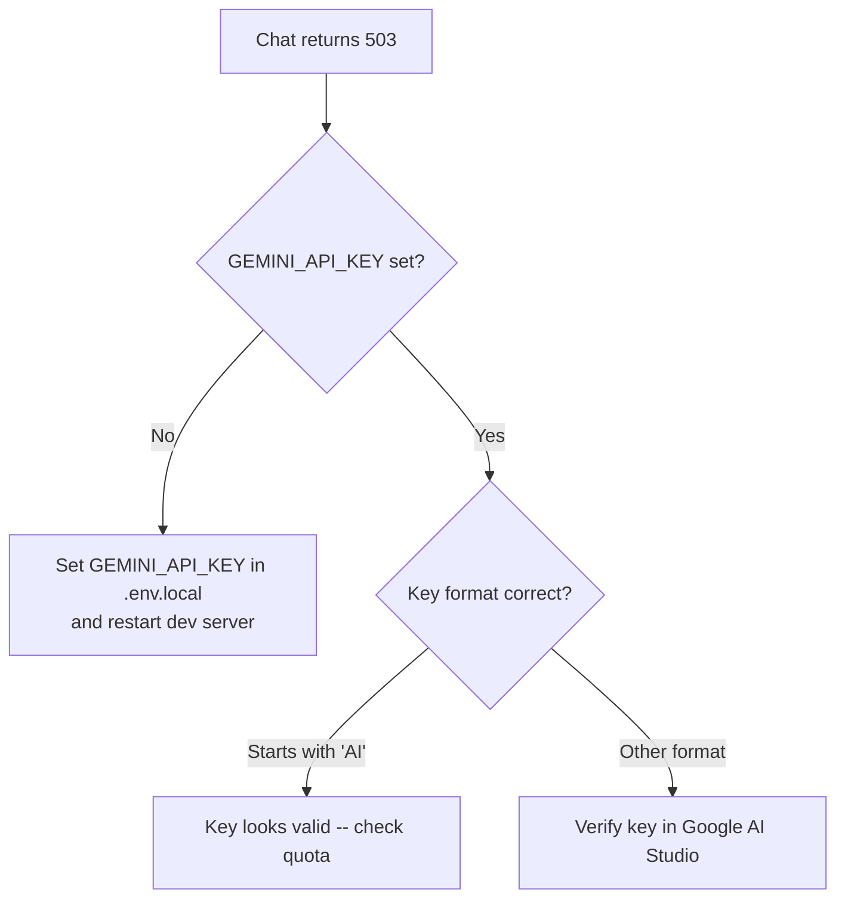
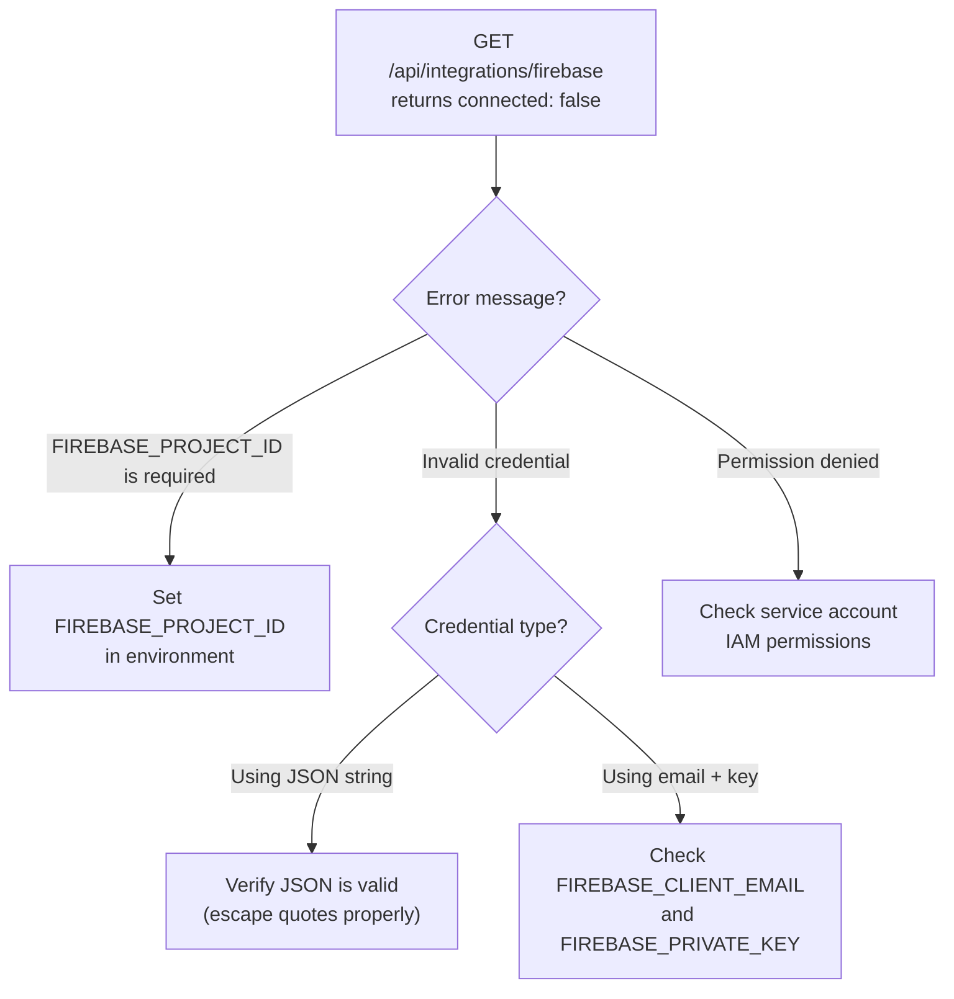
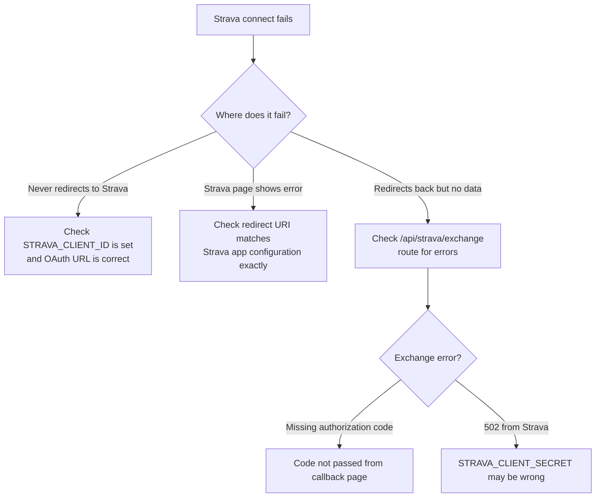
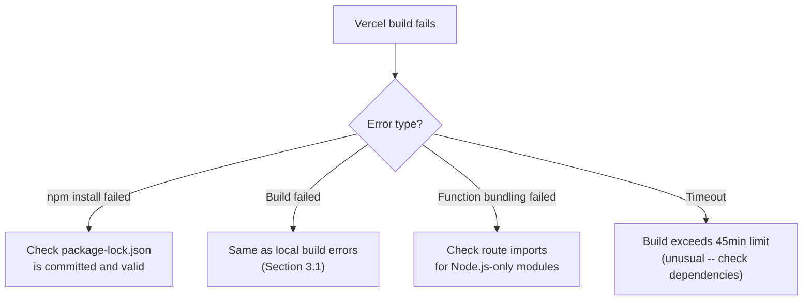
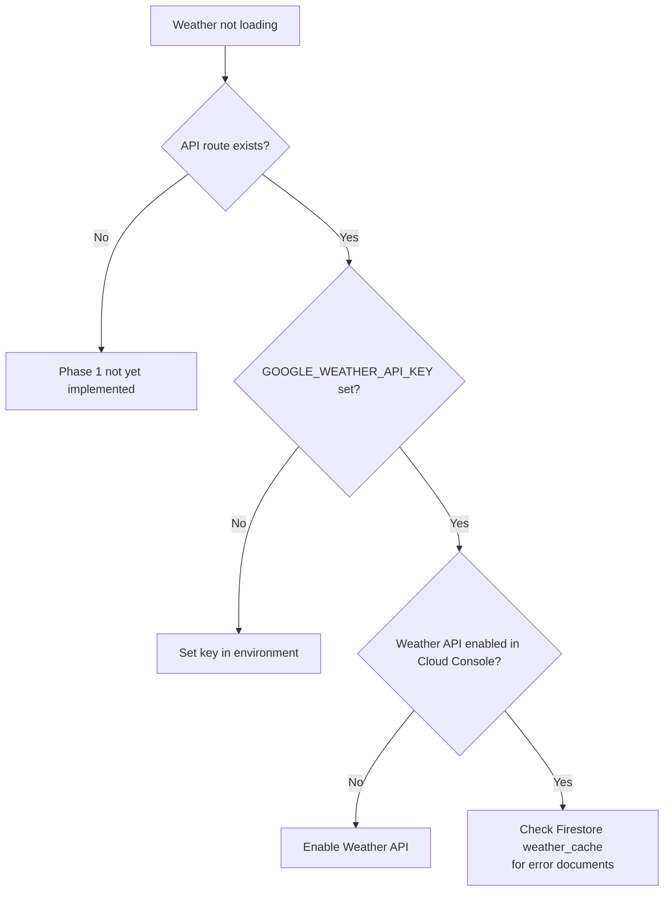

# Fit-Ready-IQ Troubleshooting Guide

## 1. Overview

This document provides a comprehensive troubleshooting reference for common issues encountered during development, deployment, and runtime of the Fit-Ready-IQ platform. Issues are organized by category with diagnostic flowcharts, root cause analysis, and step-by-step resolution procedures.

---

## 2. Diagnostic Flow

When an issue occurs, use this decision tree to identify the category and jump to the relevant section:



---

## 3. Build and Development Issues

### 3.1 `npm run build` Fails

**Diagnostic Flow:**



**Common Causes and Fixes:**

| Error Message | Cause | Fix |
| --- | --- | --- |
| `Module not found: Can't resolve '...'` | Missing dependency or typo in import | Run `npm install`. Check import path spelling. |
| `Type error: Property '...' does not exist` | TypeScript type mismatch | Fix the type definition or add proper typing |
| `ESLint: ...` | Lint rule violation | Run `npm run lint` and fix reported issues |
| `.next/types` reference error | Stale build cache | Delete `.next/` directory and rebuild |
| `FATAL ERROR: Heap out of memory` | Large build exceeds default Node memory | Set `NODE_OPTIONS=--max-old-space-size=4096` |

### 3.2 Development Server Won't Start

**Checks:**
1. Port 4790 may be in use: `Get-NetTCPConnection -LocalPort 4790` (PowerShell)
2. Kill existing process: Use the "Kill Frontend Port" VS Code task
3. Verify `.env.local` exists in `frontend/` with required variables
4. Run `npm install` to ensure all dependencies are present
5. Delete `.next/` and restart: `Remove-Item .next -Recurse -Force; npm run dev`

### 3.3 Hot Reload Not Working

**Causes:**
- File watcher limit reached (rare on Windows)
- File saved outside of `src/` directory
- Next.js config changed (requires full restart)

**Fix:** Stop the dev server, delete `.next/`, and restart with `npm run dev`.

### 3.4 TypeScript Errors in IDE but Build Passes

**Cause:** IDE TypeScript version differs from project version.

**Fix:** In VS Code, open any `.ts`/`.tsx` file, press `Ctrl+Shift+P`, select "TypeScript: Select TypeScript Version", choose "Use Workspace Version".

---

## 4. Google Maps Issues

### 4.1 Map Does Not Render (Blank Area)

**Diagnostic Flow:**



**Resolution Steps:**

1. Open browser DevTools (F12) > Console tab
2. Look for Google Maps JavaScript API error messages
3. Verify `NEXT_PUBLIC_GOOGLE_MAPS_API_KEY` is set in `.env.local`
4. Verify the API key has Maps JavaScript API, Places API, and Elevation API enabled
5. Verify the API key's HTTP referrer restrictions include `localhost:4790` and your production domain

### 4.2 Places Search Returns No Results

**Causes:**
- Places API not enabled for the API key
- Search query returns no results for the area
- API quota exceeded

**Fix:**
1. Go to Google Cloud Console > APIs & Services > Enabled APIs
2. Confirm "Places API" is enabled
3. Check API key restrictions -- ensure Places API is allowed
4. Check quota usage in Cloud Console > APIs & Services > Quotas

### 4.3 Elevation Data Missing

**Causes:**
- Elevation API not enabled
- Batch request exceeds 512 locations
- Network timeout on large batches

**Fix:**
1. Enable "Elevation API" in Google Cloud Console
2. The code batches up to 512 locations -- if more are needed, they're split automatically
3. Check network tab for failed elevation requests

### 4.4 Map Markers Not Appearing

**Causes:**
- Data fetching failed silently
- Coordinates are outside visible map bounds
- Filter criteria too restrictive

**Fix:**
1. Open DevTools > Network tab and check for failed Places API requests
2. Reset filters to defaults
3. Pan/zoom the map to the area where results are expected

---

## 5. Chat Assistant Issues

### 5.1 Chat Returns "Service Not Configured"

**Diagnostic Flow:**



**Fix:** Set `GEMINI_API_KEY` in `.env.local` and restart the development server. On Vercel, add it to environment variables and redeploy.

### 5.2 Chat Returns "AI Service Unavailable" (502)

**Causes:**
- Gemini API is temporarily down
- API key quota/rate limit exceeded (free tier: 15 RPM)
- Network timeout (30-second function limit on Vercel)

**Fix:**
1. Wait 60 seconds and retry (rate limit recovery)
2. Check [Google AI Studio](https://makersuite.google.com/) for service status
3. If consistent, check API key quota in Google Cloud Console
4. For production, upgrade from free tier to paid plan

### 5.3 Chat Messages Not Persisting

**Causes:**
- Firebase not configured (missing `FIREBASE_PROJECT_ID`)
- Service account credentials invalid
- Firestore database not initialized

**Fix:**
1. Verify `FIREBASE_PROJECT_ID` is set
2. Check `/api/integrations/firebase` returns `firestoreWrite: true`
3. If using emulators, ensure Docker Compose is running

---

## 6. Firebase Issues

### 6.1 Health Endpoint Returns `connected: false`

**Diagnostic Flow:**



**Resolution Steps:**

1. Set `FIREBASE_PROJECT_ID` to your Firebase project ID
2. For `FIREBASE_SERVICE_ACCOUNT_KEY_JSON`:
   - Must be a valid JSON string (the entire service account file content)
   - In Vercel, paste the JSON as a single-line string
   - Verify with: `JSON.parse(process.env.FIREBASE_SERVICE_ACCOUNT_KEY_JSON)` in a test
3. If using `FIREBASE_PRIVATE_KEY`, preserve newline characters (`\n`) in the key value

### 6.2 Firestore Write Probe Fails

**Causes:**
- Service account does not have Firestore write permissions
- Firestore database not created in Firebase Console
- Wrong project ID

**Fix:**
1. Go to Firebase Console > Firestore Database > Create database (if not exists)
2. Go to Google Cloud Console > IAM > verify service account has "Cloud Datastore User" role
3. Verify `FIREBASE_PROJECT_ID` matches the project where Firestore is initialized

### 6.3 Firebase Admin SDK Initialization Timeout

**Cause:** Cold start on Vercel serverless function + large service account JSON parsing.

**Fix:** The `lib/firebaseAdmin.ts` singleton pattern ensures initialization happens once per cold start. If timeouts persist:
1. Increase function timeout in `vercel.json`
2. Consider using `FIREBASE_CLIENT_EMAIL` + `FIREBASE_PRIVATE_KEY` (faster to parse than full JSON)

---

## 7. Strava Integration Issues

### 7.1 OAuth Callback Not Completing

**Diagnostic Flow:**



**Fix:**
1. In Strava Developer settings, verify the "Authorization Callback Domain" matches your domain (e.g., `localhost` for dev, `your-domain.com` for production)
2. Verify `STRAVA_CLIENT_ID` and `STRAVA_CLIENT_SECRET` are set correctly
3. Check that `/auth/callback/strava` page correctly extracts the `code` query parameter

### 7.2 Activities Endpoint Returns 401

**Causes:**
- Access token has expired (Strava tokens expire after 6 hours)
- Token was not properly extracted from exchange response

**Fix:**
1. Re-connect Strava (triggers new OAuth flow for fresh token)
2. Phase 3 will add automatic token refresh via server-managed lifecycle

### 7.3 Activities List is Empty

**Causes:**
- User has no public activities on Strava
- Activity scope not granted during OAuth
- Pagination issue (requesting page > available pages)

**Fix:**
1. Verify the OAuth scope includes `read,activity:read_all`
2. Check if user has activities visible in Strava app
3. Try requesting page=1 explicitly

---

## 8. Deployment Issues

### 8.1 Vercel Build Fails

**Diagnostic Flow:**



### 8.2 Vercel Deployment Succeeds but APIs Fail

**Causes:**
- Environment variables not set for the correct scope (Production vs Preview)
- Server routes expecting Node.js runtime but defaulting to Edge
- Firebase Admin SDK failing to initialize due to missing credentials

**Fix:**
1. Go to Vercel Project Settings > Environment Variables
2. Verify all required variables are set for **Production** environment
3. Verify routes have `export const runtime = 'nodejs'` where Firebase Admin is used
4. Check Vercel function logs for initialization errors

### 8.3 Preview Deployment Works but Production Doesn't

**Cause:** Environment variables are scoped to Preview only, not Production.

**Fix:** In Vercel dashboard, edit each environment variable and enable the "Production" checkbox.

---

## 9. Weather API Issues (Phase 1)

### 9.1 Weather Data Not Loading

**Diagnostic Flow:**



### 9.2 Weather Shows Stale Data

**Cause:** Firestore TTL cache has not expired (default 60 minutes).

**Fix:**
1. Delete the relevant document in `weather_cache` collection
2. Refresh the page to trigger a new API call
3. To reduce staleness, lower the TTL value in the weather route configuration

### 9.3 Weather Alerts Not Showing

**Causes:**
- `persona` query parameter not passed
- Conditions are below alert thresholds for the given persona

**Fix:** Verify the URL includes `?persona=mountaineer` (or relevant persona). Check that conditions actually exceed the threshold values defined in the API reference.

---

## 10. Performance Issues

### 10.1 Slow Initial Page Load

**Causes:**
- Large JavaScript bundle (DetailsModal is heavy)
- Google Maps SDK loading time
- Multiple Places API calls on mount

**Diagnostics:**
1. Open DevTools > Network tab > check total transfer size
2. Open DevTools > Performance tab > record page load
3. Look for blocking waterfall patterns in API calls

**Improvements (Phase 6):**
- Dynamic imports for DetailsModal (code-split)
- Deduplicate Places API calls
- Memoize Google Maps service instances

### 10.2 Elevation Profile Slow to Render

**Cause:** Elevation API batch for many points takes time.

**Fix:** The API batches up to 512 locations. If the profile appears slow:
1. Check Network tab for elevation request duration
2. Ensure only necessary points are requested (not all markers at once)

---

## 11. Useful Validation Commands

### 11.1 Local Development Commands

```bash
cd frontend

# Check for build errors
npm run build

# Check for lint errors
npm run lint

# Run unit tests
npm run test:unit

# Check dependency vulnerabilities
npm audit --audit-level=high

# Check for outdated packages
npm outdated
```

### 11.2 Runtime Endpoint Validation

| Endpoint | Method | Expected Success |
| --- | --- | --- |
| `/` | GET | HTML with Google Maps rendering |
| `/api/integrations/firebase` | GET | `{ "connected": true }` |
| `/api/chat` | POST | `{ "message": "...", "sessionId": "..." }` |
| `/api/strava/exchange` | POST | Token payload (requires valid code) |
| `/api/weather?lat=14.5&lng=121.0` | GET | Forecast JSON (Phase 1) |

### 11.3 PowerShell Diagnostic Commands

```powershell
# Check if port is in use
Get-NetTCPConnection -LocalPort 4790 -ErrorAction SilentlyContinue

# Kill process on port
Get-NetTCPConnection -LocalPort 4790 | ForEach-Object { Stop-Process -Id $_.OwningProcess -Force }

# Check Node.js version
node --version

# Check npm version
npm --version

# Verify environment variables are loaded (in dev server output)
# Look for "ready - started server on 0.0.0.0:4790"
```

---

## 12. Getting Help

If an issue is not covered in this guide:

1. Check the [SOLUTION-PLAN.md](../solution-plan/SOLUTION-PLAN.md) for known limitations and planned fixes
2. Search existing [GitHub Issues](https://github.com/Oweeboi011/Fit-Ready-IQ/issues)
3. Open a new issue with:
   - Steps to reproduce
   - Expected vs actual behavior
   - Browser DevTools console output
   - Environment (local dev / Vercel preview / production)
   - Relevant environment variables (names only, never values)
