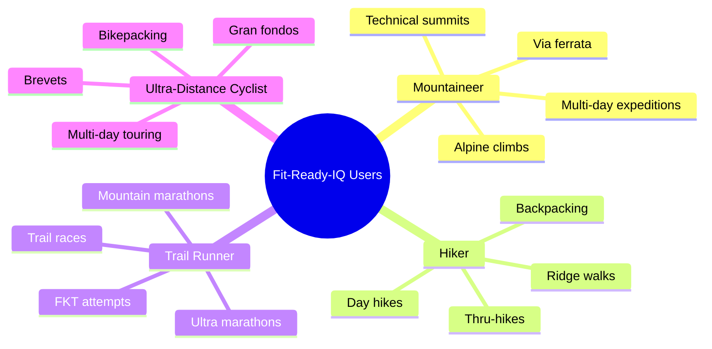
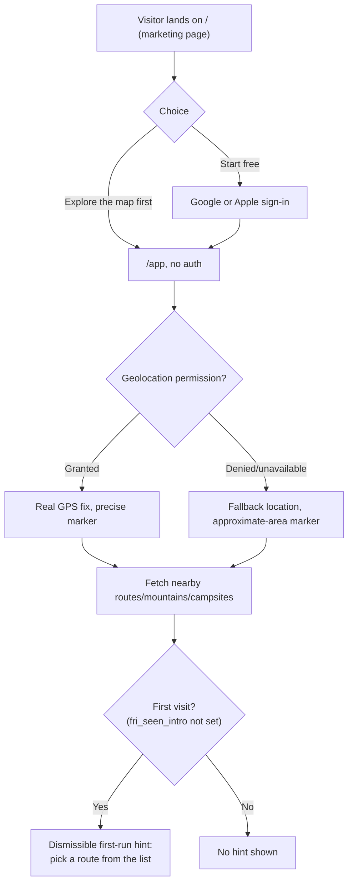
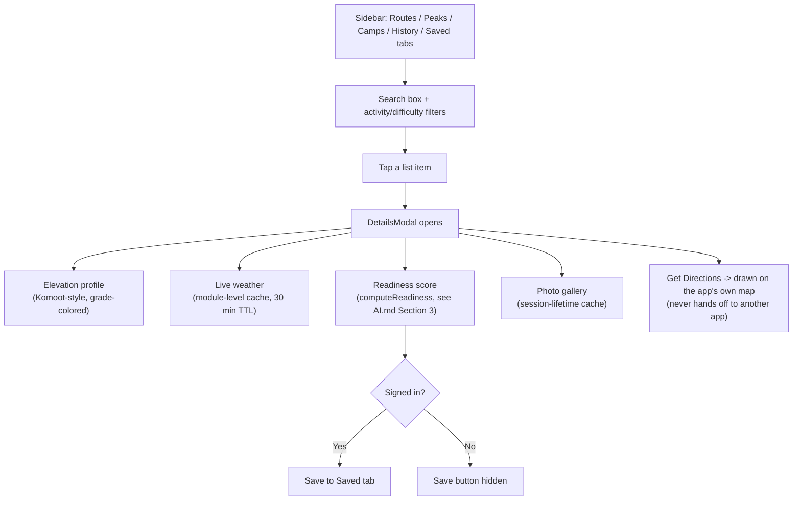
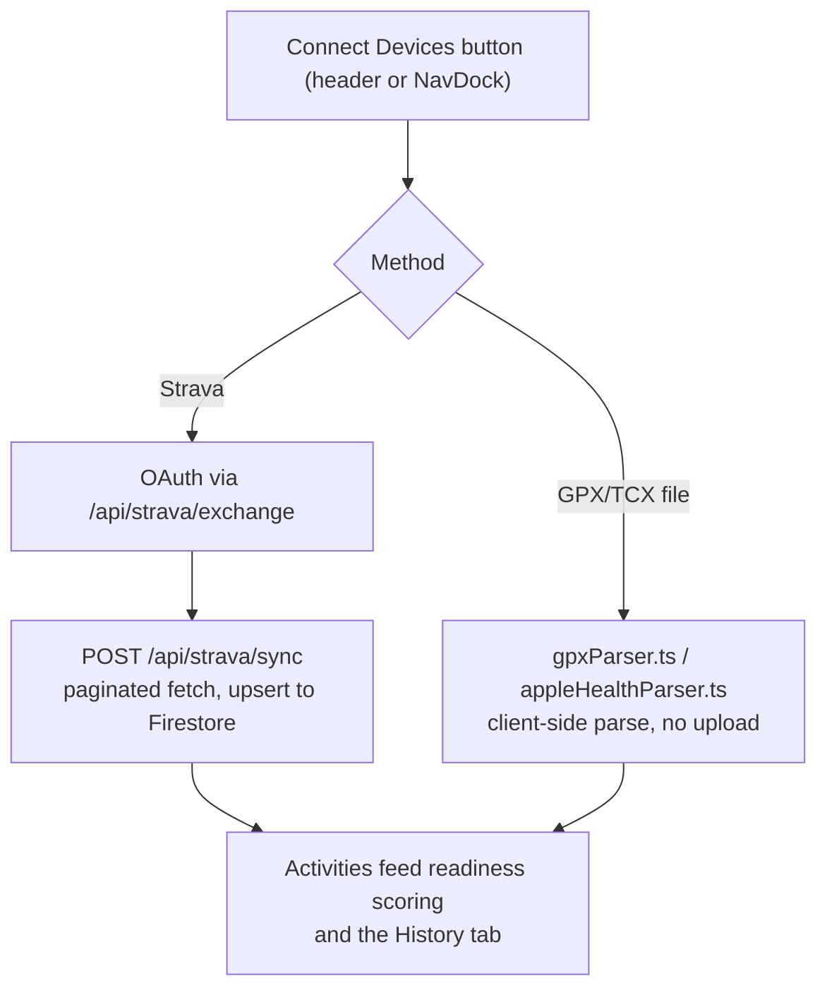
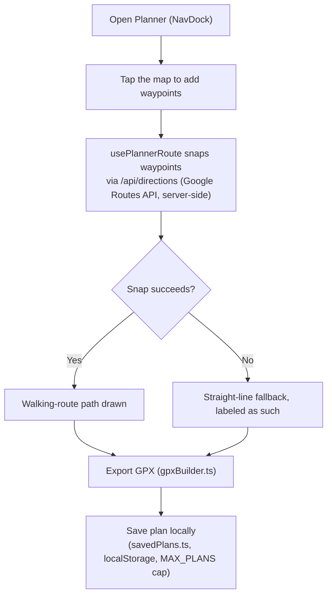
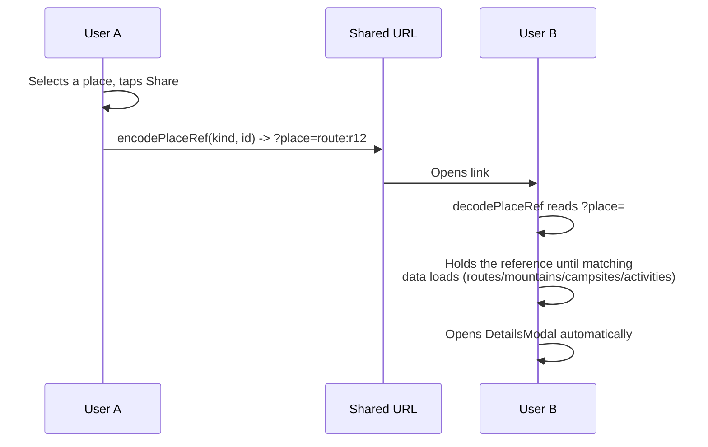

# Fit-Ready-IQ User Flow

## 1. Overview

This document describes who uses Fit-Ready-IQ and the actual journeys they take through the current app — the marketing landing page (`/`) and the map product (`/app`). It replaces the persona-feature-parity matrix that previously lived in `docs/solution-plan/SOLUTION-PLAN.md` Section 7, which had drifted from the real feature set (it listed "Strava segments: Yes" for every persona, a feature that was deliberately removed as fabricated data — see `strava_segment` field comments in `src/frontend/src/lib/placesTypes.ts`). Everything below is checked against what the app currently does, not what a plan says it will do; planned-but-not-built flows are labeled as such.

---

## 2. Who Uses It

The product does not yet branch its UI by persona — every user sees the same map, filters, and detail views regardless of which of these four groups they belong to. Persona-specific behavior (different alert thresholds, different chat system prompts) is planned, not built; see `docs/wiki/AI.md` Section 4.

---

## 3. Landing to First Map View

Signing in is never required to browse — `/app` is fully usable signed out. Sign-in only gates the **Saved** tab and saving places, per `useSavedPlaces.ts`. The location fallback is explicit rather than silent: `useUserLocation.ts` reports a `source` (`gps` / `restored` / `fallback`), and the UI never draws an unearned "you are here" marker on a guessed location — see the `distance_from_user_km` hiding rule in `.claude/CLAUDE.md`'s "Rules this codebase holds to".

---

## 4. Discover and Evaluate a Route

Readiness only renders a score when there is training data to score against — with zero recent activities the badge is silent rather than showing a misleading zero (`AI.md` Section 3.2). Elevation, weather, and difficulty each have their own explicit "unknown" state for the same reason; nothing here is guessed to fill a blank.

---

## 5. Connect Training Data

This is the only way readiness scoring has anything to score against — a user with no connected activities always sees the `unknown` readiness state (`AI.md` Section 3.2), by design, not as a missing feature.

---

## 6. Plan a Route

Route planning is fully client-local today — plans live in `localStorage`, not Firestore. There is no server-side, cross-device persistence of user-drawn routes yet; that gap is what GitHub issue #23 ("Data model for user-created routes") is asking to close, and ADR-0004's route-geometry model is the natural target shape for it once built.

---

## 7. Share and Deep-Link

Before this existed, nothing in the app was addressable — no tab, no selected place, no viewport survived a reload or a share. `placeUrl.ts` is the encode/decode contract both ends of a shared link agree on; a link to a place not found near the recipient degrades to an explicit message ("that link points to a place we can't find near you"), not a silent failure.

---

## 8. Chat Assistant (Current, Limited)

The floating chat widget is available throughout `/app`. Today it is a general-purpose adventure-advice assistant with no awareness of the user's selected route, location, or fitness data — seeing the full current behavior and its planned context-grounded evolution belongs in `docs/wiki/AI.md`, not duplicated here.

---

## 9. Not Yet Built

Flows described in earlier planning documents that do not exist in the app today, kept here so this document stays the single place to check "is this real yet":

- Persona-specific UI branching or alert thresholds (Section 2)
- Server-side, cross-device persistence of user-drawn routes (Section 6)
- Chat assistant tool-use — saving a route from a conversation, asking it to analyze a specific route (`docs/wiki/AI.md` Section 2.2, GitHub issues #26-#31)
- The Trip entity and server-side safety timer described in ADR-0003 — no onboarding, gear-list, or check-in flow exists yet
